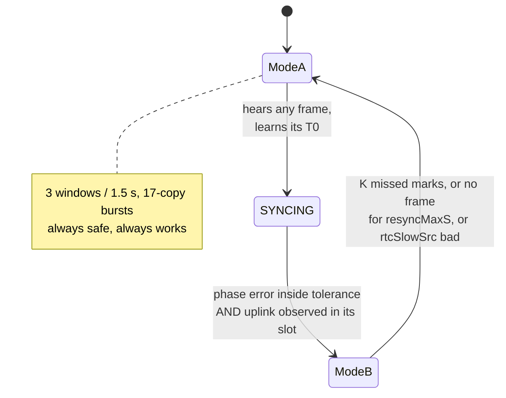

# LoRa blinds — consolidated implementation plan

**Authoritative.** Supersedes the design content of `timed-window-mode-plan.md`
and `superframe-structure.md`, which disagreed with each other on slot geometry,
node count and phase order. `timed-window-node-analysis.md` and the
pre-existing documents (`timing-accuracy.md`, `wake-cost-proposal.md`,
`power-analysis.md`, `optimization-analysis.md`, `protocol-questions.md`) remain
valid as **evidence** and are cited rather than restated.

Target: **~32 nodes**, one mains-powered hub, SX1278 at SF7 / BW500 / CR4-8 on
433.3 MHz.

---

## 1. Three modes, two tracks

| mode | shape | node population | status |
|---|---|---|---|
| **A — burst / windowed** | 3 RX windows per 1.5 s, 17-copy downlink bursts | every node, always available | **exists today; kept permanently** |
| **B — timed interactive** | 1 RX window per 1.5 s at an assigned slot, single-copy downlink | interactive nodes, once synced | new |
| **C — auto** | LoRaWAN Class A: uplink, then RX windows at fixed offsets from the node's own transmission, then sleep | automatic-mode nodes | new |

Mode A is not a legacy path being replaced. It is the **acquisition and recovery
path for B**, and the permanent fallback when anything is uncertain. Every node
starts there and returns there.

Modes B and C are **independent tracks with no dependency between them**:

```
auto nodes        : Mode C  ──  sleepOk (Tier 1) ──► Class A windows (Tier 2)
interactive nodes : Mode B  ──  P0 … P5
```

They target different populations and do not compete for the same milliamp
(`timed-window-node-analysis.md` §10). Mode C needs **no clock agreement at
all** — its windows are referenced to the node's own transmission — so nothing
in Mode B blocks it.

**Scoping note.** Mode B's benefit scales with the number of *interactive*
nodes, not with 32. Mode C's benefit scales with the number of *automatic* ones,
and the automatic population also sets Mode A's contention load. That split
should be decided before committing effort to either track.

---

## 2. Common foundations

These apply to all three modes and are the first work in either track.

### 2.1 The reference point: T0 = SFD end

Every instant in this document is relative to **T0, the end of the LoRa
start-frame delimiter**.

```
air_start                    T0 = SFD end      (ValidHeader)          RxDone
    |                              |                 |                   |
    |<-- n_pre up-chirps --><-sync-><-SFD->|<- header 8 sym ->|<- payload ... ->|
    |<------------ 3136 us --------------->|<--- 2048 us --->|
```

At SF7 / BW500, `T_sym = 2^7 / 500 000 = 256.0 µs`:

| interval | symbols | µs |
|---|---|---|
| `T_pre` — air start → **T0** | `n_pre + 4.25` = 12.25 | **3136** |
| `T_hdr` — **T0** → ValidHeader (*structural only, DIO3 not routed*) | 8 | 2048 |
| **`T0` → RxDone** | **`n_sym(len)`** | **18 432 … 92 160** |

Both ends name T0:

- **hub:** `T0 = t_fire + d_tx_ramp + T_pre`, where `t_fire` is the `esp_timer`
  reading taken at the single SPI write that starts transmission.
- **node:** `T0 = t_rxdone − n_sym(len)·T_sym` — **one line, not a decomposition.**
  Subtracting `T_pay` and `T_hdr` separately is arithmetically identical and
  invites a −2.048 ms double-count; an earlier draft made exactly that error.

DIO2 and DIO3 are **not routed to the CPU** on the node PCB, so ValidHeader is
unavailable and RxDone is the only timing event. That costs no measurable
accuracy: both paths carry identical ISR and light-sleep wake latency, and those
dominate. It trades a calibration risk for a software-correctness risk, which
§2.2 discharges.

Frame reference:

| on-air bytes | `n_sym` | time on air |
|---|---|---|
| 25 (ack) | 72 | 21.57 ms |
| 45 (beacon) | 120 | 33.86 ms |
| 60 (routine command) | 152 | 42.05 ms |
| 152 (8-entry `ScheduleConfig`) | 360 | 95.30 ms |

### 2.2 `LoraTiming.h` — the first deliverable

One shared, dependency-free implementation of `T_sym`, `T_pre`, `T_hdr` and
`n_sym(len)`, compiled by hub, node and host tests. **It is the reference point**
— nothing else can check it.

Pinned by test against: `T_pre = 3136 µs`, 42.048 ms @ 60 B, 95.296 ms @ 152 B,
and the convention `PL = RegRxNbBytes` (which excludes the CRC; the formula's
`+16·CRC` term accounts for it separately). That last one is the off-by-two-bytes
that would appear as a constant ~0.5 ms bias and be blamed on the crystal.

Also pinned: the hub's burst copy spacing must stay **88 000 µs exactly**, and
any grid period must be an exact integer number of milliseconds.
`DriftEstimator.h:47-70` records that `1500/17` as 88.235 ms rather than the
hub's integer 88.000 cost three firmware revisions at −2663 ppm; a microsecond
timer invites the same mistake.

### 2.3 Timebase

| clock | source | resolution | survives light sleep | used for |
|---|---|---|---|---|
| `esp_timer` | TG0 LAC ← APB ← 26 MHz XTAL | 1 µs | no — IDF adds RTC-measured sleep time on wake | all timestamps and scheduling, both ends |
| RTC slow | **external 32.768 kHz crystal** (`CONFIG_RTC_CLK_SRC_EXT_CRYS=y`) | 30.5 µs | yes | carries the node's phase across sleep |

Everything reads `esp_timer_get_time()`. Nothing *schedules* on the FreeRTOS
tick — 1000 Hz on the hub, **100 Hz on the node**.

But the tick is not yet out of the path: **every SPI register write on both ends
is gated by `xSemaphoreTake(xSemaphore, (TickType_t)1)` and silently does nothing
on timeout** (hub `lora.cpp:158`, node `components/lora/lora.cpp:143, 251, 304`).
That is a 10 ms window on the node, and the timed-mode ARM write goes through it.
It must become a bounded-and-*reported* take before Mode B ships (§10).

### 2.4 Prepare / fire — separating the timing-critical path

**The timing-critical operation is a single SPI register write. Nothing else
happens between the timer firing and that write.** Everything with variable
duration — FIFO transfer, protobuf, crypto, logging, NVS — moves before the mark
or after the event. This applies to hub TX, node RX arming and node TX alike.

| phase | work | timing-critical |
|---|---|---|
| **PREPARE** (≈20 ms before) | radio mutex, standby, FIFO fill **in one SPI transaction**, payload length | no |
| **FIRE / ARM** (at the mark) | one polled SPI write: `RegOpMode = TX` or `= RX_SINGLE` | **yes** |
| **SETTLE / DRAIN** (after) | TxDone or FIFO read, decrypt, dispatch, log | no |

Hub timing marks: FIRE at `T0 − (T_pre + d_tx_ramp)` = `T0 − 3356 µs`.
Node timing marks: ARM at `T0 − (T_pre + G)` = `T0 − 17 216 µs` (§4.2).

Five changes make the hub deterministic. Four are convergence with the node,
whose fork of the same driver already made them:

1. **Prepare/fire split** — the FIFO fill is ~1 ms today and **payload-dependent**
   (one SPI transaction per byte), so it must leave the timing path.
2. **One burst SPI transaction for the FIFO**, both ends. Removes the
   payload-dependent bias that no time-on-air correction can undo, and removes
   ~60 chances per frame for the silent register-write drop of §2.3.
3. **Delete `esphome::delay(1)` from `lora_idle()` and `lora_tx()`** on the hub —
   use the `esp_rom_delay_us(120)` / `(220)` values already commented out beside
   them. The node did this already.
4. **Move `ESP_LOGI("Sending packet…")` out of the mutex and after FIRE**
   (`lora_tracker.cpp:496`). Its cost is **unverified** — `sendPacketBurst` runs
   off the ESPHome main task and the logger may buffer — but it has no business
   in the path either way.
5. **Hoist the six per-packet config writes** (SF/CR/BW/sync/CRC, never change)
   into `setup()`.

Two constraints on the ARM callback, both verified:

- `ESP_TIMER_ISR` dispatch is **not compiled in**
  (`# CONFIG_ESP_TIMER_SUPPORTS_ISR_DISPATCH_METHOD is not set`, `sdkconfig:1811`),
  so every callback runs in `ESP_TIMER_TASK` at priority 22;
- and it would not help, because `spi_device_polling_transmit()` acquires the bus
  lock and is not ISR-callable. `CONFIG_SPI_MASTER_ISR_IN_IRAM=y` places the
  *driver's* ISR in IRAM, which is a different property.

So ARM stays a priority-22 task dispatch: **±100 µs typical, milliseconds at the
p99** until NVS writes are moved off the RX path.

### 2.5 Light sleep and the RxDone timestamp

Production runs `light_sleep_enable = true` (`SystemCtrl.cpp:444`) and **nothing
in the node arms a GPIO light-sleep wake source** — `grep` for
`gpio_wakeup_enable` / `esp_sleep_enable_gpio_wakeup` returns zero hits, and
`pm_lock_handle_rx` (`main.cpp:99`) is declared but never created.

Because DIO0 is level-triggered the packet is not lost — it waits in the FIFO
and the ISR runs at the next wake. **The timestamp is lost**: it records when the
CPU woke, up to 500 ms late. That is why the drift test disables light sleep
outright, and it is the single prerequisite for any phase tracking.

**Fix: arm GPIO light-sleep wakeup on DIO0 *and* DIO1.** DIO1 matters because
the empty-window path ends on RxTimeout, which is what runs `lora_sleep()`
(`frtosTasks.cpp:272-274`); arm DIO0 only and the radio sits in STANDBY (~1.5 mA)
for most of every round — a term that alone exceeds the whole 1.2 mA node
average.

Two cautions:

- The level wake source stays armed across `gpio_intr_disable`, which the ISR
  does on entry (`myinterrupts.cpp:36-37`). Any path leaving an IRQ flag set —
  the unhandled branch at `frtosTasks.cpp:218-224` — leaves DIO0 asserted, and
  automatic light sleep then refuses to sleep or thrashes. **The wake source must
  be disarmed in step with every `gpio_intr_disable`**, and the gate for this
  work must include a sleep-residency check, not just timestamp quality.
- **Do not hold `ESP_PM_NO_LIGHT_SLEEP` across the window instead.** It costs
  ~0.4 mA and takes the change from 26.2 to ~25.5 mAh/day against 18.4 with the
  CPU asleep — it would erase the entire battery win.

`CmdDispatcher.cpp:2154-2158` justifies `esp_pm_configure` over a PM lock on the
grounds that "the lock leaves automatic light sleep armed underneath". That is
almost certainly a misdiagnosis of a lock that was **never created**:
`esp_pm_lock_create` is called exactly once in the tree, for the motor
(`MotorCtrl.cpp:200`).

---

## 3. Mode A — burst / windowed (today, kept)

Unchanged: the node listens in 3 windows of 29.44 ms every 1.5 s
(`symTimeout = 115`, `LoraInterface.cpp:347`); the hub sends 17 copies at 88 ms.

**Why it stays.** It is the only path that works without clock agreement, and it
is what every node uses to acquire one. Reception geometry, derived in closed
form:

| configuration | P(≥1 copy heard per round) |
|---|---|
| 3 windows, 17 copies | **96.4 %** |
| 1 window, 17 copies, unsynchronised | 32.9 % |
| 1 window, 1 copy, synchronised | ~100 % |

Copy *i* leaves at `88i`; it is caught iff `(x + 88i) mod P ∈ [0, 29.44)`. At
`P = 500` the residues sort to gaps of 28 ms (×11) and 32 ms (×6), so the union
is `11×28 + 6×29 = 482` of 500 → 96.4 %. At `P = 1500` all 17 gaps exceed the
window, so the union is `17×29 = 493` of 1500 → 32.9 %.

Treating the three windows as independent gives 69.8 % and is **wrong by 27
points**: 88 ms against 500 ms sweeps the copies almost uniformly across the
window period, so they are strongly anti-correlated. That anti-correlation *is*
`optimization-analysis.md` §2's "tuned to the window scheme".

**What changes in Mode A: nothing on air.** The only new requirement is that the
hub's scheduler knows which nodes are in Mode B, so it can defer a colliding
private-window transmission by one round (§4.5).

---

## 4. Mode B — timed interactive (Class B shape)

### 4.1 What the node does

One 29.44 ms RX window per 1500 ms round, at its assigned slot phase, plus one
extra window in the shared beacon slot every beacon interval.

Receive duty **5.9 % → 1.96 %**; interactive battery **26.2 → 18.4 mAh/day**;
command latency unchanged at ≤1.5 s.

### 4.2 The round: 32 slots in 1500 ms

```
T0_k = A + n·1 500 000 µs + k·46 875 µs          k = 0 … 31
```

```
 round n, 1500 ms
 |<-------------------------------------------------------------->|
 |  k=0     k=1     k=2     k=3     k=4    ...              k=31   |
 |  ┌──┐    ┌──┐    ┌──┐    ┌──┐    ┌──┐                    ┌──┐   |
 |  │29│    │29│    │29│    │29│    │29│       ...          │29│   |
 |  └──┘    └──┘    └──┘    └──┘    └──┘                    └──┘   |
 |  <-46.9->      ↑ 17.4 ms clear between adjacent windows          |
```

- window k spans `[T0_k − 17.22 ms, T0_k + 12.22 ms]`
- adjacent windows are 46.875 ms apart with **17.4 ms clear** — no overlap
- `A` is the grid anchor, set once when the grid starts, never moved

**The guard band comes free from the existing symbol timeout.** Arm at
`T0 − (T_pre + G)` and the tolerance is symmetric:

```
G = (N_symtimeout·T_sym − T_detect) / 2 = (29.44 − 1.28) / 2 = ±14.08 ms
```

- early by `e`: preamble starts at `T0 − T_pre − e`, inside the window while `e ≤ G`
- late by `l`: detection completes at `T0 − T_pre + l + T_detect`, before close while `l ≤ G`

Three things this rests on, two unverified:

- **Detection stops the timeout** — a 95.3 ms `ScheduleConfig` is received today
  inside a 29.44 ms window, so the SX1278 demonstrably does not abort a packet
  in progress. Empirically settled; worth stating.
- **`T_detect ≈ 5 symbols` is a LoRaWAN rule of thumb**, not a datasheet number,
  and it sets the entire late-side margin. `RegDetectionOptimize` /
  `RegDetectThreshold` are never written (`LoraInterface.cpp:78-82`), so they sit
  at reset defaults. **Bench item.**
- **The 29.44 ms window is an accident.** `symTimeout = int(30.0f/0.26f)` came
  from a comment claiming "20 ms per packet"; real frames are 42–95 ms. Pin it as
  a named constant before shipping Mode B.

### 4.3 How many nodes the hub serves per round

A transmission is wider than a window, so serving node *k* also covers
neighbours' windows. Counting hub frame plus node reply:

| downlink | hub occupies (rel. `T0_k`) | next servable slot | nodes/round |
|---|---|---|---|
| ack, 25 B | −3.1 … +60.0 ms | k+2 | 16 |
| routine command, 60 B | −3.1 … +80.5 ms | **k+3** | **10** |
| `ScheduleConfig`, 152 B | −3.1 … +133.7 ms | k+4 | 8 |

At 3.5 commands/node/day this almost never binds. Where it does:

| clustered event (all 32 nodes) | time to reach every node |
|---|---|
| today, back-to-back bursts | **22.9 s** |
| Mode B, 10 per round | **6.0 s** |

### 4.4 The beacon slot

**The 32 private windows are at 32 different phases, so one broadcast cannot
reach them all.** The beacon therefore needs its own instant that every node
opens, on beacon rounds only (`n mod M == 0` for a published `M`).

Cost to the node: one extra 29.44 ms window per beacon interval — 0.1–0.4 % more
listening. Cost to the hub: **flat in node count.**

| | 32 nodes, 3.5 cmd/node/day | occupancy |
|---|---|---|
| today, all burst | 80.1 s/day | 0.093 % |
| Mode B + **unicast** keepalive @5.8 min | 274.5 s/day | 0.318 % — **3.4× worse** |
| Mode B + **broadcast** beacon @5.8 min | **13.1 s/day** | 0.015 % — **6× better** |
| Mode B + broadcast @58 min | 5.5 s/day | 0.006 % |

Same mechanism, opposite sign, purely because of N. **A unicast keepalive is not
viable at 32 nodes.**

**The beacon interval is bounded by how well the node knows its clock:**

| clock knowledge | maximum interval |
|---|---|
| unmeasured, ±20 ppm crystal spec | **11.7 min** |
| measured to ±2 ppm | **117 min** |

So a 12-minute beacon is the edge with no margin, and 50 minutes requires the
ppm estimate working. Two softeners: ordinary traffic also refreshes the phase,
so the beacon covers only the gaps; and `symTimeout` is a runtime write, so the
window can widen while sync is stale (200 symbols → ±25.0 ms, 3.41 % duty,
holds 20 ppm for 20.8 min — still better than today's 5.9 %).

**The beacon is not optional.** With it off, a node holds phase only for
`resyncMaxS` after each frame — at 3.5 commands/day that is ~5.6 % of the day in
Mode B, and there is no measurable battery saving. The beacon is the mechanism
that keeps the node in the mode, so it ships **with** the one-window change, not
after it.

Optional later: the beacon may carry a 32-bit pending-data bitmap, so a node
with its bit clear skips its private window until the next beacon
(`wake-cost-proposal.md` Tier 3). Pure addition; not needed for v1.

### 4.5 Mixed modes: priority, not a reserved region

While node 1 is in Mode B and node 2 is in Mode A, node 2's 17-copy burst spans
1.4 s and walks through node 1's window 81 % of the time (42 ms copies every
88 ms leave a 46 ms gap; a 29.44 ms window fits with 17 ms of freedom).

**Do not reserve a contention region.** An earlier draft proposed ~300 ms; the
arithmetic kills it, because confining copies destroys the incommensurate
sweep that makes the burst work:

| copies × region | P(heard)/round | to 99.9 % |
|---|---|---|
| 3 in 300 ms | 17.7 % | 36 rounds — **54 s** |
| 5 in 400 ms | 29.4 % | 20 rounds — 30 s |
| **17 across the round (today)** | **99.0 %** | 2 rounds — **3 s** |

**The rule instead:** when the hub has unsynced-node work it runs a normal
full-round burst, and defers any colliding private-window traffic by one round.

```
P(a given node needs a frame in a given round)  = 3.5 / 57 600 = 6.1e-5
P(any of 32 nodes does)                          = 1.9e-3
bursts/day (32 nodes × 4 deep-sleep wakes)       = 128
⇒ collisions with real queued traffic            = 0.23 per day
```

A quarter of one command per day, deferred by 1.5 s. All 32 slots stay
available and acquisition stays at 3 s.

**Consequence for demotion:** the node's "M empty windows" test is blinded by
this — a window walked through by another node's burst is *not* empty. The
counter must key on **"no frame addressed to me at my mark"**, not on "nothing
received".

### 4.6 Promotion and demotion



**The asymmetry rule**, which is the whole safety argument:

1. the node may drop to Mode A **unilaterally, at any moment**;
2. the hub may send single-shot **only** with positive, recent confirmation that
   the node is in a timed window — the last K acks arrived in their slots;
3. **any hub uncertainty → burst**: reboot, session change, missing beacon, stale
   confirmation, unknown firmware version;
4. a single shot that goes unacked is retried **as a burst, immediately**.

That makes the one dangerous combination — hub single-shot while the node is
windowed, ~6 % hit rate — unreachable by construction. Promotion requires an
uplink **observed in its slot**, not a claim: a beacon saying "I am ready" is not
evidence that the node's window is where it thinks.

Demotion is immediate, promotion needs a long baseline, and no promotion within
X minutes of a demotion.

**Mode B is gated on `rtcSlowSrc` reporting the 32 kHz crystal.** A node on the
internal RC oscillator (~5 %) stays in Mode A permanently, visibly in Home
Assistant rather than silently.

### 4.7 Reliability

**100 % cannot be ensured, and is not ensured today.** The 96.4 % of §3 is
geometry only; 433 MHz is shared with weather stations, garage remotes and alarm
sensors. Reliability comes from **acknowledgement and retry**, which already
exist (`kOpMaxRetries = 4` at `kOpRetryIntervalMs = 3000`):

| per-frame success `q` | after 4 retries | + burst fallback |
|---|---|---|
| 0.90 | 99.999 % | 100 % |
| 0.50 | 96.9 % | **99.99998 %** |
| 0.30 | 83.2 % | 99.961 % |

The burst fallback's statistics are *independent* of the timed attempt, which is
what buys the last decimal places. **The frame structure's job is to make the
first attempt cheap — 42 ms instead of 715 ms — not certain.**

**The one genuine regression:** a single copy loses the time diversity that 17
copies gave against bursty interference. The dial:

| | duty | battery | independent attempts/round |
|---|---|---|---|
| 1 window | 1.96 % | 18.4 mAh/day | 1 |
| **2 windows, 750 ms apart** | 3.93 % | 22.3 mAh/day | **2** |
| 3 windows (Mode A) | 5.89 % | 26.2 mAh/day | 3 |

`windowsPerRound` is a per-node config value. **Start at 2**, drop to 1 once the
measured `q` justifies it.

**Retry semantics.** A burst retry must reuse the msgid **and retransmit the
byte-identical frame**. Two constraints force it: the node's replay filter
requires `msgid > rx_id_` (`SessionManager.cpp:111-121`), so a fresh msgid means
the node executes the command twice; and the AEAD nonce is msgid-derived
(`lora_client.cpp:256`), so a reused msgid with *different* plaintext is GCM
nonce reuse. The hazard is narrow and sharp: `tx_tracked_op_` re-reads
`op_position_` at pack time, so a user changing position mid-retry would encrypt
different plaintext under the same nonce.

This leaves a gap the protocol cannot currently express — **"arrived, but the ack
was lost"**. The node must answer a replayed msgid with a **cached ack** rather
than dropping it. Required before single-copy downlink becomes normal, because
that is when retries stop being rare.

---

## 5. Mode C — auto (LoRaWAN Class A)

### 5.1 The shape

The node uplinks when it wants, opens RX windows at **fixed offsets after its
own transmission**, and sleeps if they are empty.

**This needs no clock agreement.** The window is referenced to the node's own
transmission, which it timed itself — no drift, no ppm, no beacon, no grid. That
is precisely why it works for a node that has just booted with no phase, which is
every auto-mode wake.

### 5.2 What it replaces

Today the node infers "the hub has finished" from **silence**, using a fixed
timeout (`automode::kQuietWindowMinMs`). Measured: a check-in wake costs 28.1 s,
of which the real work finishes at 4.7 s — **73 % of every wake is the node
proving a negative** (`wake-cost-proposal.md`).

| | wake | awake s/day @ 6 h check-in |
|---|---|---|
| today | 28.1 s | 112 |
| **Tier 1** — `sleepOk` in `TimeSync` | 7.7 s | 31 |
| **Tier 2** — Class A windows | **~3 s** | **12** |

### 5.3 The anchor already exists

`lora_endPacket(async = true)` already maps DIO0 to TxDone
(`components/lora/lora.cpp:563`), the handler task already services it
(`frtosTasks.cpp:205-213`), and the DIO0 ISR already takes
`esp_timer_get_time()` as its first statement for **every** edge — TxDone
included.

So the node already has a hardware-timestamped end-of-own-transmission event.
RX1/RX2 need the existing timestamp plus two `esp_timer` one-shots. The §2.1 T0
discipline applies unchanged, referenced to the node's own SFD:

```
T0_uplink = t_txdone − n_sym(len)·T_sym
RX1 opens at T0_uplink + D1 − (T_pre + G)
RX2 opens at T0_uplink + D2 − (T_pre + G)
```

`D1` and `D2` are protocol constants; the hub answers a beacon at a deferred
+750 ms today, so `D1 ≈ 1 s` and `D2 ≈ 2 s` fit the existing behaviour without
changing the hub's reply timing.

### 5.4 Ordering, and what it does not fix

**Tier 1 before Tier 2.** `sleepOk` is one proto field, one hub check and one
node branch, and it removes 73 % of the wake on its own. Tier 2 then removes most
of the rest.

Tier 0 is free and unblocks Tier 1: **cancel `resumeFallbackCb` when the session
is proven.** It is armed for 12 s and never cancelled — the decrypted TimeSync at
4.7 s already proved the session, and the log line at 13.6 s is the timer finding
out nine seconds late. Not on the critical path today only because the 20 s
window is longer.

**What Class A cannot fix:** the network can only talk right after an uplink, so
an auto node stays unreachable between check-ins — up to 6 h. Already true today,
no regression, and it is the reason interactive mode exists.

---

## 6. Protocol changes

The `.proto` lives in the node repo (`proto/blinds.proto`); the hub vendors the
generated C. Changes are made there, regenerated into both trees, and mirrored in
`tests/proto_sim/sim/messages.h` and `wire_codec.cpp`.

**Mode B** — new downlink command (`LoraClientOperationMessage.cmd`, tag 19):

```proto
message GridSync {
  uint32 anchorRound      = 1;  // n for THIS frame's slot
  uint32 roundPeriodUs    = 2;  // 1 500 000
  uint32 slotPeriodUs     = 3;  //    46 875
  uint32 slotCount        = 4;  // 32
  uint32 slotIndex        = 5;  // which slot is yours
  uint32 beaconEveryRounds= 6;  // M; beacon rounds are n mod M == 0
  uint32 windowsPerRound  = 7;  // §4.7 diversity dial
  uint32 guardUs          = 8;  // hub's view of the tolerance it can hit
  uint32 resyncMaxS       = 9;  // stale after this without a frame
  bool   enable           = 10;
}
```

**Mode C** — one field on the existing `TimeSync`:

```proto
  bool sleepOk = ...;   // "nothing further for you — you may sleep"
```

**Both** — additions to `NodeWakeBeacon`:

```proto
  bool   timedRxReady     = ...;  // node believes it can hold a slot
  bool   timedRxActive    = ...;  // what the node is ACTUALLY doing
  int32  phaseErrUs       = ...;  // last (T0_measured − T0_predicted)
  int32  ppmEstimate      = ...;
  uint32 ppmSamples       = ...;
  int32  measuredPeriodUs = ...;  // ruler-mismatch alarm, DriftEstimator.h:89
  uint32 rtcSlowSrc       = ...;  // gates Mode B entirely
```

Three constraints, each paid for once already in this project:

- **proto3 defaults must mean the safe thing.** `enable=false` → Mode A;
  `timedRxActive=false` → the hub must burst; `rtcSlowSrc=0` → unknown → Mode A;
  `sleepOk=false` → keep waiting, i.e. today's behaviour.
- **Deploy node-first.** An unknown field decodes as `NOT_SET` with the header
  still readable.
- `LoraHeader.burstCount == 0` already means "single-shot, no deferral" — timed
  frames use it unchanged.

---

## 7. Configuration surface

Per node, in `loradevices.yml`:

| key | default | effect |
|---|---|---|
| `timed_mode` | `false` | master switch for Mode B |
| `slot_index` | auto | 0…31, assigned in declaration order like `login_slot_` |
| `windows_per_round` | **2** | §4.7 diversity dial; 1 for max battery |
| `beacon_interval_s` | `350` | 0 = off (Mode B then holds phase only briefly); raise to 3500 once ppm is trusted |
| `auto_sleep_ok` | `true` | Mode C Tier 1 |
| `rx1_delay_ms` / `rx2_delay_ms` | 1000 / 2000 | Mode C Tier 2 |

`beacon_interval_s = 0` is a valid, safe operating point: the node falls back to
Mode A between traffic, which costs power but never connectivity. Useful as a
kill switch and for A/B measurement.

---

## 8. Phasing

Two tracks. Neither blocks the other.

### Track C — automatic-mode nodes

| phase | content | gate |
|---|---|---|
| **C0** | Cancel `resumeFallbackCb` on `noteSessionProven()` | fallback no longer fires after a proven session |
| **C1** | `sleepOk` field, hub sets it when its per-node queue is empty, node sleeps on it | wake 28.1 s → ~7.7 s, measured on a real check-in |
| **C2** | RX1/RX2 windows off TxDone (§5.3) | wake → ~3 s; no missed downlinks over a week |

### Track B — interactive nodes

| phase | content | gate |
|---|---|---|
| **B-1** | `LoraTiming.h` (§2.2) + per-frame TX policy `send(buf, len, {copies, first_mark_us, copy_stride_us})` replacing the global `setBurstCopies` | host tests pin every constant; a single-copy frame is expressible |
| **B0** | GPIO light-sleep wakeup on DIO0 **and** DIO1, disarmed in step with `gpio_intr_disable` (§2.5) | timestamps lose their 100 ms-scale outliers, jitter < 1 ms, **and light-sleep residency is unchanged** |
| **B1** | Hub grid anchor; bursts start at the addressed node's `T0`. **On air: unchanged.** | bursts observably start on the grid; nothing regresses |
| **B2** | Node phase tracking — `T0_measured`, `phaseErrUs`, `ppmEstimate`, `rtcSlowSrc` in the beacon. **Must filter the phase sample by slot/address first**: `noteDriftSample` is called before parsing by design (`frtosTasks.cpp:160-165`), so a node currently stamps its neighbour's frames and `phaseErrUs` would be bimodal at 0 and ±46.9 ms. | `phaseErrUs` inside ±2 ms in the field, on every node, over days |
| **B3** | **One window + beacon slot together** (§4.1, §4.4) — they are one deliverable. Hub still bursts. Slot-aware deferral (§4.5) lands here, since two nodes can now be in different modes. | reception ≥ Mode A over a week; battery measurably improved |
| **B4** | Single-copy downlink + the cached-ack fix (§4.7), **node and hub**. The hub half is larger: `tx_tracked_op_` re-packs with a fresh msgid today and must become pack-once / cache / retransmit-stored. | command success rate unchanged over a week |
| **B5** | Determinism work (§2.4 items 1–5) + pending-data bitmap. **Not a prerequisite** — at ±14.08 ms it buys resync interval, not correctness. | p99 fire residual < 200 µs |

**B3 is the deliverable.** B-1…B2 make it safe; B4–B5 make it cheap.

Note B5's gate is **unmeasurable as the hub is built**: there is no
`gpio_isr_handler_add` anywhere in the hub component, and `lora_endPacket(false)`
polls `REG_IRQ_FLAGS` with `esphome::delay(2)` between reads. It needs a wired
DIO0 on the hub or a scope.

---

## 9. Tests

Host tests, in the style of the existing dependency-free policy headers:

- **`LoraTiming.h`** — `T_sym`, `T_pre`, `T_hdr`, `n_sym(len)`; pinned against
  3136 µs, 42.048 ms @ 60 B, 95.296 ms @ 152 B, and `PL = RegRxNbBytes`.
- **`TimedGrid.h`** — `T0_k(n)`, slot assignment, `anchorRound` wraparound,
  and the servable-slot rule of §4.3.
- **`TimedModePolicy.h`** — promotion/demotion as a pure function of (ppm
  validity, phase error, consecutive misses, `rtcSlowSrc`, confirmation age).
  **The test that matters is the negative one**: no input combination may
  produce "hub single-shot + node in Mode A".
- **`ClassAWindows.h`** — RX1/RX2 offsets from `T0_uplink`; and that a node
  sleeps immediately on `sleepOk`.
- **Reception geometry** — the closed-form 96.4 % / 32.9 % of §3, so the
  independence trap (69.8 %) cannot be reintroduced.
- **Guard band** — `G` from symbol timeout, and the beacon-interval ceiling from
  `G` and ppm, against the `drift_us_over` cases in `drift_estimator_test.cpp`.
- **Ruler coupling** — assert on the *hub* side that copy spacing is 88 000 µs
  and any grid period is integer milliseconds, so the node's compiled
  `kCopySpacingUs` cannot silently diverge.
- **Slot-aware deferral** — one node in Mode B and one in Mode A: assert no
  burst copy overlaps the Mode B node's window *while the hub also has traffic
  for it*. The property a single-node test can never catch.
- **Replay/ack** — a msgid-reuse retry produces a cached ack, not a drop; and a
  content change during a pending retry forces a **new** msgid.

---

## 10. Known defects this plan depends on fixing

| defect | effect here |
|---|---|
| `pm_lock_handle_rx` never created (`main.cpp:99`); no GPIO wake source anywhere | B0 is exactly this; without it the phase estimate is worthless (§2.5) |
| `sendPacketBurst` overwrites `burstCount` (`lora_tracker.cpp:420`); `setBurstCopies` is global | a single-copy frame **cannot be expressed** today; blocks B-1 |
| `tx_tracked_op_` mints a fresh msgid per retransmit (`lora_client.cpp:1166`, `:1276`) | a lost ack makes the blind move twice — **live today**, not caused by this plan |
| `lora_write_reg` silently skips on a 1-tick semaphore timeout (hub `lora.cpp:158`, node `:143`) | a dropped `RegOpMode = TX` is a frame that never transmits, with no error |
| `lora_write_reg_isr` takes a **mutex** from an ISR with zero block time (node `components/lora/lora.cpp:198`, mutex at `:108`) then calls non-ISR-callable SPI | anything built on it inherits a silent-miss path |
| `lora_reset()` — `pdMS_TO_TICKS(1)` is **0 ticks** at the node's 100 Hz | no SX1278 reset pulse at all; one line, adjacent |
| `getBurstEndUs` predicts `remaining × 88 ms` (`CmdDispatcher.cpp:2836`) | a 95 ms frame overruns its slot, so the node replies into the burst tail |
| FIFO filled one SPI transaction per byte (`lora_tracker/lora.cpp:702-717`) | §2.4's "one transaction" is a driver rewrite, needed by B-1's PREPARE |
| `CONFIG_FREERTOS_HZ` unpinned in `loradevices.yml` | the hub's tick rate is inferred; 88 ms is consistent with 1000, 500, 250 and 125 Hz |
| `loradevices.yml:221` documents an 88235 µs ruler | the exact error that cost three firmware revisions |
| `symTimeout = int(30.0f/0.26f)` is a magic number tied to an assumed 20 ms frame | it now sets the guard band; pin it (§4.2) |

---

## 11. Rejected alternatives

All three were precision tools aimed at a budget the ±14.08 ms guard already
made comfortable. Full reasoning in `timed-window-mode-plan.md` §12.

| term | magnitude | share of guard |
|---|---|---|
| MCPWM hardware capture | 12.5 ns | 0.0000001 % |
| plain ISR, CPU awake | 2–5 µs | 0.03 % |
| ULP polling through light sleep | 2–5 µs | 0.03 % |
| **light-sleep wake latency jitter** | **~±0.2 ms** | **~1.4 %** |

- **MCPWM capture** — APB-clocked, and APB stops in light sleep, so the edge is
  never latched. Using it means holding WAITI across the window at ~0.39 mA,
  which erases the battery win. **Free and useful inside the bench drift test**,
  where light sleep is already disabled; both units and all six channels are
  unused (the motor is on LEDC).
- **ULP coprocessor** — the ULP-FSM has no SPI, and none of the radio pins are
  RTC-capable (`gpios.md` annotates CS/RST/MISO/MOSI/SCK as `NO_RTC`), so it
  cannot reach the SX1278 at all. Its only viable task, timestamping DIO0,
  recovers 1.4 % of a budget that is not short.
- **Wiring DIO3 for ValidHeader** — the copper is not there (§2.1).

All three become live again **only if the window narrows**. At ~4 ms the wake
latency becomes binding and the ULP is the only way through sleep.

---

## 12. Open measurements

Nothing here can be settled from the repositories.

1. **`d_tx_ramp`** — the constant in `T0 = t_fire + d_tx_ramp + T_pre`. Its only
   provenance today is a commented-out `delayMicroseconds(220)`. Needs a scope
   or a wired DIO0 on the hub.
2. **`T_detect`** — preamble symbols actually needed to lock, at the driver's
   reset-default detection registers. Sets the entire late-side guard.
3. **Node RxDone ISR latency**, distribution not mean, including the light-sleep
   wake latency of §2.5. **Most likely to fail**: §2.5 assumes it is a repeatable
   constant, but production scales 40–240 MHz and the motor's PM lock changes the
   frequency mid-operation, so PLL relock time varies with what the node is doing.
4. **RX-on current.** The ~11 mA that every battery figure rests on appears in
   `timing-accuracy.md:117` as a *whole-node* figure for the measuring profile
   (240 MHz pinned, no light sleep), which cannot also be the radio-only number.
   One meter reading across an RX window settles §4.1 and §4.7.
5. **ppm under the production power profile.** The +8 ppm was measured with light
   sleep **disabled**; it says nothing about the clock Mode B runs on.
6. **Interactive vs automatic split** across the 32-node target. Decides which
   track carries the value.
