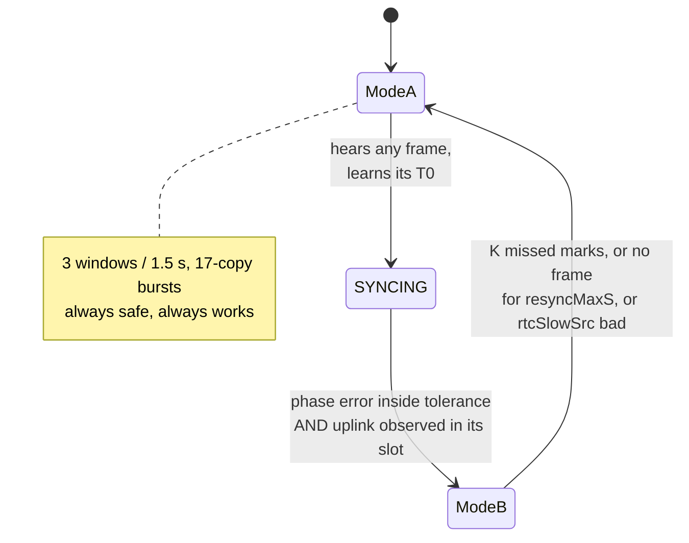

# LoRa blinds — consolidated implementation plan

**Authoritative.** Supersedes the design content of `timed-window-mode-plan.md`
and `superframe-structure.md`, which disagreed with each other on slot geometry,
node count and phase order. `timed-window-node-analysis.md` and the
pre-existing documents (`timing-accuracy.md`, `wake-cost-proposal.md`,
`power-analysis.md`, `optimization-analysis.md`, `protocol-questions.md`) remain
valid as **evidence** and are cited rather than restated.

Target: **~32 nodes**, one mains-powered hub, SX1278 at SF7 / BW500 / CR4-8 on
433.3 MHz.

**Drawings:** `mode-diagrams.md` carries to-scale timing diagrams, message
sequence charts and power-state traces for all three modes. Its SVGs are
generated by `diagrams/gen.py` from a constants block mirroring §2.1 and §4.2, so
they cannot drift from the numbers here.

**Layering:** everything in this document is **MAC-layer** work — the burst
geometry, the slot grid, the guard band and the Class A offsets have no
application-layer term. `mac-layer.md` draws that boundary, stages security and
sequencing as optional sublayers, and defines the KPIs the modes are judged by.

**Tests:** `test-plan.md` carries the per-mode host-test specification and the
on-hardware `ModeTest` mode that annotates the measurements (frames offered /
heard / decoded, phase error, ppm, arm and turnaround residuals). It also lists
**four numbers in this document that its assertions cannot reproduce** — see
`test-plan.md` §9, and §12 below.

---

## 0. Open work — the index

**One place to look, and it holds no reasoning of its own.** Every row points at
the section that argues the case; a duplicated argument is a duplicated thing to
drift, which is the failure mode this whole document is organised against.

Row ids are prefixed **D** (defect), **U** (unwired), **T** (testability) and
**K** (known and accepted). They are deliberately NOT in the `B-1 … B5 / C2 /
HW-n` families, which name the PHASES of this plan and are already spoken for.

**Nothing below is deployed.** The host suite is green at 918 and says nothing
about a roof. That is the largest open item and it is not a row.

### Fixed by the end-to-end suite

`e2e_test` drives the real hub and the real node through whole conversations —
login to a proven session, command to ack, a lost ack, a lost command, a
schedule push. It found two defects on its first run, both of which had been
invisible because every earlier end-to-end scenario drove hand-written mirrors
that agreed with each other by construction.

| what | the sequence |
|---|---|
| **A retried command was undeliverable once any other downlink had arrived.** The replay filter was a bare ratchet (`msgid > rx_id_`), and pack-once retransmits the byte-identical frame — so a retry is never a forward jump. Four retries refused, then the hub tore down a session that was working. Now a **sliding window**: the high-water mark plus a bitmap, so an unseen id behind the mark is accepted once and a true replay still finds its bit set. | cover op = 2, lost on air → TimeSync 3 and ScheduleConfig 4 arrive, mark = 4 → retry of 2 refused |
| **A lost ack was unrecoverable once another command was acked.** `AckCache` held ONE entry, so the next acked command evicted the one about to be retried and B4's recovery could not fire. Now four entries, each with its own re-ack budget. | cover op 2 acked, ack lost → ScheduleConfig 4 acked, evicting 2 → retry of 2 not recognised |

### Bugs — something behaves wrongly today

**None open.** Both rows that stood here needed a decision before they could be
touched, and both decisions were made: D-1 became a new frame type, D-2 turned
out to be already handled by a mechanism pointing the other way. They are kept
struck through rather than deleted, because what each one *concluded* is the
part worth not re-deriving. The list stayed short on purpose: a backlog padded
with work nobody has argued for is how a real item gets lost.

| # | what | where | why it is not done | §ref |
|---|---|---|---|---|
| ~~D-1~~ | ~~**The hub's startup grid demote goes out in the clear**~~ — **FIXED** as `GridDemote`, a fieldless broadcast exempt from the plaintext gate. See §11b. | `broadcast_grid_demote()` | — | §11b |
| ~~D-2~~ | ~~**A copy lost into RX1 is not retried into RX2**~~ — **CLOSED, resolved by design.** The recovery already exists and is NODE-driven: the node re-beacons twice at ~4 s and the hub answers every beacon with a TimeSync, so the node re-*asks* rather than the hub guessing which window to re-aim at. A hub-side RX2 retry would be redundant with it. See §8 C2 for the timeline and the one latent bug the investigation found. | — | §8 C2 |

### Wiring — code that exists and nothing calls

| # | symbol | consequence | §ref |
|---|---|---|---|
| ~~U-1~~ | ~~`LORAListener::hubBelief()`~~ — **CLOSED, and it was more than a sensor.** Publishing the boolean alone would have said what is happening and nothing about why, and a node stuck on bursts pays seventeen copies for every frame. So the hub gained `TxRefusal` + `txRefusalFor()` — one named rung per condition, mirroring the node's `demotionReason()` beside `modeFor()` — and `txPolicyFor` is now *derived* from it rather than repeating the ladder. Two sensors: single-shot active, and the reason it is not. | The enum values are a wire format now that HA reads them, so they are numbered explicitly: append, never renumber. Tested for reachability of every rung with an exhaustiveness check, and swept to prove the derived answer and the published reason can never disagree — two copies of that ladder would drift, and the drift would be silent. | §11a |
| ~~U-2~~ | ~~`LoraInterface::rxBusySkips()`~~ — **CLOSED.** `PhaseReport.rxBusySkips` (field 8) carries it on every ack and wake beacon, the hub stores it and logs when it *grows*, and a template sensor publishes it beside the window-miss rate — which is where it has to be read: a mark that was never armed is invisible to WMR by construction, so a wedged radio shows a flawless miss rate over an empty denominator. | The two side-issues were also real, and one was worse than the row said: **a failed transmit left the node deaf for the rest of a drift test.** `beginCad()` and the stuck-mutex recovery *idle* the radio, which stops reception as dead as sleeping, but only the five `lora_sleep()` sites cleared `cont_rx_armed_` — so a CAD that never came back clear left the flag claiming the radio was armed and `armContinuousRx()` did nothing thereafter. v1.0.33's failure through a door `noteRadioSlept()` did not cover. Also: a busy radio during a drift test no longer counts as a skipped window (continuous RX is released only by an interrupt, so most passes find the mutex busy by design), and the warning is throttled to the first three then every 32nd. | §11a |
| ~~U-3~~ | ~~`CmdDispatcher::noteClassASleepOk()`~~ — **CLOSED, and this row had it backwards.** Wiring it does not break the invariant; **the invariant says what to do.** `sleep_ok` is the *second* way for `classa::nextAction()` to return `Sleep`, so it needs the same clearing rule `noteClassAWindowResult` already applied for the first. `handleTimeSync` passes `sleepOk` through unconditionally — the local auto-sleep guards decide whether to *sleep*, which is a different question from whether a reply is still coming. | The function also wrote `classa_` **bare**, with no `classa_mux_`, on a struct the header documents as cross-core three lines above the member. That would not have been noticed until it had a caller. Safe to wire because `noteUplinkSent` assigns a fresh `WakeState` per uplink, so one round's "nothing further" cannot suppress the next round's RX1 — tested, since that is the one way this could lose a reply. | §11a |
| ~~U-4~~ | ~~`NodeState::in_slot_uplinks`~~ — **CLOSED.** `TimeSync.inSlotUplinks` (field 5) carries the hub's own `in_slot_acks` to the node, which stores it and reads it at every arming decision. The hub answers every beacon with a TimeSync, so it is the natural carrier. Proto3's zero default reads as *not confirmed* and holds the node in Mode A, which is the safe direction; and it deadlocks nothing, because the uplink aim places the node's frames on its mark regardless of mode, so the count can be earned from Mode A. | **The wiring was the smaller half.** It broke no test — because **every `timedRxActive()` test in the suite asserted FALSE.** Nothing anywhere asserted the node *ever* promotes, which is the entire point of Mode B, and that is exactly why a disabled criterion went unnoticed: with it disabled, nothing depending on it could fail either way. Four tests now cover it, including the positive case for the first time, and the withdrawal case — the count is the hub's *current* belief, not a latch. | §11b |
| ~~U-5~~ | ~~`belief_.beacon_missed`~~ — **CLOSED, and "which is a feature" was wrong.** The hub already *had* the prediction: `next_wake_epoch_()`, computed from the node's own vendored scheduler so it does not burst login frames at a sleeping node. Only the comparison was missing. `beacon_overdue_()` is it, gating single-shot and published as a diagnostic. | Two clauses, both load-bearing: the predicted wake has passed by more than a 60 s grace **and** nothing has been heard *since* that predicted wake. The second is not belt-and-braces — in automatic mode the event branch clamps the prediction to `now`, so the first alone would call an awake, beaconing node overdue. Fails **open** on a node it cannot predict: a prediction that cannot be made must never deny single-shot permanently, which is how the old in-slot criterion became unsatisfiable. | §11b |

### Structural — gaps in what can be tested at all

| # | what | why it matters | §ref |
|---|---|---|---|
| T-1 | **`frtosTasks.cpp` is not compiled by the host suite, so the whole interrupt path is unreachable.** — *`LoraInterface.cpp` compiles AND its task body is now callable.* `real_lora_interface_test` builds the real driver and the real file; `loraRxTask`'s body was lifted into `serviceRxWindow` / `armTimedRxWindow` / `armContinuousRx` / `noteRxWindowSkipped` / `transmitOneQueuedFrame` / `beginCad` with no behaviour change (verified by diffing the stripped statement sets, not asserted). 13 tests, three spot-check-verified by breaking production. | What remains is `frtosTasks.cpp` — the DIO0/DIO1 handler, the TX_DONE branch that pairs with `last_tx_len_`, and the ISR timestamps every phase measurement rests on. It needs an ADC shim and the motor/battery task surface. **And one limit that closing T-1 will not lift:** these tests assert the *order* of radio operations, never how long the critical path took, so the log line that sat between the aimed instant and the CAD would still not be caught. That needs a scope, and it is HW-7's number. | §11b |
| T-2 | **Tested and mostly closed; one sized choice left.** The pool is `POOL_SIZE` = 5 against a queue of 20, and a placed frame holds its buffer from `send()` until its mark — so the pool, not the queue, is the real depth, and `real_lora_tracker_test` now pins that: a placed push is accepted exactly 5 times, the refusal is counted (`poolAllocationFailures()`, published as a tracker-wide sensor), and a fired frame returns its buffer, which is why a *rate-limited* fleet push fits in five and an all-at-once one does not. | **This row was wrong in both directions.** "`send()` drops silently" was already false — it returns bool, and `send_aligned_` declined to consume the mark and logged. But `send_aligned_` returned **void**, so no producer could see the refusal, and `send_base_nonce_exchange` committed the new base nonce *before* the send: a refused frame left the hub deriving IVs from a nonce the node had never been told, so nothing either end sent could be decrypted and only a REGISTER recovered it. Both overloads return `bool` now and the nonce is committed only after a successful handoff, leaving both ends on the previous base. **Left open:** whether `POOL_SIZE` should rise to 32 for a simultaneous fleet push (~6.9 KB more static RAM). It is a throughput question rather than a correctness one now that every refusal path recovers, and the hub's RAM headroom is not measurable from a host test. | §8 B1a |
| ~~T-3~~ | ~~`processTxCommand` is not covered end to end~~ — **CLOSED.** Its body is now `serviceTxCommand`, and `runOneTxCommand()` drives one iteration, so the host suite reaches the code that builds every uplink the node sends. The task still loops and blocks; behaviour is unchanged. | This is what made `e2e_test` possible at all. | §11b |

### Accepted — recorded, with the price, not to be fixed

| # | what | the price of closing it |
|---|---|---|
| K-1 | **A compromised node can forge beacons fleet-wide.** Every node holds the same `netKey`. Bounded by what a beacon can do, and why the guard-band clamp stays even for a beacon that verifies. | Per-node signatures on a broadcast, or a hardware root of trust. |
| K-2 | **An unprovisioned node accepts plaintext `ClientConfig`.** Not a defect: the carve-out is what makes provisioning possible at all. | A secret present before the first exchange — burned at manufacture or entered by hand. |
| K-3 | **Drift samples are still taken from unauthenticated frames.** Deliberate: it runs off arrival time alone and feeds no decision. Gating it would make it a measurement of the traffic pattern rather than of the crystal. | Nothing worth paying. |

### Measurements — nothing here can be settled from the repositories

Nine, in §12, mapped to bench procedures in `test-plan.md` §10.6. Seven close
on-node with no external instrument using the `ModeTest` mode. Two now gate work
that has already shipped:

| ref | measurement | what it gates |
|---|---|---|
| §12.2 | **`T_detect`** | Turning Mode B on at all. It sets the entire late-side guard and is a rule of thumb today. |
| §12.7 | **Node DRAIN + build turnaround** (HW-7) | Whether the uplink aim ever hits its mark. The node's own hit/miss counters are what will say. |
| the rest | §12.1, 12.3–12.6, 12.8–12.9 | Battery figures, the servable-slot count, and one deployment decision. |

---

## 1. Three modes, two tracks

| mode | shape | node population | status |
|---|---|---|---|
| **A — burst / windowed** | 3 RX windows per 1.5 s, 17-copy downlink bursts | every node, always available | **exists today; kept permanently** |
| **B — timed interactive** | 1 RX window per 1.5 s at an assigned slot, single-copy downlink | interactive nodes, once synced | new |
| **C — auto** | LoRaWAN Class A: uplink, then RX windows at fixed offsets from the node's own transmission, then sleep | automatic-mode nodes | new |

Mode A is not a legacy path being replaced. It is the **acquisition and recovery
path for B**, and the permanent fallback when anything is uncertain. Every node
starts there and returns there.

Modes B and C target different populations and do not compete for the same
milliamp (`timed-window-node-analysis.md` §10). But they are **only partly
independent**, and an earlier draft of this document overstated it:

```
auto nodes        : C0 ── C1  (independent, cheap, ship first)
                    C2 ── requires B-1, B5 and hub RX timestamping  ← NOT independent
interactive nodes : B-1 … B5
```

**C0 and C1 are genuinely independent** — pure logic changes on paths that need
no timing, delivering 28.1 s → 7.7 s per wake on their own (§5.2). Do them first
regardless of anything else.

**C2 is not.** Class A is a *two-ended* contract. The node's half exists today
(§5.3); the hub's half does not exist at all (§5.4), and building it needs most
of Track B plus one item Track B does not contain. §8 prices C2 accordingly.

**Scoping consequence:** if the fleet skews automatic, C0+C1 is the cheap
independent win — but C2 is not, and must not be costed as though it were the
same size of change as C1.

**Scoping note.** Mode B's benefit scales with the number of *interactive*
nodes, not with 32. Mode C's benefit scales with the number of *automatic* ones,
and the automatic population also sets Mode A's contention load. That split
should be decided before committing effort to either track.

---

## 2. Common foundations

These apply to all three modes and are the first work in either track.

### 2.1 The reference point: T0 = SFD end

Every instant in this document is relative to **T0, the end of the LoRa
start-frame delimiter**.

```
air_start                    T0 = SFD end      (ValidHeader)          RxDone
    |                              |                 |                   |
    |<-- n_pre up-chirps --><-sync-><-SFD->|<- header 8 sym ->|<- payload ... ->|
    |<------------ 3136 us --------------->|<--- 2048 us --->|
```

At SF7 / BW500, `T_sym = 2^7 / 500 000 = 256.0 µs`:

| interval | symbols | µs |
|---|---|---|
| `T_pre` — air start → **T0** | `n_pre + 4.25` = 12.25 | **3136** |
| `T_hdr` — **T0** → ValidHeader (*structural only, DIO3 not routed*) | 8 | 2048 |
| **`T0` → RxDone** | **`n_sym(len)`** | **18 432 … 92 160** |

Both ends name T0:

- **hub:** `T0 = t_fire + d_tx_ramp + T_pre`, where `t_fire` is the `esp_timer`
  reading taken at the single SPI write that starts transmission.
- **node:** `T0 = t_rxdone − n_sym(len)·T_sym` — **one line, not a decomposition.**
  Subtracting `T_pay` and `T_hdr` separately is arithmetically identical and
  invites a −2.048 ms double-count; an earlier draft made exactly that error.

DIO2 and DIO3 are **not routed to the CPU** on the node PCB, so ValidHeader is
unavailable and RxDone is the only timing event. That costs no measurable
accuracy: both paths carry identical ISR and light-sleep wake latency, and those
dominate. It trades a calibration risk for a software-correctness risk, which
§2.2 discharges.

Frame reference:

| on-air bytes | `n_sym` | time on air |
|---|---|---|
| 25 (ack) | 72 | 21.57 ms |
| 45 (beacon) | 120 | 33.86 ms |
| 60 (routine command) | 152 | 42.05 ms |
| 152 (8-entry `ScheduleConfig`) | 360 | 95.30 ms |

### 2.2 `LoraTiming.h` — the first deliverable

One shared, dependency-free implementation of `T_sym`, `T_pre`, `T_hdr` and
`n_sym(len)`, compiled by hub, node and host tests. **It is the reference point**
— nothing else can check it.

Pinned by test against: `T_pre = 3136 µs`, 42.048 ms @ 60 B, 95.296 ms @ 152 B,
and the convention `PL = RegRxNbBytes` (which excludes the CRC; the formula's
`+16·CRC` term accounts for it separately). That last one matters more than a small
bias: because the ceil term steps in blocks of `(CR+4) = 8` symbols per 28 bits,
a two-byte error in `PL` is worth **0 or 2.048 ms, discontinuously**, depending
where it falls relative to a block boundary (`PL = 58, 60 → 152 symbols;
PL = 62 → 160`). It would look like an intermittent crystal fault.

Also pinned: the hub's burst copy spacing must stay **88 000 µs exactly**, and
any grid period must be an exact integer number of milliseconds.
`DriftEstimator.h:47-70` records that `1500/17` as 88.235 ms rather than the
hub's integer 88.000 cost three firmware revisions at −2663 ppm; a microsecond
timer invites the same mistake.

### 2.3 Timebase

| clock | source | resolution | survives light sleep | used for |
|---|---|---|---|---|
| `esp_timer` | TG0 LAC ← APB ← 26 MHz XTAL | 1 µs | no — IDF adds RTC-measured sleep time on wake | all timestamps and scheduling, both ends |
| RTC slow | **external 32.768 kHz crystal** (`CONFIG_RTC_CLK_SRC_EXT_CRYS=y`) | 30.5 µs | yes | carries the node's phase across sleep |

Everything reads `esp_timer_get_time()`. Nothing *schedules* on the FreeRTOS
tick — 1000 Hz on the hub, **100 Hz on the node**.

~~But the tick is not yet out of the path: every SPI register write on both ends
is gated by `xSemaphoreTake(xSemaphore, (TickType_t)1)` and silently does nothing
on timeout.~~ **FIXED, both ends** (§10). Both `lora_write_reg` and
`lora_read_reg` now wait on the mutex rather than skipping; the read's buffer is
initialised, because it returned `in[1]` on both paths and a timeout on
`REG_IRQ_FLAGS` therefore read as stack garbage. The tick is out of the transmit
and arm paths too — see B5 in §8 for what came off each end.

### 2.4 Prepare / fire — separating the timing-critical path

**The timing-critical operation is a single SPI register write. Nothing else
happens between the timer firing and that write.** Everything with variable
duration — FIFO transfer, protobuf, crypto, logging, NVS — moves before the mark
or after the event. This applies to hub TX, node RX arming and node TX alike.

| phase | work | timing-critical |
|---|---|---|
| **PREPARE** (≈20 ms before) | radio mutex, standby, FIFO fill **in one SPI transaction**, payload length | no |
| **FIRE / ARM** (at the mark) | one polled SPI write: `RegOpMode = TX` or `= RX_SINGLE` | **yes** |
| **SETTLE / DRAIN** (after) | TxDone or FIFO read, decrypt, dispatch, log | no |

Hub timing marks: FIRE at `T0 − (T_pre + d_tx_ramp)` = `T0 − 3356 µs`.
Node timing marks: ARM at `T0 − (T_pre + G)` = `T0 − 17 216 µs` (§4.2).

Five changes make the hub deterministic. Four are convergence with the node,
whose fork of the same driver already made them:

1. **Prepare/fire split** — the FIFO fill is ~1 ms today and **payload-dependent**
   (one SPI transaction per byte), so it must leave the timing path.
2. **One burst SPI transaction for the FIFO**, both ends. Removes the
   payload-dependent bias that no time-on-air correction can undo, and removes
   ~60 chances per frame for the silent register-write drop of §2.3.
3. **Delete `esphome::delay(1)` from `lora_idle()` and `lora_tx()`** on the hub —
   use the `esp_rom_delay_us(120)` / `(220)` values already commented out beside
   them. The node did this already.
4. **Move `ESP_LOGI("Sending packet…")` out of the mutex and after FIRE**
   (`lora_tracker.cpp:496`). Its cost is **unverified** — `sendPacketBurst` runs
   off the ESPHome main task and the logger may buffer — but it has no business
   in the path either way.
5. **Hoist the six per-packet config writes** (SF/CR/BW/sync/CRC, never change)
   into `setup()`.

Two constraints on the ARM callback, both verified:

- `ESP_TIMER_ISR` dispatch is **not compiled in**
  (`# CONFIG_ESP_TIMER_SUPPORTS_ISR_DISPATCH_METHOD is not set`, `sdkconfig:1811`),
  so every callback runs in `ESP_TIMER_TASK` at priority 22;
- and it would not help, because `spi_device_polling_transmit()` acquires the bus
  lock and is not ISR-callable. `CONFIG_SPI_MASTER_ISR_IN_IRAM=y` places the
  *driver's* ISR in IRAM, which is a different property.

So ARM stays a priority-22 task dispatch: **±100 µs typical, milliseconds at the
p99** until NVS writes are moved off the RX path.

### 2.5 Light sleep and the RxDone timestamp

Production runs `light_sleep_enable = true` (`SystemCtrl.cpp:444`) and **nothing
in the node arms a GPIO light-sleep wake source** — `grep` for
`gpio_wakeup_enable` / `esp_sleep_enable_gpio_wakeup` returns zero hits, and
`pm_lock_handle_rx` (`main.cpp:99`) is declared but never created.

Because DIO0 is level-triggered the packet is not lost — it waits in the FIFO
and the ISR runs at the next wake. **The timestamp is lost**: it records when the
CPU woke, up to 500 ms late. That is why the drift test disables light sleep
outright, and it is the single prerequisite for any phase tracking.

**Fix: arm GPIO light-sleep wakeup on DIO0 *and* DIO1.** DIO1 matters because
the empty-window path ends on RxTimeout, which is what runs `lora_sleep()`
(`frtosTasks.cpp:272-274`); arm DIO0 only and the radio sits in STANDBY (~1.5 mA)
for most of every round — a term that alone exceeds the whole 1.2 mA node
average.

Two cautions:

- The level wake source stays armed across `gpio_intr_disable`, which the ISR
  does on entry (`myinterrupts.cpp:36-37`). Any path leaving an IRQ flag set —
  the unhandled branch at `frtosTasks.cpp:218-224` — leaves DIO0 asserted, and
  automatic light sleep then refuses to sleep or thrashes. **The wake source must
  be disarmed in step with every `gpio_intr_disable`**, and the gate for this
  work must include a sleep-residency check, not just timestamp quality.
- **Do not hold `ESP_PM_NO_LIGHT_SLEEP` across the window instead.** It costs
  ~0.4 mA and takes the change from 26.2 to ~25.5 mAh/day against 18.4 with the
  CPU asleep — it would erase the entire battery win.

`CmdDispatcher.cpp:2154-2158` justifies `esp_pm_configure` over a PM lock on the
grounds that "the lock leaves automatic light sleep armed underneath". That is
almost certainly a misdiagnosis of a lock that was **never created**:
`esp_pm_lock_create` is called exactly once in the tree, for the motor
(`MotorCtrl.cpp:200`).

---

## 3. Mode A — burst / windowed (today, kept)

Unchanged: the node listens in 3 windows of 29.44 ms every 1.5 s
(`symTimeout = 115`, `LoraInterface.cpp:347`); the hub sends 17 copies at 88 ms.

**Why it stays.** It is the only path that works without clock agreement, and it
is what every node uses to acquire one. Reception geometry, derived in closed
form:

| configuration | closed form (window width) | **measured (physical)** |
|---|---|---|
| 3 windows, 17 copies | 96.4 % | **95.3 %** |
| 1 window, 17 copies, unsynchronised | 32.9 % | **31.9 %** |
| 1 window, 1 copy, synchronised | ~100 % | 100 % |

**The measured column is the one to quote.** The closed form uses the window
width `w` as the catch width. Physically a frame must BOTH start after the
window opens AND complete detection before it closes, so the usable width is
`W − T_detect = 29.44 − 1.28 = 28.16 ms` — which is exactly `2G`, the guard band
already derived in §4.2. The two derivations were inconsistent with each other
and nobody noticed, because the closed form was only ever checked against an
enumeration of itself.

Measured by `tests/proto_sim/scenarios/air_channel_test.cpp`, which runs the
frames past a receiver that opens and closes (`sim/air_channel.h`). The
conclusion is unchanged and slightly strengthened: three windows still beat one
by 3×, and the honest figure is ~1 point lower than advertised in both rows.

Copy *i* leaves at `88i`; it is caught iff `(x + 88i) mod P ∈ [0, w)` with
`w = 29 ms` (the window rounded down — use the same `w` in the predicate, the
union and the table, or §9's test will not reproduce these figures; at 29.44 the
answers are 96.9 % and 33.4 %). At
`P = 500` the residues sort to gaps of 28 ms (×11) and 32 ms (×6), so the union
is `11×28 + 6×29 = 482` of 500 → 96.4 %. At `P = 1500` all 17 gaps exceed the
window, so the union is `17×29 = 493` of 1500 → 32.9 %.

Treating the three windows as independent gives 69.8 % and is **wrong by 27
points**: 88 ms against 500 ms sweeps the copies almost uniformly across the
window period, so they are strongly anti-correlated. That anti-correlation *is*
`optimization-analysis.md` §2's "tuned to the window scheme".

**What changes in Mode A: nothing on air.** The only new requirement is that the
hub's scheduler knows which nodes are in Mode B, so it can defer a colliding
private-window transmission by one round (§4.5).

---

## 4. Mode B — timed interactive (Class B shape)

### 4.1 What the node does

One 29.44 ms RX window per 1500 ms round, at its assigned slot phase, plus one
extra window in the shared beacon slot every beacon interval.

Receive duty **5.9 % → 1.96 %**; interactive battery **26.2 → 18.4 mAh/day**;
command latency unchanged at ≤1.5 s.

### 4.2 The round: 32 slots in 1500 ms

```
T0_k = A + n·1 500 000 µs + k·46 875 µs          k = 0 … 31
```

```
 round n, 1500 ms
 |<-------------------------------------------------------------->|
 |  k=0     k=1     k=2     k=3     k=4    ...              k=31   |
 |  ┌──┐    ┌──┐    ┌──┐    ┌──┐    ┌──┐                    ┌──┐   |
 |  │29│    │29│    │29│    │29│    │29│       ...          │29│   |
 |  └──┘    └──┘    └──┘    └──┘    └──┘                    └──┘   |
 |  <-46.9->      ↑ 17.4 ms clear between adjacent windows          |
```

- window k spans `[T0_k − 17.22 ms, T0_k + 12.22 ms]`
- adjacent windows are 46.875 ms apart with **17.4 ms clear** — no overlap
- `A` is the grid anchor, set once when the grid starts, never moved

**The guard band comes free from the existing symbol timeout.** Arm at
`T0 − (T_pre + G)` and the tolerance is symmetric:

```
G = (N_symtimeout·T_sym − T_detect) / 2 = (29.44 − 1.28) / 2 = ±14.08 ms
```

- early by `e`: preamble starts at `T0 − T_pre − e`, inside the window while `e ≤ G`
- late by `l`: detection completes at `T0 − T_pre + l + T_detect`, before close while `l ≤ G`

Three things this rests on, two unverified:

- **Detection stops the timeout** — a 95.3 ms `ScheduleConfig` is received today
  inside a 29.44 ms window, so the SX1278 demonstrably does not abort a packet
  in progress. Empirically settled; worth stating.
- **`T_detect ≈ 5 symbols` is a LoRaWAN rule of thumb**, not a datasheet number,
  and it sets the entire late-side margin. `RegDetectionOptimize` /
  `RegDetectThreshold` are never written (`LoraInterface.cpp:78-82`), so they sit
  at reset defaults. **Bench item.**
- **The 29.44 ms window is an accident.** `symTimeout = int(30.0f/0.26f)` came
  from a comment claiming "20 ms per packet"; real frames are 42–95 ms. Pin it as
  a named constant before shipping Mode B.

### 4.3 How many nodes the hub serves per round

A transmission is wider than a window, so serving node *k* also covers
neighbours' windows. Counting hub frame plus node reply:

| downlink | hub occupies (rel. `T0_k`) | next servable slot | nodes/round |
|---|---|---|---|
| ack, 25 B | −3.1 … +60.0 ms | k+2 | 16 |
| routine command, 60 B | −3.1 … +80.5 ms | **k+3** | **10** |
| `ScheduleConfig`, 152 B | −3.1 … +133.7 ms | k+4 | 8 |

The 20 ms turnaround in that table is **assumed, not measured**, and it is
exactly §2.4's PREPARE lead — so it budgets **zero** for DRAIN (a 152-byte
per-byte FIFO read, protobuf unpack, AES-GCM decrypt and three queue hops across
priority-6 tasks, on a CPU scaling down to 40 MHz). The true turnaround is
`DRAIN + build + 20 ms`. Sensitivity: the k+3 headline survives a turnaround up
to **62.9 ms**, k+4 to 56.6 ms, but **k+2 breaks above 36.5 ms**. Measure it
(§12).

**The uplink instant is deliberately left unspecified, and that is a gap.** An
earlier design fixed `T_ul_off = 150 000 µs` and carried `ulOffsetUs` in
`GridSync`; this document replaced it with "the node replies immediately after
the downlink" while keeping "an uplink **observed in its slot**" as §4.6's
promotion criterion — a slot the protocol then does not define. Making the
uplink instant a function of node-side processing latency is also precisely what
§2.4 exists to forbid.

**Resolution:** `ulOffsetUs` is restored to `GridSync` (§6). The node replies at
`T0_k + ulOffsetUs`, not "immediately", and §4.6's promotion test means what it
says. The value must be ≥ the measured DRAIN + build time.

**CAD is dropped in Mode B, and this document must say so.** The slot *is* the
arbitration. If CAD were retained, the unconditional pre-CAD backoff of
`29·(1..10)` ms — quantised to 20…290 ms at the node's 100 Hz tick
(`LoraInterface.cpp:467`) — would make both the turnaround and "in its slot"
impossible. Mode A keeps CAD unchanged.

At 3.5 commands/node/day the servable-slot limit almost never binds. Where it
does:

| clustered event (all 32 nodes) | airtime | **elapsed** |
|---|---|---|
| today, back-to-back bursts | 22.9 s | **59.2 s** |
| Mode B, 10 per round | 4.7 s | **6.0 s** |

The elapsed column is the one that matters and an earlier draft quoted only
airtime under an elapsed heading. Today a burst is `16×88 + 42.05 = 1450 ms` and
`sendTask` then blocks a further `responseWindowMs = 400 ms`
(`lora_tracker.cpp:310`) before dequeuing — **1850 ms per node**, 59.2 s for 32.
The error understated Mode B's advantage by ~10×.

### 4.4 The beacon slot

**The 32 private windows are at 32 different phases, so one broadcast cannot
reach them all.** The beacon therefore needs its own instant that every node
opens, on beacon rounds only (`n mod M == 0` for a published `M`).

Cost to the node: one extra 29.44 ms window per beacon interval — 0.1–0.4 % more
listening. Cost to the hub: **flat in node count.**

| | 32 nodes, 3.5 cmd/node/day | occupancy |
|---|---|---|
| today, all burst | 80.1 s/day | 0.093 % |
| Mode B + **unicast** keepalive @5.8 min | 274.5 s/day | 0.318 % — **3.4× worse** |
| Mode B + **broadcast** beacon @5.8 min | **13.1 s/day** | 0.015 % — **6× better** |
| Mode B + broadcast @58 min | 5.5 s/day | 0.006 % |

Same mechanism, opposite sign, purely because of N. **A unicast keepalive is not
viable at 32 nodes.**

**The beacon interval is bounded by how well the node knows its clock:**

| clock knowledge | maximum interval |
|---|---|
| unmeasured, ±20 ppm crystal spec | **11.7 min** |
| measured to ±2 ppm | **117 min** |

**State the safety factor once:** the airtime table above prices **half** these
ceilings — 5.8 min and 58 min — leaving 50 % margin for ppm uncertainty and for
a lost beacon (which doubles the elapsed time since sync). Those two numbers,
not the ceilings, are the operating points. Two softeners: ordinary traffic also refreshes the phase,
so the beacon covers only the gaps; and `symTimeout` is a runtime write, so the
window can widen while sync is stale (200 symbols → ±25.0 ms, 3.41 % duty,
holds 20 ppm for 20.8 min — still better than today's 5.9 %).

**BUILT.** `GridBeacon` on the wire, `LORATracker::serviceBeacon()` transmitting
it from the loop, and the node opening a beacon window and re-anchoring off it.
It is the tracker's rather than a listener's for the same reason the anchor is:
one grid per radio, one beacon for the fleet — 32 per-listener beacons would BE
the unicast keepalive priced below. Three things were needed before it could
work at all, and each was its own defect:

- **The two ends numbered rounds differently.** `send_grid_sync` declared
  `txround = 0` while the frame went out in some later round, so the node
  numbered its rounds from wherever the frame happened to land and "beacon
  round" meant something different at each end. The mark it will be placed on
  is now chosen BEFORE the frame is built (`nextPlacementT0_`, shared with
  `send_aligned_` so the two cannot answer differently) and the true round is
  declared.
- **A node that skipped its window would have skipped the beacon too.** The
  skip permission drops the private window only; `gridstate::nextWindow` never
  skips the beacon, because the beacon is what grants and revokes the
  permission and what expires it when it goes missing.
- **The plaintext gate would have refused it.** A node holding a session
  refuses every unauthenticated frame, and one broadcast cannot be SEALED with
  32 per-node session keys. `CMD_GRIDBEACON` stays exempt from that gate —
  the gate asks "was this encrypted?" and a broadcast's answer is permanently
  no — but it is no longer unauthenticated: it is **SIGNED**. See below. It is
  exempt from the replay filter for a different reason: a broadcast belongs to
  no per-node sequence, and running it through one would ratchet every node's
  rx counter onto the beacon's.

### The beacon is authenticated: AES-CMAC under a fleet key

**A MAC, not an AEAD, and the distinction is the whole design.** Nothing in a
beacon is secret — `txRound`, `txSlot` and the bitmap are all public — so what
it needs is *authenticity*, not confidentiality. Extending the existing AES-GCM
to a one-to-many key would need a shared base nonce **and** a counter that never
repeats under it; a hub reboot restarts that counter while every node still
holds the key, so it would have to be persisted in NVS, and the penalty for one
repeat is total rather than partial: two AAD-only tags under the same nonce
yield `GHASH(H,A₁) ⊕ GHASH(H,A₂)`, a polynomial solvable for the hash subkey
`H`, after which beacons can be forged at will. **AES-CMAC has no nonce to
reuse**, so none of that state exists to get wrong.

**Freshness is not the MAC's job.** A replayed beacon declares the round it was
minted for, so its predicted mark is rounds in the past and `reanchorIsSane`
refuses it on arithmetic alone. The MAC carries no timestamp and only has to
stop forgery.

**The key needs no new bootstrap secret**, which is what makes it cheap. Every
node already has a per-node AEAD session, so `netKey` rides an ordinary
encrypted `GridSync` and rotates the same way — adopted **only** from an
authenticated frame, because a plaintext `GridSync` that could install the key
would make the MAC decorative. It is minted in `startGrid()` alongside the
anchor and re-minted on every hub restart, which costs nothing: a restart
already invalidates every node's anchor and forces `GridSync` to be
re-published, so the key's lifetime is exactly the grid's and there is nothing
to persist. `netKeyId` is random rather than a counter for the same reason.

**The ratchet, on the node.** A node holding **no** key behaves exactly as
before — a beacon may correct the anchor within the guard and may never touch
the mask — so nothing regresses on a node that never receives one, and this
ships safely ahead of the hubs. A node holding a key requires a matching id and
a valid tag, or the beacon is ignored **entirely**: no re-anchor, no phase
sample, no mask. Tolerating an unsigned beacon once forgery is detectable would
leave the attack open, because an attacker would simply omit the tag — and the
guard band does not close it, since it bounds ONE nudge rather than a sequence
of them. **That anchor walk is what the MAC buys today**, not Tier 3.

**Residual, stated rather than implied:** any compromised node holds the fleet
key and can forge beacons for the whole fleet. That is inherent to one-to-many
authentication without per-node signatures, and it is why the guard-band clamp
on re-anchoring stays *even for a beacon that verifies*.

**Tier 3 (the pending mask) is still published all-listening, deliberately.**
Two independent things had to be true before this hub could clear a bit. **One
of them is now true and the other is not.** The nodes will now accept a mask —
that was the fleet key's job and it is done. But a clear bit remains a promise
the hub cannot keep for an INTERACTIVE node: Home Assistant can produce a
command at any instant and the node would not be listening for up to 5.8
minutes, which is the opposite of what "timed interactive" is for. Tier 3 suits
automatic-mode nodes, which are already unreachable between check-ins by design
(§5.5). *Being able to authenticate a bit and being willing to clear one are two
separate decisions; only the first is made here.* The mechanism is now proven
end to end — the seam test drives the hub's tag against the real node's verify —
and what is published is `pending::allListening()`.

**The beacon is not optional.** With it off, a node holds phase only for
`resyncMaxS` after each frame — at 3.5 commands/day and the ±20 ppm ceiling of
704 s that is `3.5 × 704 / 86400` = **2.9 % of the day** in Mode B, and there is
no measurable battery saving. (An earlier draft said 5.6 %, having summed across
two nodes a per-node fraction; the correct figure strengthens the conclusion.) The beacon is the mechanism
that keeps the node in the mode, so it ships **with** the one-window change, not
after it.

**The beacon needs a slot *position*, not just a period.** `beaconEveryRounds`
says *which* rounds; nothing says *which instant within them*. And the beacon is
not covered by §4.3's servable-slot rule, which governs unicast traffic only —
so if it were placed at slot 0's `T0`, its 33.86 ms of air would run from −3.1 to
+30.7 and cover slot 1's window opening at +29.66, **systematically blinding the
same node on every beacon round**. `beaconSlotIndex` is added to `GridSync` (§6),
and the hub must leave `ceil(33.86 / 46.875) = 1` slot clear after it.

~~Optional later: the beacon may carry a 32-bit pending-data bitmap~~ —
**BUILT.** `PendingData.h` (shared, gated, 11 tests) plus `GridSync.pendingMask`
and `pendingMaskValid`. A node whose bit is clear skips its window; at the
default 233-round cadence that is up to 349 s of skipped windows on one beacon,
which is the saving and also why the two rules below are strict.

**Absent is not empty.** A zeroed proto3 field is indistinguishable from a
deliberate "nothing for anyone", so validity is carried by its own flag and an
invalid mask means *listen*. Without that, the first beacon that omitted the
field — or the first hub firmware that did not know it — would put the entire
fleet to sleep.

**A skip must expire.** Not "until the next beacon" but *at the round the next
beacon is due*, whether or not it arrives. A node that skipped until a beacon it
then missed would be deaf for nearly six minutes; one that kept trusting a stale
mask would be deaf indefinitely. Every uncertain path — no cadence, a round
before the beacon's own, an out-of-range slot — returns "listen", because the
failure is silent: a node that skips wrongly reports nothing, it just stops
hearing.

The hub half is honest rather than complete: a `LORAListener` knows only its own
pending traffic, so it publishes its own bit and sets every other. Setting them
is the safe direction. A fleet-wide mask has to come from the tracker, where the
queues are.

### 4.5 Mixed modes: priority, not a reserved region

While node 1 is in Mode B and node 2 is in Mode A, node 2's 17-copy burst spans
1.4 s and walks through node 1's window 81 % of the time (42 ms copies every
88 ms leave a 46 ms gap; a 29.44 ms window fits with 17 ms of freedom).

**Do not reserve a contention region.** An earlier draft proposed ~300 ms; the
arithmetic kills it, because confining copies destroys the incommensurate
sweep that makes the burst work:

| copies × region | P(heard)/round | to 99.9 % |
|---|---|---|
| 3 in 300 ms | 17.7 % | 36 rounds — **54 s** |
| 5 in 400 ms | 29.4 % | 20 rounds — 30 s |
| **17 across the round (today)** | **96.4 %** (§3) | 2 rounds — **3 s** |

**The rule instead:** when the hub has unsynced-node work it runs a normal
full-round burst, and defers any colliding private-window traffic by one round.

```
P(a given node needs a frame in a given round)  = 3.5 / 57 600 = 6.1e-5
P(any of 32 nodes does)                          = 1.9e-3
bursts/day (32 nodes × 4 deep-sleep wakes)       = 128
× 30/32 windows a burst actually blinds           = **0.23 per day**
```

A quarter of one command per day. All 32 slots stay available and acquisition
stays at 3 s.

**"Defer by one round" is wrong, and the API could not express deferral at
all.** *(B1a has since closed the second half of this: `TxPolicy::earliest_us`
expresses it and `sendTask` honours it. The reasoning below is kept because it
is why the answer is two rounds and not one.)* A burst occupies 1450 ms and `sendTask` then blocks a further 400 ms
(`lora_tracker.cpp:310`) — **1850 ms against a 1500 ms round**, so a frame
deferred to round n+1 lands inside the same burst's response window on the same
serialised task. Deferral must be **by two rounds**, or the response window must
go — and removing it breaks what it was added for (`lora_tracker.cpp:299-304`:
keeping the channel clear for the addressed node's deferred reply).

And downlinks reach the radio through **one FIFO queue** (`data_queue` →
`sendTask` → `sendPacketBurst`), which blocks that task for the whole burst.
Deferring one frame past another needs a **reordering, time-scheduled transmit
queue on the hub**. B-1's `send(buf, len, {copies, first_mark_us, copy_stride_us})`
places a single frame; it gives no way to say "not before round n+2, and behind
nothing else". **That queue is the real work item behind §4.5, and it is now a
phase of its own (§8, B1a) — and it is built.**

**Consequence for demotion:** the node's "M empty windows" test is blinded by
this — a window walked through by another node's burst is *not* empty. The
counter must key on **"no frame addressed to me at my mark"**, not on "nothing
received".

**Both estimates above are now measured** (`mixed_mode_test.cpp`, against the
air-channel model rather than the closed form):

| estimated here | measured |
|---|---|
| "walks through node 1's window 81 % of the time" | a copy occupies 42.048 ms of a 46.875 ms pitch — **47 % of its 88 ms stride**, and the *union* of 17 copies denies **31 of 32 slots** |
| "× 30/32 windows a burst actually blinds" | **31/32**. Only the last slot survives, and only because the 17th copy ends before it |

The mechanism is worth stating because it is not obvious from either number: the
88 ms stride is **1.878 slot pitches**, so successive copies walk *across* slot
boundaries instead of landing on them, and each copy's 42 ms shadow clips the
slots on both sides. The incommensurate sweep that makes the burst reliable
(§3) is the same property that makes it total.

So there is no hole to interleave into. Mixed operation cannot mean "both at
once" in a round where a full burst runs; it means either the Mode A node is
served with a **single copy** (B4's remaining half — which the same tests show
costs exactly one slot, wherever it is placed), or that round belongs to the
burst and to nothing else. That is what B1a's deferral has to encode.

The demotion consequence is measured too, and it splits in two: of the 31
denied slots, some hear **silence** and some hear a **frame addressed to another
node** — `detected` and `crcValid` both increment on the latter while
`addressed` does not. A KPI that stopped at `detected` would read that as a
healthy link, which is why `MacFunnel.h` does not stop there.

### 4.6 Promotion and demotion



**The asymmetry rule**, which is the whole safety argument:

1. the node may drop to Mode A **unilaterally, at any moment**;
2. the hub may send single-shot **only** with positive, recent confirmation that
   the node is in a timed window — the last K acks arrived in their slots;
3. **any hub uncertainty → burst**: reboot, session change, missing beacon, stale
   confirmation, unknown firmware version;
4. a single shot that goes unacked is retried **as a burst, immediately**.

That makes the one dangerous combination — hub single-shot while the node is
windowed, ~6 % hit rate — unreachable by construction. Promotion requires an
uplink **observed in its slot**, not a claim: a beacon saying "I am ready" is not
evidence that the node's window is where it thinks.

Demotion is immediate, promotion needs a long baseline, and no promotion within
**10 minutes** of a demotion (an earlier draft left this as "X minutes"; the
value matters because at `beacon_interval_s = 0` a node would otherwise flap
several times a day — see §7).

**A hub reboot must force an immediate broadcast demote.** `A` is "set once and
never moved", so after a restart the hub holds a new anchor on a fresh
`esp_timer` epoch while all 32 nodes still hold the old one. Rule 3 covers the
hub's own behaviour, but each node would independently burn up to `resyncMaxS`
(11.7 min) of missed windows before demoting — and the beacon that would
re-anchor them is placed on a grid they no longer share. The hub must burst a
`GridSync{enable=false}` on startup, before anything else.

**Mode B is gated on `rtcSlowSrc` reporting the 32 kHz crystal.** A node on the
internal RC oscillator (~5 %) stays in Mode A permanently, visibly in Home
Assistant rather than silently.

### 4.7 Reliability

**100 % cannot be ensured, and is not ensured today.** The 96.4 % of §3 is
geometry only; 433 MHz is shared with weather stations, garage remotes and alarm
sensors. Reliability comes from **acknowledgement and retry**, which already
exist (`kOpMaxRetries = 4` at `kOpRetryIntervalMs = 3000`):

| per-frame success `q` | after 4 retries | + burst fallback |
|---|---|---|
| 0.90 | 99.999 % | 100 % |
| 0.50 | 96.9 % | **99.99998 %** |
| 0.30 | 83.2 % | 99.961 % |

The burst fallback's statistics are independent of the timed attempt **against
interference**, which is what buys the last decimal places. They are **not**
independent against §4.5: the hub running a full-round burst for an unsynced node
is exactly when a timed node's window is walked through *and* when the single
serialised TX task is blocked for 1850 ms and cannot issue the fallback. Those
two failure modes share a cause, so the final decimal places are not there in
that case. **The frame structure's job is to make the
first attempt cheap — 42 ms instead of 715 ms — not certain.**

**The one genuine regression:** a single copy loses the time diversity that 17
copies gave against bursty interference.

**A second window is not available at 32 slots.** An earlier draft proposed two
windows 750 ms apart and defaulted to it. The arithmetic forbids it:

```
750 / 46.875 = 16.000 exactly
```

so every node's diversity window would sit **precisely on node (k+16)'s primary
`T0`** — not a probabilistic overlap but an exact, systematic one across all 32
nodes, halving the usable grid to 16 slots and contradicting §4.3 and §4.4.

Nor is a different offset the fix. A window is 29.44 ms against a 46.875 ms
pitch, so it occupies **62.8 %** of a slot; any second window overlaps *some*
node's primary window wherever it is placed. **At 32 slots, `windowsPerRound > 1`
and a full grid are mutually exclusive.**

The honest options, none free:

| option | cost |
|---|---|
| fewer slots (16), two windows each | halves node capacity |
| a per-node second-window offset the hub schedules around | the hub must solve a placement problem every round |
| **put the diversity copy in the same slot a round later** | that is simply a retry — and §4.7's table already prices retries better |

**So `windowsPerRound` defaults to 1**, and time diversity comes from the retry
ladder rather than from a second window. Keep the field in `GridSync` for a
future smaller-N deployment, but it is not the dial this document claimed.

**Retry semantics.** A burst retry must reuse the msgid **and retransmit the
byte-identical frame**. Two constraints force it: the node's replay filter
requires `msgid > rx_id_` (`SessionManager.cpp:111-121`), so a fresh msgid means
the node executes the command twice; and the AEAD nonce is msgid-derived
(`lora_client.cpp:256`), so a reused msgid with *different* plaintext is GCM
nonce reuse. The hazard is narrow and sharp: `tx_tracked_op_` re-reads
`op_position_` at pack time, so a user changing position mid-retry would encrypt
different plaintext under the same nonce.

This leaves a gap the protocol cannot currently express — **"arrived, but the ack
was lost"**. The node must answer a replayed msgid with a **cached ack** rather
than dropping it. Required before single-copy downlink becomes normal, because
that is when retries stop being rare.

---

## 5. Mode C — auto (LoRaWAN Class A)

### 5.1 The shape

The node uplinks when it wants, opens RX windows at **fixed offsets after its
own transmission**, and sleeps if they are empty.

**This needs no clock agreement.** The window is referenced to the node's own
transmission, which it timed itself — no drift, no ppm, no beacon, no grid. That
is precisely why it works for a node that has just booted with no phase, which is
every auto-mode wake.

### 5.2 What it replaces

Today the node infers "the hub has finished" from **silence**, using a fixed
timeout (`automode::kQuietWindowMinMs`). Measured: a check-in wake costs 28.1 s,
of which the real work finishes at 4.7 s — **73 % of every wake is the node
proving a negative** (`wake-cost-proposal.md`).

| | wake | awake s/day @ 6 h check-in |
|---|---|---|
| today | 28.1 s | 112 |
| **Tier 1** — `sleepOk` in `TimeSync` | 7.7 s | 31 |
| **Tier 2** — Class A windows | **~3 s** | **12** |

### 5.3 The anchor already exists

`lora_endPacket(async = true)` already maps DIO0 to TxDone
(`components/lora/lora.cpp:563`), the handler task already services it
(`frtosTasks.cpp:205-213`), and the DIO0 ISR already takes
`esp_timer_get_time()` as its first statement for **every** edge — TxDone
included.

So the node already has a hardware-timestamped end-of-own-transmission event.
RX1/RX2 need the existing timestamp plus two `esp_timer` one-shots. The §2.1 T0
discipline applies unchanged, referenced to the node's own SFD:

```
T0_uplink = t_txdone − n_sym(len)·T_sym
RX1 opens at T0_uplink + D1 − (T_pre + G)
RX2 opens at T0_uplink + D2 − (T_pre + G)
```

`D1` and `D2` are protocol constants. **They do not fit the hub's current reply
behaviour**, and an earlier draft of this section claimed they did — see §5.4.

### 5.4 The hub has no Class A half, and this is the largest gap in the plan

Class A is a two-ended contract. Everything in §5.3 is about the node. On the
hub:

- ~~**There is no timestamp of any kind.**~~ **PARTLY CLOSED — see Bx below.**
  It was true: `esp_timer_get_time`, `micros()` and `millis()` appeared **zero
  times** in `local_components/lora_tracker/`. `checkReception()` now stamps
  the poll and derives `T0` from it, so an uplink has a position in time. That
  position is still quantised by the poll loop's `esphome::delay(10)`
  (`lora_tracker.cpp:167`) — the estimate is the **midpoint** of the gap since
  the previous poll and the uncertainty is **half its width**, both measured
  rather than assumed, because the gap is the delay plus whatever else the main
  loop did. **±5 ms at the nominal gap, against C2's ±1 ms gate.**
- **The reply is scheduled at +750 ms, not +1000** —
  `set_timeout("timesync_push", 750, …)` (`lora_client.cpp:927`, `:2189`).
- **The reply is a 17-copy burst.** `send_timesync()` goes through
  `parent_->send()` → `data_queue` → `sendPacketBurst`, which stamps
  `burstcount` unconditionally (`lora_tracker.cpp:420`). Copies land at
  `750 + 88i`.

Worked through with this plan's own arm points, both windows are empty:

```
RX1 = [1000 − 17.216, +29.44] = [982.8, 1012.2]  → nearest copies 926, 1014 — both outside
RX2 = [2000 − 17.216, +29.44] = [1982.8, 2012.2] → nearest copies 1982, 2070 — both outside
```

**Convention note.** The window bounds above are defined on the arriving frame's
**T0**, but "copies at 926, 1014" are hub **transmit** instants, and the two are
`kPreambleToT0Us` = 3136 µs apart. The conclusion here survives the correction —
the copies miss by tens of milliseconds — but the conflation is not harmless in
general, and it is where the code's convention came from: both placement
producers passed a wanted T0 as `TxPolicy::earliest_us`, which is a fire
instant, so every placed frame arrived 3136 µs late until `fireInstantUs()` was
finally given a production caller. Whenever a window and an instant appear in
the same comparison, say which end of the frame each refers to.

and the node then sleeps. Even a fortunate alignment would only be a 33.5 %
hit (`29.44 / 88`). **Class A requires a single copy at a precisely known
offset; a burst is the opposite construction.**

So C2 needs, in addition to the node work: a **hub RX timestamp** (new, in no
phase before this revision), single-copy TX policy (B-1), prepare/fire
determinism (B5), and the transmit scheduler of §4.5. §8 places it accordingly.

**What Bx delivered, and what it could not.** The arithmetic — `T0` from
`RxDone` through `LoraTiming.h`, carried to clients the same way
`get_last_rssi()` already is — is written once and is the same whatever the
stamp's source. What Bx could not deliver is the source: closing to ±1 ms needs
DIO0 wired to the ESP32 and an ISR stamp, exactly as the node does it
(`g_dio0_rx_us` in `isr_pinLoraDIO0`). **DIO0 is not in the hub's pin map at
all** (`lora.cpp:24-28` lists SCK, MISO, MOSI, CS, RESET and nothing else), so
that half is a hardware change, not a code one. An ISR stamp would replace only
where `last_rx_done_us_` comes from.

Six tests in `real_lora_tracker_test.cpp` drive `checkReception()` against the
harness clock: T0 is `RxDone` minus the payload's symbols; the estimate is the
gap's midpoint and never falls outside it; the uncertainty tracks the *measured*
gap rather than the nominal 10 ms (understating it exactly when the hub is busy
is the failure mode that matters); the worst gap is a high-water mark; and one
test asserts outright that the poll path **cannot** meet C2's gate, so the claim
is checked rather than remembered.

Writing the tests found a small defect in the first draft: the poll baseline
used `last_poll_us_ > 0` as its sentinel, and `esp_timer_get_time()` starts near
zero at boot — so the first polls reported a gap of 0, an uncertainty of ±0 µs,
a false claim of precision at exactly the moment the hub knows least. It is an
explicit flag now.

### 5.5 Ordering, and what it does not fix

**Tier 1 before Tier 2.** `sleepOk` is one proto field, one hub check and one
node branch, and it removes 73 % of the wake on its own. Tier 2 then removes most
of the rest.

Tier 0 is free and unblocks Tier 1: **cancel `resumeFallbackCb` when the session
is proven.** It is armed for 12 s and never cancelled — the decrypted TimeSync at
4.7 s already proved the session, and the log line at 13.6 s is the timer finding
out nine seconds late. Not on the critical path today only because the 20 s
window is longer.

**What Class A cannot fix:** the network can only talk right after an uplink, so
an auto node stays unreachable between check-ins — up to 6 h. Already true today,
no regression, and it is the reason interactive mode exists.

---

## 6. Protocol changes

The `.proto` lives in the node repo (`proto/blinds.proto`); the hub vendors the
generated C. Changes are made there, regenerated into both trees, and mirrored in
`tests/proto_sim/sim/messages.h` and `wire_codec.cpp`.

**Mode B** — new downlink command (`LoraClientOperationMessage.cmd`, tag 19):

```proto
message GridSync {
  uint32 anchorRound      = 1;  // n for THIS frame's slot
  uint32 roundPeriodUs    = 2;  // 1 500 000
  uint32 slotPeriodUs     = 3;  //    46 875
  uint32 slotCount        = 4;  // 32
  uint32 slotIndex        = 5;  // which slot is yours
  uint32 ulOffsetUs       = 6;  // node replies at T0_k + this — §4.3
  uint32 beaconEveryRounds= 7;  // M; beacon rounds are n mod M == 0
  uint32 beaconSlotIndex  = 8;  // WHERE the beacon is, not just when — §4.4
  uint32 burstStrideUs    = 9;  // 88 000; the node compiles this in today — §10
  uint32 windowsPerRound  = 10; // §4.7; must be 1 at 32 slots
  uint32 guardUs          = 11; // hub's view of the tolerance it can hit
  uint32 resyncMaxS       = 12; // stale after this without a frame
  bool   enable           = 13;
}
```

`burstStrideUs` closes a live cross-repo coupling: the node hard-codes
`kBurstTxIntervalMs = 88` (`CmdDispatcher.h:425`) and feeds it to `getBurstEndUs`
(`CmdDispatcher.cpp:2836-2840`), so **any** hub-side change to copy placement —
which B-1's `copy_stride_us` explicitly invites — silently breaks the node's
reply deferral. §10 lists `getBurstEndUs` only for the 88-vs-95 ms overrun; this
is the larger hazard.

```proto
```

**Mode C** — one field on the existing `TimeSync`:

```proto
  bool sleepOk = ...;   // "nothing further for you — you may sleep"
```

**Both** — additions to `NodeWakeBeacon`:

```proto
  bool   timedRxReady     = ...;  // node believes it can hold a slot
  bool   timedRxActive    = ...;  // what the node is ACTUALLY doing
  uint32 windowsActive    = ...;  // how many windows it is ACTUALLY opening
  int32  phaseErrUs       = ...;  // last (T0_measured − T0_predicted)
  int32  ppmEstimate      = ...;
  uint32 ppmSamples       = ...;
  int32  measuredPeriodUs = ...;  // ruler-mismatch alarm, DriftEstimator.h:89
  uint32 rtcSlowSrc       = ...;  // gates Mode B entirely
```

Three constraints, each paid for once already in this project:

- **proto3 defaults must mean the safe thing.** `enable=false` → Mode A;
  `timedRxActive=false` → the hub must burst; `rtcSlowSrc=0` → unknown → Mode A;
  `sleepOk=false` → keep waiting, i.e. today's behaviour.
- **Deploy node-first.** An unknown field decodes as `NOT_SET` with the header
  still readable.
- `LoraHeader.burstCount == 0` already means "single-shot, no deferral" — timed
  frames use it unchanged.

---

## 7. Configuration surface

Per node, in `loradevices.yml`:

| key | default | effect |
|---|---|---|
| `timed_mode` | `false` | master switch for Mode B |
| `slot_index` | auto | 0…31, assigned in declaration order like `login_slot_` |
| `windows_per_round` | **1** | §4.7 — >1 is geometrically impossible at 32 slots |
| `beacon_interval_s` | `350` | 0 = off (Mode B then holds phase only briefly); raise to 3500 once ppm is trusted |
| `auto_sleep_ok` | `true` | Mode C Tier 1 |
| `rx1_delay_ms` / `rx2_delay_ms` | 1000 / 2000 | Mode C Tier 2 |

`beacon_interval_s = 0` is a **kill switch, not a normal operating point**. The
node falls back to Mode A between traffic — never a connectivity risk, but at
3.5 commands/day it also means the node demotes and re-promotes several times
daily, which is exactly the A↔B flapping §4.6's hysteresis exists to prevent.
Cost without benefit (§4.4). Use it to disable Mode B or for A/B measurement,
not as a configuration to ship.

---

## 8. Phasing

> ### Status accuracy — read this before trusting any row below
>
> Three design reviews (node, hub, interactions) in 2026-09 found that several
> rows in this table claimed **integration that does not exist**. The pattern
> was consistent and is worth naming, because it will recur otherwise:
>
> **A tested policy header is not a shipped feature.** The dependency-free
> headers (`TxQueue.h`, `TimedGrid.h`, `GridState.h`, `ClassAWindows.h`, …) are
> compiled straight from source by the host suite and tested hard. Those tests
> pass whether or not any production code calls the header. So "721/721 green"
> was evidence the *arithmetic* was right, and was repeatedly reported here as
> though it were evidence the *feature* worked.
>
> Concretely, at the time of the reviews: `set_grid_aligned()` had zero callers,
> so grid alignment could not be switched on at all; `send_grid_sync(true)` was
> never called, so no node could ever be told to adopt Mode B;
> `txqueue::deferUntilUs()` had zero callers; `firePacket()` was only ever
> called with `not_before_us = 0`; and `AckCache.h` had zero call sites on the
> node. Each had a passing test suite and a row here saying DONE.
>
> **The rule now: a row may say DONE only when a production call path reaches
> the code from a real trigger.** Where that is not true the row says
> INTEGRATION MISSING and names the specific symbol that has no caller, so the
> gap is greppable rather than a matter of interpretation.
>
> §11a lists every such gap in one place. §11b covers the link-security
> findings, which are a different failure and not a wiring gap.


Three tracks. B and C do not block each other. **Track M blocks the measurement
of both**, and nothing else.

### Track M — the MAC boundary

`mac-layer.md` §8 steps 1–4, priced here because `test-plan.md` depends on them:
without M1 and M2 the KPIs of `mac-layer.md` §6 cannot be measured, and B3's gate
("reception ≥ Mode A over a week") has no fair way to compare two arms.

| phase | content | gate |
|---|---|---|
| **M0** | Name the layers in the existing code — comments and one header listing what belongs where. No code moves. | a reviewer can say which layer any function is in |
| **M1** | **BUILT, BUT THE KPI MEASURES THE WRONG INTERVAL.** `MacControl` in both directions (field 20); node counts, timestamps and echoes via `send_tx_buffer`, bypassing the application queues; hub emits one copy per mark on an `esp_timer` grid and records echoes by `seq`. Twelve host tests. **WRONG:** `turnaroundUs` is computed as `fire_us - last_rx_us` where `fire_us` is taken around `send_tx_buffer()` — which only memcpys into a pool buffer and pushes a queue. The real transmit is behind a tick of queue latency, the burst-deferral wait, an unconditional pre-CAD backoff of 20–290 ms (§4.3 says CAD should be dropped in Mode B; it is not), and a CAD round trip of up to 2 s. So the number reported is `RxDone → enqueue`, flattering by one to two orders of magnitude. §4.3's servable-slot table rests on it. | `turnaroundUs` must measure `RxDone → TX fire` — **it does not** |
| **M2** | **BUILT; TWO STAGES ARE UNSOUND.** `MacFunnel.h` (shared, gated) counts detected/crcValid/parsed/addressed/counterAccepted/micValid and computes `FER_air`, `FER_link`, `WMR`, `DUP`, `MIC_FAIL` as integer ppm. Wired into the node's real RX path. **UNSOUND:** (a) the hub increments stage 0 "offered" unconditionally after `parent_->send()`, which returns `void` and may have dropped the frame at `get_free_buffer()`, at `xQueueSend`, or at `tx_queue_.push()` — so an internally dropped frame is counted as offered *and* as never received, which is exactly the distinction `FER_link` exists to make (mac-layer.md §6.1). (b) `funnel_` is documented as spinlock-protected on both sides; six call sites in the node's RX dispatch path touch it with no lock, across cores. | `FER_air`, `FER_link` and `WMR` separately reportable — **`FER_link`'s denominator is not trustworthy on the hub** |
| **M3** | ~~MAC-1 / MAC-2 switches, with the arming rules~~ — **DONE.** `MacSublayers.h` (shared, gated); switches apply to **MAC control frames only** so application traffic is never exempt; arming requires a session AND an authenticated request; node-owned 15 min cap. 14 host tests. | each sublayer's cost is a measured delta, not an estimate |

**Track M is complete** (M0's layer naming is carried by the headers' banners
rather than a separate pass). **M is small and it comes first.** M1 is one branch on each side; M0 and M2 are
bookkeeping. Everything downstream that claims a number — B2's phase error, B3's
reception comparison, B5's fire residual, §12.7's turnaround — is measured
through M2's counters, so building B before M means building it blind.

Not in Track M, and deliberately: the fixed-offset wire header
(`mac-layer.md` §2) and the `msgId` split (§3). Both are the right end state and
both are a fleet migration; **B4 already makes the `msgId` overload safe without
splitting it.**

### Track C — automatic-mode nodes

| phase | content | gate |
|---|---|---|
| **C0** | ~~Cancel `resumeFallbackCb` on `noteSessionProven()`~~ — **LANDED** on node `main`; `noteSessionProven()` now stops `resume_timer_` and the code carries the Tier-0 rationale | fallback no longer fires after a proven session |
| **C1** | ~~`sleepOk` field~~ — **LANDED**: the field is in the proto and `CmdDispatcher.cpp` sleeps on it | wake 28.1 s → ~7.7 s, measured on a real check-in |

**C0 and C1 are the independent, cheap part of Track C and deliver most of its
value.** They need nothing from Track B — and both are **already implemented**
on the node's `main` branch, discovered when the node repository was attached
for the implementation work. The phasing above was written against an older
checkout. What remains of Track C is C2 alone.

**C2 — RX1/RX2 windows off TxDone — is not independent** and has been moved out
of this track (§5.4). *(It is now built; see B-1…Bx below for what it waited on
and §5.4 for what it still needs from hardware.)* It requires, in addition to the node work: hub RX
timestamping (**Bx**, new), single-copy TX policy (**B-1**), prepare/fire
determinism (**B5**), and the transmit scheduler (**B1a**). It is priced with
Track B below, not here.

### Track B — interactive nodes

| phase | content | gate |
|---|---|---|
| **B-1** | ~~`LoraTiming.h` (§2.2) + per-frame TX policy replacing the global `setBurstCopies`~~ — **DONE.** `LoraTiming.h`, `TimedGrid.h`, `TimedModePolicy.h`, `ClassAWindows.h` shared and drift-gated; `send(buf, len, {copies, stride_ms})` carries the policy on the buffer. `first_mark_us` deliberately omitted until B1a's scheduler can honour it. **Fixed a live bug:** `setBurstCopies` was tracker state set at enqueue and read at dequeue, so every frame sent during a 300 s drift test — including a user's blind command — went out as one copy, ~5.8 % delivery. | host tests pin every constant; a single-copy frame is expressible |
| **B0** | ~~GPIO light-sleep wakeup on DIO0 **and** DIO1, disarmed in step with `gpio_intr_disable` (§2.5)~~ — **WRITTEN AND COMPILED, NOT RUN.** `LoraInterface::wakeSourceEnable/Disable`, paired one-for-one with the four existing `gpio_intr_enable`/`disable` sites; the ISR disarms nothing (`gpio_wakeup_disable` takes a spinlock and is not IRAM-resident), so the handler task does it on dequeue. Compiles clean (xtensa-esp-elf, ESP-IDF v6.0, zero warnings in the changed files); **never run on hardware.** | timestamps lose their 100 ms-scale outliers, jitter < 1 ms, **and light-sleep residency is unchanged** — the residency half is the one this change could plausibly break, and it needs hardware |
| **B1** | ~~Hub grid anchor; bursts start at the addressed node's `T0`~~ — **DONE**, alignment **default off** (it costs up to 1.5 s of latency and buys nothing until B3; B3 enables it per promoted node). The startup broadcast demote moves to B3, where `GridSync` exists. | bursts observably start on the grid; nothing regresses |
| **B1a** | **DONE.** `TxQueue.h` (shared, gated) and `sendTask` draining `data_queue` into it and waiting on `nextEligibleUs()` replaced an `xQueueReceive(portMAX_DELAY)` that held a deferred frame not until it was eligible but until unrelated traffic woke the task. `send_aligned_` now produces placed frames for every grid-aligned downlink — `earliest_us` = the node's next mark clear of the hub's own burst — instead of holding them in an ESPHome timeout that could only hand them to the back of the queue near the right time (and that silently REPLACED a second command for the same node inside one round; the second now goes to the following mark). `earliest_us` reaches the air instant too: `popDue()` releases a placed frame one prepare-lead early and `firePacket()` fires it on the mark (B5). **Corrected after review:** `earliest_us` is a FIRE instant and both producers were handing it a wanted T0, so every placed frame landed 3136 µs late — `LoraTiming.h`'s own `fireInstantUs()`, the declared conversion for this, had no production caller in either repo. Also corrected: `send()` returned void and drops silently on an exhausted buffer pool, so the mark was recorded as spent for a frame that never entered the queue, pushing the next real command a further round out. ~~**Still open:** ... TimeSync, ScheduleConfig and BaseNonceExchange are still unplaced~~ — **FIXED. Every downlink that is addressed to a node is now placed on that node's mark.** They went out through the bare `parent_->send()`, so in Mode B they left whenever the queue drained, into a window the node had stopped opening — which made the largest frame on the link, a 152 B `ScheduleConfig`, also the one least likely to be heard. **Whether each may be ONE copy is a separate question from whether it is placed, and it turns on whether the loss is VISIBLE:** `ScheduleConfig` is single-shot *eligible*, because the node acks it and the retry is already a burst — Rule 4's bounded exposure exactly. `TimeSync` and `BaseNonceExchange` ask for the burst **explicitly**, because they carry no ack: a missed single copy is silent, and for `BaseNonceExchange` — which installs a key the node persists — it breaks the session from that moment with nothing to notice. **One defect found doing it:** `send_aligned_` assigned `op_sent_single_shot_`, the flag Rule 4 reads, so *any* later frame overwrote the tracked command's shape. A grid publication already did it (it asks for the burst, so it CLEARED the flag and Rule 4 could not fire for a single shot that had really gone unacked); routing routine downlinks through the same function would have made it happen on every push. The flag now belongs to the command it describes. **Still open here:** the deferral moved from the heap into a 5-entry buffer pool (`POOL_SIZE`) against a queue of 20, and a placed frame holds its buffer until its mark — so five is the real depth. Tested and largely closed under T-2; what remains is only whether to buy a 32-deep pool with ~6.9 KB of static RAM. `txqueue::deferUntilUs()` is superseded rather than wired — see §11a. | "a frame can be placed 'not before round n+2, behind nothing else'" — **expressible and expressed.** Met. |
| **B2** | ~~Node phase tracking~~ — **DONE.** `PhaseTracker.h` (shared, gated); sample committed only for addressed frames; distribution not mean, so a bimodal set is rejected on spread. Beacon carries `rtcSlowSrc`, ppm, phase error/spread/count. 14 tests. Original text: `T0_measured`, `phaseErrUs`, `ppmEstimate`, `rtcSlowSrc` in the beacon. **Must filter the phase sample by slot/address first**: `noteDriftSample` is called before parsing by design (`frtosTasks.cpp:160-165`), so a node currently stamps its neighbour's frames and `phaseErrUs` would be bimodal at 0 and ±46.9 ms. | `phaseErrUs` inside ±2 ms in the field, on every node, over days |
| **B3** | ~~**Mode B is unreachable**~~ — **REACHABLE NOW, both ends; still default OFF and still ungated by a bench measurement.** Node: adopting a `GridSync` enables timed RX (`setTimedRxEnabled` had no caller); the phase expectation is predicted from the grid on every sample instead of being frozen at adoption (`setExpectedT0Us` had no caller, so `phaseTrustworthy()` went permanently false on the *second* addressed frame); the demotion body is reachable from the live counting path (it sat in `noteMarkOutcome`, which has none); and `resyncMaxS` and the anti-flap hold now come from real timestamps rather than hardcodes that disabled both criteria. Hub: `LORAListener::enable_timed_mode()` starts the grid, sets alignment and publishes `GridSync(true)` — exposed as a **`switch`** in `loradevices.yml`, default off, per node. **This also unblocks HW-2**, which needs a `GridSync` carrying `armOffsetUs`. **§4.6's hub half now works:** `txPolicyFor()` and `HubBelief` had no production caller at all, so the whole airtime saving of Mode B — 17 copies down to 1 — was written, tested and never asked for; a hub in Mode B paid Mode A's cost for a narrower window. Each listener now maintains its belief from observed events: `admit_frame_` measures every uplink's T0 against the grid (its mark plus the `ulOffsetUs` the hub itself published, within the same guard the node's phase tracking uses) and counts consecutive in-slot arrivals; a login sets `session_changed`; the first retry of a single shot sets `single_shot_unacked`, which is Rule 4's one-frame exposure; `firmware_known` follows the beacon's version. `send_aligned_` asks the policy and sends ONE copy when it says so. ~~**Still open, node half:** `in_slot_uplinks` in the node's `NodeState` is still hardcoded~~ — **CLOSED (U-4).** It is *hub-confirmed* by definition — "a beacon saying I am ready says nothing about where its window actually landed" — so the node cannot fill it in from its own measurements without turning it into the claim §4.6 rejects. It needed the count on the wire and now has it: `TimeSync.inSlotUplinks` carries the hub's `in_slot_acks`, which the hub had been measuring all along as a diagnostic. **And the hardcode had hidden something bigger:** every `timedRxActive()` test asserted FALSE, so nothing had ever asserted that the node promotes at all. The positive case is now tested, along with withdrawal — the count is the hub's current belief, not a latch. **Note what did NOT close this:** the hub's periodic broadcast beacon (§4.4) is a DOWNLINK that keeps node phase fresh and carries the pending mask. It is not a carrier for anything the node has to tell the hub, so it was never the mechanism §4.6 was waiting on; that turned out to be the CommandAck. **The beacon is now built** — `GridBeacon`, `serviceBeacon()`, and the node's beacon window — which is what makes the mode worth being in: without it a node holds phase only for `resyncMaxS` after each addressed frame. And the gate below is unchanged. | `T_detect` on the bench first, then reception ≥ Mode A over a week |
busy window before each burst (last copy's air-end plus `responseWindowMs`) and
`msUntilNextClearT0()` skips marks that fall inside it, so a timed downlink
moves to the same slot a round later rather than being transmitted into a burst.
That is the only correct answer: a 17-copy burst denies 31 of the 32 slots, so
there is no hole to slide into. 5 tests. | **`T_detect` measured on the bench first** (§12.2 — it sets the entire late-side guard, and a field failure would surface late, on 32 nodes, unattributable); then reception ≥ Mode A over a week and battery measurably improved |
| **B4** | ~~**REGRESSION**~~ — **FIXED.** `AckCache.h` is wired on the node: `sendCommandAck()` notes the cache (one place, so a handler added later inherits it), and the msgid rejection in `admitFrame` classifies instead of dropping. A byte-identical retransmit past the burst span is answered again; the sixteen other copies of a Mode A burst stay silent, which is the hard half — answering them all would be sixteen uplinks per command on a battery node, worse than the bug. **Encrypted frames only**, so lost-ack recovery cannot become an unauthenticated uplink trigger. 6 tests. **Residual test gap, stated rather than implied:** the positive re-ack path is not covered end to end (the host fixture has no AES-GCM helper to build an encrypted duplicate); the two halves are covered separately, leaving the `&& was_encrypted` conjunction unverified. **Still open:** single-copy as the default downlink, gated on B3's window. | command success rate unchanged over a week |
| **B5** | **COST REMOVALS AND PLACEMENT BOTH DONE; THE GATE IS UNMEASURED.** What genuinely changed on the transmit path, both ends: the per-byte FIFO fill (60 B now 1 SPI transaction, 152 B now 3); the five per-packet radio config writes, which `setup()`/`init()` already wrote and nothing alters at runtime, so seventeen burst copies paid seventeen times; the `ESP_LOGI` calls that held the radio mutex across a UART write (~3.5 ms at 115200); and the tick-quantised delays. The node's were the worse half at `CONFIG_FREERTOS_HZ=100`, where one tick is 10 ms: `lora_rxContinuous()` carried `vTaskDelay(1)` **on the arm path**, spending 71 % of the ±14.08 ms guard before any real error term was counted (now 115 µs); `lora_endPacket()` polled TX-done at 20 ms against 29.44 ms windows (now 500 µs, with a 500 ms timeout — that loop previously had **no termination at all**). ~~**INTEGRATION MISSING:** `firePacket(not_before_us)` is called from exactly one site, with `0`.~~ **WIRED** — this row contradicted §11a and B1a and was stale: `TxQueue::popDue()` releases a placed frame `kPrepareLeadUs` early and reports the instant it was scheduled for, and `serviceTxQueue` passes that to `sendPacketBurst`, which fires copy 0 on it. **Still open:** the p99 gate itself, which needs a scope or a wired DIO0. | p99 fire residual < 200 µs — **wired; needs a scope or a wired DIO0 to measure** |
the gate itself, which needs a scope or a wired DIO0 on the hub. The two
histograms that would show it — `armResidualUs` (the whole chain) and
`oneShotErrorUs` (the timer alone) — are now fed from the real arm path, and
they are deliberately separate: if the residual is bad but the one-shot is fine
the cost is software, and if the one-shot is bad it is the sleeping clock and no
amount of prepare/fire work would help. | p99 fire residual < 200 µs |
| **Bx** | ~~**Hub RX timestamping**~~ — **CODE HALF DONE; the gate needs hardware.** `checkReception()` stamps the poll, derives `T0` via `LoraTiming.h`, and reports a *measured* uncertainty (midpoint of the poll gap, ±half its width) plus a worst-gap high-water mark, all readable by clients inside `set_response()` and printed by `dump_config()`. 6 tests. **±5 ms at the nominal 10 ms poll**, so the gate is not met and cannot be by software: DIO0 is not wired to the hub's ESP32 (§5.4). | an uplink's `T0` is known to ±1 ms — **blocked on wiring DIO0**, not on code |
| **C2** | **BOTH HALVES FIXED.** *Fixed:* the origin. `sendPacketBytes` transmits with `async = true`, so `lora_endPacket`'s polling branch never runs, `lora_lastTxDoneUs()` was 0 forever, and `noteUplinkSent()`'s `max()` fell through to `g_dio0_rx_us` — which at that moment still held the **CAD-done edge from before the transmit**, making every window early by the frame's whole air time (42–95 ms) against a 29.44 ms window. `noteUplinkSent()` now runs in the **TX_DONE branch of the receive task**, off the ISR's own edge stamp, with the frame length carried from the send site (`LoraInterface::lastTxLen()`). *Fixed:* the mode gate — Class A activated on **every uplink from every node**, so on an unmodified Mode A node it was a straight reception regression; it now requires automatic mode AND no adopted grid. *Fixed:* the shared one-shot's identity — `grid_timer_running_` said only "the one-shot is in use", so every Class A window counted as a grid mark and fed WMR and the demotion counter; `arm_source_` now distinguishes them. *Fixed:* the hub's origin — `send_into_rx1_()` read `last_rx_t0_us()`, which is **tracker-global, not per-node**, 750 ms after the uplink that triggered the reply; it now uses the per-node stamp captured when that node's frame was authenticated. *Fixed:* the hub had **no mode gate at all** — `send_timesync()` is armed after every login-confirm and every beacon, so every node in the fleet got its TimeSync as ONE copy aimed at T0+1 s, including interactive nodes that sweep a free-running window and hit it ~6 % of the time. It now mirrors the node's own predicate. *Fixed:* the aim was 3136 µs late (see B1a). *Fixed:* a stray Mode A window was completing the sequence, because `noteUplinkSent` runs on TX_DONE after the next window is already armed; `classa_window_open_` now discriminates. *Fixed:* `classa_` was read cross-core with a torn 64-bit origin. *Fixed:* the hub had **no RX2 half** (`grep kRx2` returned nothing), so a sequence that reached RX2 listened where nothing was sent. `send_into_rx1_` is now `send_into_class_a_window_`: it aims at RX1 when the queue can still fire on it, otherwise at RX2 — which is precisely the window the node arms, since `classa::nextAction` returns `OpenRx2` exactly when RX1 passed WITHOUT DATA, and nothing was sent into it. The old code logged "RX1 already past" and fell back to a 17-copy burst: 1408 ms of air aimed at a 29.44 ms window whose position the hub knows exactly. Reachability is now judged against `txqueue::kPrepareLeadUs` rather than `now`, because `popDue` releases a placed frame that far early and a nearer target cannot be fired ON — a test that was free to tighten only because declining RX1 now means trying RX2 instead of giving up on placement. ~~**Still open:** a copy that WAS sent into RX1 and lost on air is not retried into RX2~~ — **CLOSED, resolved by design, and this entry had the question backwards.** It asked what would trigger a hub-side retry. Nothing needs to: **the recovery is node-driven and already shipped.** `armResumeFallback()` starts a ladder before it arms anything, and `handle_beacon_` answers EVERY beacon with a TimeSync, so a lost reply is re-asked rather than re-aimed: `t=0` wake and beacon → `~4 s` re-beacon → `~8 s` re-beacon → `12 s` REGISTER fallback (`kResumeFallbackMs`) → `20 s` quiet window ends and the node sleeps. Three chances before any escalation, and the escalation completes before sleep. The node re-asking is *better information* than a retry policy could have — the hub never has to guess which window is still open. **What makes it structural rather than lucky:** `sleepOk` rides the TimeSync itself (`ts.sleepok = !more_to_send`), so a node that loses the reply never receives permission to sleep early and therefore *must* stay awake for the full quiet window — exactly the window the ladder needs. The failure keeps its own recovery alive. **Priced against the alternative:** sending into both windows unconditionally costs one extra ~26 ms transmission on *every* check-in, to save ~3 s of node awake time on the unknown fraction where RX1 is lost — a certain cost against an uncertain one, with the frame-error rate still an open measurement (§12). **And the investigation found the real bug**, which was not the retry: `automode::kQuietWindowMinMs` was 10 000 against a 12 000 ms `kResumeFallbackMs`, so a `post_event_window` configured at the floor let the node **sleep before the fallback could fire** — a node losing three replies in a row slept with `session_proven_` false and no escalation, recovering only on some later wake. The shipped default (20 s) was safe; the floor the YAML is allowed to configure was not. Raised to 17 000 (fallback plus one hub inter-frame gap) and both orderings are now `static_assert`s in `CmdDispatcher.h`, so the number is only today's answer and the *relationship* is what is enforced. | wake → ~3 s; no missed downlinks over a week — **both halves reachable, both windows served** |

**B3 is the deliverable.** B-1…B2 make it safe; B4–B5 make it cheap; Bx and C2
are a separate, larger piece of work that only the automatic fleet benefits
from. **M0–M2 come before all of it**, because they are what turns each gate
above from a judgement into a number.

Dependency, stated once: **M1 → M2 → (B2 gate, B3 gate, B5 gate, §12.7)**. M3 is
needed only to attribute cost between sublayers, so it can follow B3.

Note B5's gate is **unmeasurable as the hub is built**: there is no
`gpio_isr_handler_add` anywhere in the hub component, and `lora_endPacket(false)`
polls `REG_IRQ_FLAGS` with `esphome::delay(2)` between reads. It needs a wired
DIO0 on the hub or a scope.

---

## 9. Tests

**Specified in full in `test-plan.md`** — per-mode host tests (§4–§8 there), the
on-hardware `ModeTest` mode (§10 there), and the mapping from each §12 open
measurement below to the bench procedure that closes it.

**`ModeTest` is built** (test-plan.md §10): policy header with 24 tests, wire
messages both directions, node-side arm/run/restore, hub-side grid driver, and
eight buttons in `loradevices.yml` including the three bench-only sweep offsets
HW-2 needs. The arm rules are the load-bearing part — a node with no session
refuses, and `MODE_SWEEP` is refused off the bench — and so is the restore,
which puts back the node's **mode and slot** as well as the power profile.
DriftTest never had to think about that; a node left in Mode B against a hub
that has forgotten the grid stops answering and looks healthy while it does.

Summary of the host tests:

Host tests, in the style of the existing dependency-free policy headers:

- **`LoraTiming.h`** — `T_sym`, `T_pre`, `T_hdr`, `n_sym(len)`; pinned against
  3136 µs, 42.048 ms @ 60 B, 95.296 ms @ 152 B, and `PL = RegRxNbBytes`.
- **`TimedGrid.h`** — `T0_k(n)`, slot assignment, `anchorRound` wraparound,
  and the servable-slot rule of §4.3.
- **`TimedModePolicy.h`** — promotion/demotion as a pure function of (ppm
  validity, phase error, consecutive misses, `rtcSlowSrc`, confirmation age).
  **The test that matters is the negative one**: no input combination may
  produce "hub single-shot + node in Mode A".
- **`ClassAWindows.h`** — RX1/RX2 offsets from `T0_uplink`; and that a node
  sleeps immediately on `sleepOk`.
- **Reception geometry** — the closed-form 96.4 % / 32.9 % of §3, so the
  independence trap (69.8 %) cannot be reintroduced.
- **Guard band** — `G` from symbol timeout, and the beacon-interval ceiling from
  `G` and ppm, against the `drift_us_over` cases in `drift_estimator_test.cpp`.
- **Ruler coupling** — assert on the *hub* side that copy spacing is 88 000 µs
  and any grid period is integer milliseconds, so the node's compiled
  `kCopySpacingUs` cannot silently diverge.
- **Slot-aware deferral** — one node in Mode B and one in Mode A: assert no
  burst copy overlaps the Mode B node's window *while the hub also has traffic
  for it*. The property a single-node test can never catch. **Written
  (`mixed_mode_test.cpp`, 12 tests); it measures §4.5's two estimates — against the
  policy headers, not against the production path, which §11a shows is not
  wired.**
- **Replay/ack** — a msgid-reuse retry produces a cached ack, not a drop; and a
  content change during a pending retry forces a **new** msgid.

---

## 10. Known defects this plan depends on fixing

**All eleven are now addressed.** Struck rows say what was done and where; two
turned out to be worse than catalogued (`lora_read_reg` returned uninitialised
stack on its failure path, and `getBurstEndUs` was wrong in its anchor as well
as its end point), and one was resolved by deletion rather than repair (the ISR
register accessors). The hub-side driver changes are covered by
`real_lora_driver_test.cpp`; the delay changes at both ends are **not verified
on hardware**.

| defect | effect here |
|---|---|
| ~~`pm_lock_handle_rx` never created (`main.cpp:99`); no GPIO wake source anywhere~~ | B0 is exactly this; without it the phase estimate is worthless (§2.5). **DONE** — B0 arms DIO0/DIO1 as wake sources. The two `esp_pm_lock` handles are **deleted**, not implemented: nothing ever created, acquired or released them, and a lock that forbade light sleep would defeat the battery case interactive mode exists for. |
| ~~`sendPacketBurst` overwrites `burstCount` (`lora_tracker.cpp:420`); `setBurstCopies` is global~~ | a single-copy frame **cannot be expressed** today; blocks B-1. **FIXED in B-1** — the policy `{copies, stride_ms}` rides on the buffer, so it is read from the FRAME at dequeue rather than from tracker state. `real_lora_tracker_test.cpp` runs the production burst loop and pins the indexing contract, including `burstCount == 1` for a single copy (0 is the wire's "not part of a burst" marker). |
| ~~`tx_tracked_op_` mints a fresh msgid per retransmit (`lora_client.cpp:1166`, `:1276`)~~ | a lost ack makes the blind move twice — **live today**, not caused by this plan. **HUB HALF FIXED in B4** — pack-once: the hub stores the packed frame and retransmits the stored bytes (same msgid, same ciphertext), so a lost ack no longer moves the blind twice. **The node half is NOT built**: `AckCache.h` has zero call sites (§11a), so a genuine retry still gets a drop rather than a cached ack. |
| ~~`lora_write_reg` silently skips on a 1-tick semaphore timeout (hub `lora.cpp:158`, node `:143`)~~ | a dropped `RegOpMode = TX` is a frame that never transmits, with no error. **BOTH FIXED** — both `lora_write_reg` and `lora_read_reg` now wait on the mutex (`portMAX_DELAY`; the hub registers no ISR into this driver, and the critical section is a single SPI transaction). `lora_read_reg` was worse than the plan recorded: it returned `in[1]` on **both** paths with `in` uninitialised, so a timeout on `REG_IRQ_FLAGS` read as stack garbage. The buffer is initialised and both failure paths now log. |
| ~~`lora_write_reg_isr` takes a **mutex** from an ISR with zero block time (node `components/lora/lora.cpp:198`, mutex at `:108`) then calls non-ISR-callable SPI~~ | anything built on it inherits a silent-miss path. **DELETED, all four functions.** `lora_read_reg_isr` was worse in a quieter way — it took the mutex with the ordinary *blocking* API from what its name calls interrupt context. Neither was reachable: `lora_readInterrupts_isr`/`lora_clearInterrupts_isr` were their only callers and nothing called those. Deleted rather than repaired because there is no correct version to repair them into — IRQ flags are cleared from the handler task, and an ISR-side SPI path would be a second route to the radio with no serialisation against the first. |
| ~~`lora_reset()` — `pdMS_TO_TICKS(1)` is **0 ticks** at the node's 100 Hz~~ | no SX1278 reset pulse at all. **FIXED** — the pulse is `esp_rom_delay_us(200)`, which busy-waits and does not quantise to the tick (datasheet minimum is 100 µs); the settle afterwards is 10 ms, one tick even at 100 Hz. Confirmed `CONFIG_FREERTOS_HZ=100` in the node's `sdkconfig`, and that this was the only sub-10 ms `pdMS_TO_TICKS` on the node. |
| ~~`getBurstEndUs` predicts `remaining × 88 ms` (`CmdDispatcher.cpp:2836`)~~ | a 95 ms frame overruns its slot, so the node replies into the burst tail. **FIXED**, and it was wrong twice: it anchored on `esp_timer_get_time()` (somewhere after RxDone, not at the copy's start) and stopped when the last copy *begins* rather than when it ends. Now `T0(this copy) + remaining·88 ms + t0ToRxDone(len)`, with T0 recovered the one sanctioned way (`phase::t0FromRx`). Falls back to "now" when the caller had no hardware timestamp. |
| ~~FIFO filled one SPI transaction per byte (`lora_tracker/lora.cpp:702-717`)~~ | §2.4's "one transaction" is a driver rewrite, needed by B-1's PREPARE. **BOTH FIXED; the hub half is tested.** `lora_write` burst-writes the auto-incrementing FIFO. It is *not* one transaction: the bus is opened with `dma_chan = 0`, so transfers go through the 64-byte hardware FIFO and a frame is chunked at 63 payload bytes. 60 B goes from 61 transactions to 1, 152 B from 153 to 3. Enabling DMA would make it one, and is deliberately not bundled — it needs DMA-capable, word-aligned buffers. Verified by `real_lora_driver_test.cpp` against a recording SPI bus. The node's driver takes the same change — its bus is also opened with `dma_chan = 0` — where it sits inside the DRAIN → BUILD → FIRE turnaround that decides whether a reply still fits its slot (HW-7). |
| ~~`CONFIG_FREERTOS_HZ` unpinned in `loradevices.yml`~~ | the hub's tick rate is inferred; 88 ms is consistent with 1000, 500, 250 and 125 Hz. **FIXED** — pinned to 1000, with the reasoning in the yaml: at 100 Hz `pdMS_TO_TICKS(88)` quantises to 80 ms, a 9 % stride error against the ruler the node regresses. |
| ~~`loradevices.yml:221` documents an 88235 µs ruler~~ | the exact error that cost three firmware revisions. **FIXED** — the comment now says 88000 and explains why 1500/17 is not it. |
| ~~`symTimeout = int(30.0f/0.26f)` is a magic number tied to an assumed 20 ms frame~~ | it now sets the guard band; pin it (§4.2). **FIXED** — `LoraInterface.cpp` reads `timedgrid::kSymbolTimeoutSymbols`, where the value is named, static_asserted, and the guard band is computed from it. The comment's premise ("20 ms per packet") was wrong — real frames are 42–95 ms — so the 29.44 ms window remains an accident that happens to work, but changing it is now a deliberate act with a visible diff. |

---

## 11b. Link security — the node authenticated two downlink types out of nine

Found by the interaction review, 2026-09. **Fixed 2026-09 in the same pass; the
history is kept because the shape of the mistake is the lesson.**
`CmdDispatcher.cpp`'s plaintext rejection named exactly `CMD_OPERATION` and
`CMD_SYSOP`. Every other handler ran with no authentication check:

`ScheduleConfig`, `TimeSync`, `CoverConfig`, `ClientConfig`, `GridSync`,
`ModeTest`, `DriftTest`, `BaseNonceExchange`.

The `LoraHeader` is plaintext on every frame, so an attacker in radio range
reads `destAddress` and `msgid` directly and needs only
`msgid ∈ (rx_id_, rx_id_ + 1024]`. From one unauthenticated ~30-byte frame:

- **`ScheduleConfig`** replaces the schedule wholesale — it is idempotent by
  design. `SCHED_OPEN 03:00, dayMask 0x7F` opens every blind every night. A
  physical-security bypass with no key.
- **`BaseNonceExchange`** installs an attacker-chosen nonce and persists it to
  NVS immediately. The node can no longer decrypt the hub, and its uplinks fail
  the hub's tag check. Survives deep sleep. Repeat once a second for a
  permanent fleet DoS.
- **`ClientConfig`** skips both the address filter and the msgid check; the only
  gate is a MAC match, and the MAC is broadcast in the plaintext `ClientRegister`.
- **`TimeSync`** calls `settimeofday` from an unauthenticated frame.

### What shipped

| fix | where | test |
|---|---|---|
| The rejection is now **default-deny**: with a base nonce held for the sender, every `cmd_case` except `CMD_LOGIN` must have arrived encrypted. Naming the allowed types instead of the refused ones is what makes a tenth message type safe to add. | `CmdDispatcher::admitFrame` | `APlaintextScheduleIsRefusedOnceASessionExists` |
| `CMD_LOGIN` is the one exemption, and it is exactly one: `LoginMsg` **carries** the base nonce, so it is the whole bootstrap. The hub clears `session_confirmed_` before sending it precisely so it goes out in the clear, which is what lets a node whose nonce diverged recover. `BaseNonceExchange` is a *rotation*, sent while the session is confirmed and therefore already encrypted, so it needs no exemption. | same | `LoginItselfStaysAcceptedInPlaintext` |
| The gate runs **before the replay window**, not after. The window is a ratchet — it assigns `rx_id_` on the way through — so one forged frame at `msgid + 1024` wedged the link until the next LOGIN even though the frame itself was refused. Refusing first means a forged frame cannot touch the counter. | same | `AnUnauthenticatedFrameCannotRatchetTheReplayCounter` (verified to fail with the gate in its old position) |
| `destAddress` / `destSubnet` are assigned **after** every gate, so a frame that will be refused can no longer retarget the node's uplinks. | same | covered by the above |
| The hub had the mirror hole: `admit_frame_` assigned *and persisted* `rx_message_id` before decryption. The counter is now **checked** there and **committed** in two places only — after a successful GCM tag check, or, while no session is confirmed, on the plaintext path where there is nothing to authenticate with. | `lora_client.cpp`, `commit_rx_msgid_()` | `AForgedPlaintextUplinkCannotRatchetTheHubsReplayCounter` (verified to fail with the assignment restored) |
| `ModeTest` arming now requires an authenticated frame. `modetest::NodeContext` gained `frame_authenticated`, `ArmRefusal::NotAuthenticated` is checked **first**, and `handleModeTest` passes `frame_authenticated_` in — the same value `applyMacConfig_` already used. | `ModeTestPolicy.h`, `CmdDispatcher.cpp` | `mode_test_policy_test.cpp` |
| The F-30 login rate limit is a `CmdDispatcher` member, not a function-static. One node per process on hardware, but in the host harness one test's login silenced the next test's for five real seconds — which made a security test pass while measuring the limiter. | `CmdDispatcher.h` | see test-plan §3 |

`ModeTest` mattered because `mac-layer.md` §4 already stated the rule the code
did not enforce — the arming frame "must have arrived AUTHENTICATED — a
plaintext frame asking to turn authentication off answers its own question".
`applyMacConfig_` passed `frame_authenticated_` into `macsublayers::armRefusal`;
`handleModeTest` built a `NodeContext` with **no authentication field at all**,
then wrote `sublayers_.counter_enabled` and `sublayers_.crypto_enabled` — the
exact two variables `applyMacConfig_` guards. A plaintext `ModeTest{enable=true}`
against a node with a live session disabled MAC-1 and MAC-2.

### What is still open

- ~~**`keepPowerProfile` is a proto3 `bool` defaulting to `false`**~~ —
  **FIXED, by polarity rather than by a companion flag.** proto3 scalars have no
  presence, so an omitted field arrived as `false` and the node pinned the CPU
  at 240 MHz with light sleep off — then reported the run as if it were a
  production measurement. A comment cannot change a wire default.
  `pendingMaskValid` is the other pattern available and it is the wrong one
  here: it exists because "absent" and "empty" genuinely differ for a bitmap,
  whereas this field has one safe answer, so the fix is to make that answer the
  one proto3 gives for free. Field 7 is now `reserved` and the meaning is
  carried by `dropPowerProfile = 14`, whose `false` means "run under the
  production profile". **Reserved rather than reused**: an old sender's
  `keepPowerProfile = true` decoded under the new meaning would read as "drop
  the profile", which is the same trap with the sign flipped. The hub's own knob
  keeps the human polarity — the button and the YAML argument still say *keep* —
  and `send_mode_test` inverts on the way out.
- ~~**Phase samples are still taken from unauthenticated frames**~~ —
  **FIXED, and it turned out to be hiding two worse things.**
  The **phase** commit has moved down past the plaintext gate, to sit with the
  mark-hit counter under the comment that already said "only now, past every
  gate". The arrival instant is still captured early — that is right, and it is
  what *drift* needs — but committing it is now something only a frame the node
  will act on can do. On a node with no session nothing changes: the gate does
  not fire there, the same bootstrap carve-out `ClientConfig` has. Pinned by
  `APlaintextFrameCannotFeedThePhaseFit`, verified to fail with the commit
  restored to its old position. **Drift** sampling is deliberately left where it
  is: it runs on the DIO0 task off arrival time alone, it is a free-running ppm
  estimate rather than an input to any decision, and moving it would make it a
  measurement of the traffic pattern instead of the crystal.
  **The beacon was destroying phase trustworthiness, not feeding it.** A beacon
  is a broadcast, so it passed the address filter, and the generic path stamped
  it against **this node's own mark** — while the beacon sits in the beacon
  slot, 27 pitches away for a node in slot 4. That is 234 ms against a 14 080 µs
  guard, so `outside_guard` went to 1; `phaseTrustworthy()` requires **zero**
  outside the guard, so **one beacon made a node distrust its own anchor
  permanently** — and `handleGridBeacon` then committed a second, correct sample
  against the beacon slot's mark. Measured before the fix: `n=2, outside=1`.
  After: `n=1, outside=0`. The generic path now leaves `CMD_GRIDBEACON` to the
  handler that knows which slot it is in.
  **And the generic path never backed out `burstIndex`,** which
  `handleGridSync` and `handleGridBeacon` both do. Copies are one 88 ms stride
  apart, so stamping copy N as copy 0 commits an error of N × 88 ms — one such
  sample fails `phaseTrustworthy()` forever. Not a rare case: until the hub
  promotes to single-shot it sends seventeen copies, and a node that has not
  promoted is sweeping a free-running window, so the copy it hears first is
  usually not copy 0. Both are the same mistake the plan already records twice,
  arriving in the one place nobody had looked.
  **Also narrowed, for the beacon.** The anchor nudge a beacon grants is bounded
  per beacon rather than in total, so an attacker beaconing at the right
  instants could walk a node off the grid 14 ms at a time. A node holding a
  fleet key now refuses an unsigned or wrongly-signed beacon **entirely**. A
  node holding none still has it, which is the pre-existing behaviour.
- **A node that has never been provisioned accepts plaintext `ClientConfig`.**
  **Still open, and deliberately so — this is the one item here that is not a
  defect.** The gate's test is "does this node hold a session", so a
  factory-fresh node is unaffected *by design*: without that carve-out there is
  no way to provision a node at all. The MAC check inside the handler is the
  only gate there, and the MAC is broadcast in the plaintext `ClientRegister`.
  Closing it needs a shared secret present on the node before its first
  exchange, which means burning one at manufacture or entering one by hand — a
  deployment decision with a cost outside this repository, not a patch. The
  fleet key does not help: it is distributed *over* an established session, so
  it presupposes exactly what is missing here.

**Corrected after review — the gate asked the wrong question.** It tested
"do I hold a base nonce for the **sender**", and `senderaddress` is a plaintext
field the node never validates: naming an unknown sender made the lookup fail
and the gate did not fire at all, so the frame reached `ScheduleConfig`,
`BaseNonceExchange`, `GridSync`, `TimeSync` and `CoverConfig`, and four such
frames evict the hub's real nonce from the four-entry peer table. The test that
covered this sent from `kHubAddress` — the one sender for which the broken
predicate worked. It now asks whether **this node** holds a session, of the
node's own state and nothing on the wire.

**And it broke two live hub paths, which is the other half of the same
mistake.** A rule this strict is a constraint on the hub, and the hub had not
been changed to meet it:

- `send_base_nonce_exchange()` was the hub's recovery when it holds no nonce for
  a peer, sent as plaintext `CMD_BASENONCE`. A node holding a session refuses it
  — correctly; an unauthenticated frame offering a new key is the thing it must
  not act on. This matters most after a **hub** reboot, because
  `s_base_nonce_map` is in RAM: the hub returns holding nothing while every node
  still holds its nonce in NVS. Recovery now goes through `send_login()`, which
  carries the same nonce under the one exemption.
- `send_remote_config()` packed raw and so always went out in the clear, on the
  first REGISTER after every hub boot, and the hub set `config_synced_ = true`
  regardless and never retried — losing config changes silently. It now encrypts
  when a session exists, and a provisioned node's push is deferred to
  `confirm_session_`.

The lesson is the §11a one in a new place: a default-deny rule is only shipped
when every legitimate sender has been changed to satisfy it. Deny-by-default
plus an unchanged caller is not security, it is an outage.

### Found by review and NOT fixed

Recorded here rather than left to look maintained.

- ~~**The hub's grid anchor is never established correctly.**~~ **FIXED.** It
  had two independent halves, and either alone was enough to put every mark
  wrong. `send_grid_sync()` declared `txround = 0, txslot = grid_slot_` and then
  sent via `parent_->send()` — unplaced — so the frame did not occupy the slot
  it claimed; its own comment asserted "the grid is published only from an
  aligned client" as the safeguard and nothing enforced it. A publish now goes
  through `send_aligned_`, asking for the burst EXPLICITLY so §4.6 cannot reduce
  a frame to one copy for a node that is by definition not yet on the grid. A
  withdrawal stays an unplaced burst: it is broadcast, and addressed to nodes
  whose anchor may already be wrong.
  Second half, on the node: the declaration describes COPY 0, and the copies are
  one 88000 us stride apart against a 46875 us pitch, so adopting from whichever
  copy arrived first displaced the anchor by a non-integral number of slots.
  `handleGridSync` now backs out `burstIndex` first, as `noteDriftSample`
  already did. That could not have worked in any case, which was the real find:
  `onReceiveNew`'s `saved_header` copied four fields and dropped `burstIndex`
  and `burstCount`, so every handler downstream read the burst position as 0
  regardless of which copy arrived.
  ~~**Still open here:** `txround` stays 0~~ — **FIXED.** It was sound for the
  ANCHOR and wrong for the round COUNTER, which `beacon_every_rounds` phases
  off; the mark is now chosen before the frame is built and the true round is
  declared. This was a prerequisite for §4.4's beacon, not a tidy-up.
- ~~**§4.6's in-slot predicate is unreachable.**~~ **RESOLVED, by changing the
  evidence rather than the transmit path.** The predicate needed
  `|T0 − mark − 60000| ≤ 14080` from a node whose every uplink is preceded by
  CAD, a burst-end deferral and an unconditional random 29–290 ms backoff, and
  which never reads `ul_offset_us` at all. Against a 29 ms quantum and a 28 ms
  band, at most one of ten delays could qualify; three consecutively was
  ~1e−5. Single-shot could not engage, so the whole airtime saving of Mode B
  did not ship.
  Making the uplink land in its slot was the faithful fix and the expensive
  one: it needs a node-side transmit-at-instant mechanism (the hub's
  prepare/fire split mirrored) with CAD's variable duration in front of it,
  and the random backoff is a collision-avoidance measure, so removing it is a
  change to the collision model.
  **What shipped instead:** the hub promotes on the node's own PHASE REPORT,
  carried in its encrypted beacon — `phaseErrUs`, `phaseSpreadUs`,
  `phaseSamples`, `rtcSlowSrc`.
  **Corrected: those fields were NOT already on the wire.** They are declared in
  `blinds.proto` (fields 20-25) and the hub decodes them, but the node's beacon
  builder never assigned any of them — `grep 'beacon\.\(phase\|ppm\|rtcslow\)'`
  in the node returned nothing, and the only place phase data was ever populated
  was the on-demand `ModeTestReport`. The promotion guard requires
  `phase_samples >= kPromotionPhaseSamples` and `rtc_src == Crystal`, so proto3
  zeros meant Burst: the rule failed CLOSED, but the airtime saving still did
  not ship.
  **Now fixed, and the carrier changed with it.** The six flat fields are gone;
  `PhaseReport` is one message (samples, errUs, spreadUs, outsideGuard,
  rtcSlowSrc, ppmEstimate, ppmSamples), the node fills it from `phase::Stats`,
  and it rides **`CommandAck` as well as the beacon**. The beacon alone could
  never have worked: `phase::Stats` is a plain member, not RTC memory, so it is
  zeroed on every deep-sleep wake and the wake beacon goes out before that wake
  has heard a single grid-aligned frame — a populated wake beacon would
  honestly report zero samples. The **ack** is the carrier that does the work:
  every addressed frame feeds the phase tracker, so a node acking a command has
  just taken a sample against the frame it is acking, and the belief is
  refreshed at the one moment it is about to be read. A dedicated periodic
  uplink was the obvious alternative and is the one §4.4 already prices and
  rejects — a unicast keepalive at 5.8 min is 3.4x worse than plain burst at 32
  nodes. Riding existing uplinks is what makes the evidence free.
  Two further corrections came out of it. `outsideGuard` is now carried and
  required to be zero, because a mean and a spread can both pass while every
  sample sits near the edge of the window; that makes the hub's test the node's
  own `phaseTrustworthy()` rather than an approximation of it. And
  `kMaxConfirmationAgeS = 60` — reported here last round as shipped — was
  inert: the report rides traffic, and at 3.5 commands/node/day nothing is ever
  60 seconds old, so it refused every promotion while looking like a working
  rule. The bound is now the **resyncMaxS the hub itself published**: the
  interval over which the node's own phase is guaranteed inside the guard, and
  after which the node demotes itself. Zero (nothing published) refuses.
  **Residual test gap, stated rather than implied:** `fillPhaseReport` is
  covered against the real tracker and both hub carriers are driven by real
  encrypted frames, but the two lines in `processTxCommand` that assign the
  report into the outgoing message are not covered end to end — that body is a
  task loop the host harness does not run.

  The justification for promoting on the node's report at all is that it answers the question
  single-shot actually turns on — *will this node's window be open when my one
  copy arrives?* — while in-slot placement was a proxy produced by the node's
  TRANSMIT path, which has nothing to do with when it ARMS.
  This is a deliberate departure from §4.6's "a node claiming readiness is not
  evidence", and the distinction it rests on is that the node is not claiming
  readiness: it is reporting a measurement of the hub's own transmissions,
  authenticated by the beacon's GCM tag. Rule 4 is unchanged, so being wrong
  still costs one frame. `in_slot_acks` is still maintained as a diagnostic and
  no longer gates anything.
  ~~**Still open:** `ul_offset_us` remains unread~~ — **FIXED.**
  `gridstate::aimUplink` solves for the first of this node's marks whose uplink
  instant is still reachable and hands the transmit path a **CAD START**
  instant, because the node transmits CAD-first: a frame aimed at T0 must begin
  its CAD `kCadUs` earlier or it arrives late by the whole CAD. `kCadUs` is
  derived (one symbol of listening plus 32 chips of correlation, both exact once
  SF and BW are fixed), and the two unmeasured terms in the lead —
  `d_cad_dispatch` and `d_tx_ramp` — are passed as **zero** rather than guessed,
  so the placement is late by exactly what it omits, which is knowable, inside a
  14 080 µs guard. The hub already passes 0 for `d_tx_ramp` everywhere.
  **The random backoff is not removed.** It is a collision-avoidance measure and
  still runs on every declined aim and on every RETRY — a retry has already lost
  its mark, so pausing at random is right there and re-aiming at a passed instant
  is wrong — and CAD runs either way, so the backstop is unchanged. Three
  refusals, each because aiming would be *worse* than not aiming: no grid or no
  published offset (which is also the rollout property — every node running
  today gets the path that shipped, with no flag to set), timed RX off, and
  **phase not trustworthy**, since the anchor is what the aim is measured from
  and a confident wrong instant lands on a neighbour's slot where a random
  backoff lands somewhere harmless.
  How long a frame may wait for its mark belongs to the transmit path, not to
  the grid: the only honest bound is the delay the waiting REPLACES, so
  `LoraInterface::maxUplinkAimWaitUs` is the backoff's own worst case, derived
  from the same member the backoff uses. An ack never pays it — it asks about
  39 ms after its mark, when the published 60 ms offset is 17 ms away.
  Hits and misses are counted, because a node whose turnaround exceeds the
  offset misses EVERY mark and that is **HW-7's number showing itself in the one
  place it can be seen without a scope**; a silent fallback would look exactly
  like the offset working.
  **Coverage, corrected 2026-09:** the file compiles now, and
  `maxUplinkAimWaitUs()` is asserted to be 290 ms — larger than the 60 ms
  offset, which is the bug that moved the bound off `aimUplink` in the first
  place. The *call site* is still not covered: the wait itself lives inside
  `loraRxTask`'s `for(;;)`, so the aim is tested through the real
  `CmdDispatcher`, the headers, and the PHY the driver was handed, but the
  sequence that consumes it is not.
  The exhaustive safety sweep was extended with the hub's phase dimensions and
  the bounded-exposure property still holds.

  For the record, the arithmetic that made the old predicate unreachable:
  `txPolicyFor()` returns `Burst` in perpetuity and the hub logs a confidence
  reset on essentially every uplink. The single-copy saving that §4.6 exists for
  does not ship. The two tests cannot see this — `feed_in_slot_uplink`
  synthesises the uplink as `mark + kUplinkOffsetUs`, asserting the hub's
  arithmetic against the number the hub itself chose.
- ~~**One Home Assistant gesture can become two commands 1.5 s apart.**~~ —
  **FIXED, by supersession at the front of the queue rather than by a cancel
  API.** Placement is monotone per node, but the tracked-op state is a
  singleton: a second command re-points `op_frame_`/`op_last_msgid_` while the
  first is still queued for its mark. The node executed the first and acked it;
  the hub rejected that ack as below `op_first_msgid_` and kept retrying the
  second. The blind moved twice, 1.5 s apart, from one gesture.
  The argument that makes the fix obvious once stated: **the hub has already
  stopped caring about the first command.** `begin_tracked_op_` overwrites the
  tracking state, so from that instant the hub will neither accept the first's
  ack nor retry it. Transmitting it anyway is the inconsistency.
  A cancel/replace API on the queue was the entry's own suggested fix and is the
  wrong shape here: a frame in flight sits in either the hand-off queue or the
  scheduler, and surgery on a FreeRTOS queue from another task is how buffers
  get lost. `txqueue::SupersedeTable` does it at the other end — a frame is
  **dropped when it reaches the front** if a higher generation has since been
  queued under the same key. That works wherever the frame currently is, cannot
  corrupt either queue, and returns the buffer on the same path a transmitted
  one takes.
  `key` is the node's short address, so one node's command cannot retire
  another's, and everything that is not a tracked op carries key 0 — a beacon
  retired by a cover command would be a broadcast the whole fleet stopped
  hearing because somebody moved a blind. `gen` is a per-listener counter and
  **deliberately not msgid**: `send_login()` zeroes the message counters, so a
  generation taken from msgid would go BACKWARDS after a re-login and the first
  command afterwards would be dropped as stale. (`ModeTest.seq` is separate from
  msgid for the same family of reason.) A retransmission rides under the
  generation its frame was built with — a retry given a fresh one would retire
  the frame it is a retry of, which is the original bug with an extra step.
  `serviceTxQueue` skips stale entries in a **loop** rather than one per call:
  returning as if work had been done would pace the live frame a whole service
  interval behind, which for a placed command is the round it was aimed at — the
  fix for a double move would have become a late one. The dropped buffer is
  returned to the pool, which is five deep; a leak there would refuse every
  later downlink and present as a dead radio, so it has its own test.
- ~~**The hub's startup grid demote is plaintext, and a provisioned node
  refuses it.**~~ — **FIXED, and not the way this entry proposed.**
  `broadcast_grid_demote()` sent `send_grid_sync(false)` to the broadcast
  address on startup — the frame whose entire purpose is to tell every node that
  the anchor it holds is now wrong. It packs through
  `s_pack_operation_message(..., session_confirmed_, ...)`, and on a fresh boot
  `session_confirmed_` is false, so it went out in the clear and the node's
  plaintext gate refused it. Dropped by exactly the nodes it was aimed at.
  **The entry was wrong about the severity and about the options.** Two
  corrections:
  *On severity*: the fallback is FAST, not slow. Three consecutive missed marks
  at one mark per round is ~4.5 s, and `CmdDispatcher.cpp` already carries the
  conclusion this scenario produced — *"Demotion has to rest on the node's own
  evidence, not on an instruction it may never receive."* Self-demotion is the
  mechanism; this frame is belt-and-braces that did not work.
  *On options*: the entry said only the fleet key could sign it, and a restarted
  hub mints a new one. True, and irrelevant — **the frame needs no
  authentication at all.** The plaintext gate's question is not "is this
  secret", it is "may this frame make the node DO something", and a demote's
  only effect is Mode A: three receive windows per round against Mode B's one.
  That satisfies the rule the beacon exemption already rests on — *an
  unauthenticated frame may make this node listen MORE and never less* —
  more cleanly than the beacon does, since a beacon can also nudge the anchor
  while this can only throw one away.
  **Shipped as `GridDemote`, a message with NO FIELDS**, exempt from both the
  plaintext gate and the replay counter (a broadcast belongs to no per-node
  sequence). Three deliberate constraints:
  - *Its own type, not `GridSync{enable=false}`.* The gate switches on
    `cmd_case`; exempting a conditional would put a payload field inside its
    decision, and `enable=true` installs a slot assignment, the geometry,
    `armOffsetUs` and the fleet key.
  - *No fields at all*, so there is nothing for a sender to choose and nothing
    that can later grow into something installable.
  - *Broadcast only*, so a targeted attacker must take the whole fleet with it —
    and because a broadcast is what the hub actually sends, not yet knowing
    which nodes exist.
  **It may not clear the fleet key, and that reversed an earlier decision in
  this same document.** The withdrawal path used to clear it, reasoning that a
  key outliving its grid would let a stale beacon look valid. It would not: the
  `netKeyId` check refuses a beacon signed under a different generation, so a
  stale key is inert. What clearing it does is put the node back on the no-key
  policy, where UNSIGNED beacons are accepted — and the guard band bounds ONE
  anchor nudge, not a sequence. With the demote unauthenticated that would have
  been a one-packet way to re-open the walk the key was added to close: an
  escalation, not a fallback. The encrypted `GridSync` withdrawal no longer
  clears it either, for the same reason.
  **The residual, stated:** an attacker who can transmit one frame can now force
  a node from Mode B to Mode A. Previously that needed a jammer denying
  reception in three consecutive windows — `noteMarkMissed` fires only on
  `RX_TIMEOUT`, so a window an attacker transmits into counts as neither hit nor
  miss. So this is a real widening of capability, bounded by a ceiling of "the
  node runs the mode the fleet ships in": ~3x receive duty, 5.89 % against
  1.96 %. Judged worth it, because the alternative is a startup frame that
  cannot work.
- **A compromised node can forge beacons for the whole fleet.** Inherent to
  one-to-many authentication without per-node signatures: every node holds the
  same `netKey`. Bounded by what a beacon can do — a guard-band anchor nudge
  (still clamped, deliberately, even for a beacon that verifies) and the pending
  mask, which the hub does not clear today. Recorded rather than fixed because
  the alternatives (per-node signatures on a broadcast, or a hardware root of
  trust) cost more than the attack is worth on this link.
- ~~**`beacon_missed` is never written.**~~ — **FIXED (U-5), and this entry's
  own estimate was wrong.** It said the fix "needs the hub to compare a
  predicted check-in against an observed one, which is a feature rather than a
  fix". The hub already had the prediction — `next_wake_epoch_()`, built from
  the node's own vendored `sched::next_occurrence` so the hub does not burst
  login frames at a sleeping node — so the whole of it was the comparison.
  `beacon_overdue_()` requires both that the predicted wake has passed by more
  than a 60 s grace and that nothing has been heard *since* it, fails open on a
  node it cannot predict, and needs no clearing path because the prediction is
  computed from the last thing heard and so moves with every beacon.
- ~~**No test links the real hub and the real node.**~~ — **FIXED, and this
  entry was stale.** `seam_test.cpp` links both static libraries with
  `sim/air_channel.h` between them, on one clock. It asserts that the hub's
  placed frame lands inside the window the node armed — measured by the node's
  OWN phase machinery rather than by restating either side's arithmetic — and
  that an unplaced `GridSync` displaces every mark the node will ever arm. The
  beacon's fleet-key MAC is checked there too: the hub's tag, produced by the
  hub-side convention, against the node's real `psa_mac_verify`.
  **Extended 2026-09 into `e2e_test.cpp`**, which asserts CONVERSATIONS rather
  than geometry: login to a proven session, a command executed and acked, a lost
  ack recovered without the blind moving twice, a command lost on air carried
  through by the retry, Mode B entered and a command still completing, the grid
  withdrawn, a schedule push confirmed. It found two defects on its first run —
  see §0 — and it was only possible once `processTxCommand`'s body was split out
  of its blocking task loop, because the node's entire uplink path lived inside
  it. No ESPHome entity and no Home Assistant: the hub is driven through the API
  its automations call and every assertion is protocol state.
  The e2e harness drives the SHIM tracker, so it cannot reach frame placement,
  the prepare/fire split, or queue supersession; those need the real
  `LORATracker` and are tested against it in `real_lora_tracker_test`.
  What NEITHER can reach is the two task loops — see the entry below, which is
  the one that is actually still open.
- **`frtosTasks.cpp` is not compiled at all, so the interrupt path is
  unreachable.** *Most of this closed 2026-09:* `real_lora_interface_test`
  now compiles the real `components/lora` driver and the real
  `LoraInterface.cpp` — the first test anywhere to build the file — and pins the
  PHY that every timing number in this plan is derived from: it reads back
  SF/BW/CR/preamble/sync/CRC from the radio and *recomputes* `kSymbolTimeUs`
  (256) and `kCadUs` (320) from them rather than re-asserting the constants, so
  a PHY change that silently invalidates §4's arithmetic fails here. It also
  pins the asleep-with-interrupts-cleared start state and DIO1→`RX_TIMEOUT`,
  which is the only edge that produces `noteMarkMissed()`.
  `loraRxTask`'s body followed, by the same extraction that made the node's
  uplink path testable (`CmdDispatcher::serviceTxCommand`): `serviceRxWindow`,
  `armTimedRxWindow`, `armContinuousRx`, `noteRxWindowSkipped`,
  `transmitOneQueuedFrame` and `beginCad`, with the loop keeping only the
  watchdog feed and the two bounded waits. No behaviour moved — checked by
  stripping comments and whitespace from both revisions and diffing the sorted
  statement sets, which leaves only signatures, calls, returns and braces.
  Three of the 13 tests were spot-check verified by breaking production: the
  CAD queue reset (delete it and the node transmits into a burst, because the
  2 s CAD receive abandons an answer that stays queued), the buffer return on
  the exhausted retry path (a real leak that starved the 5-entry pool until a
  reboot), and `clearInterrupts` before `rxSingle`.
  What is still blind is `frtosTasks.cpp` — the DIO0/DIO1 handler, the TX_DONE
  branch that pairs with `last_tx_len_`, and the ISR timestamps every phase
  measurement rests on. It needs an ADC shim and the motor/battery task
  surface. The Class A task-ordering defect and the cross-core `classa_` read
  were both fixed blind, and that is still true of anything in there.
  **A limit that closing the rest of T-1 will not lift.** These tests assert
  the *order* of radio operations and which branch ran; they cannot assert how
  long the critical path took. The log line that had been sitting inside the
  aimed critical path — ~3.5 ms of UART in a ±14 080 µs guard band, found by
  reading the diff — would still not be caught. What catches that is the
  comment now standing in its place, and a scope: it is HW-7's measurement, not
  a host test's.

**What was sound all along:** the nonce design itself. `send_login()` mints a
fresh base nonce *and* zeroes both counters together; `send_base_nonce_exchange()`
rotates without resetting; the node matches both exactly, and the
uplink/downlink direction bit closes the remaining collision. **No GCM nonce
reuse was found.** The weakness was entirely in *who may install a nonce* and
*which frames must be authenticated*.

## 11a. Wiring gaps — code that exists and nothing calls

Every entry here is a symbol with **zero production callers**, found by the
2026-09 design reviews and verified by grep. They are listed together because
they share one cause and one fix shape: a policy header was written and tested,
and the call site that would reach it was never added. The host suite compiles
these headers directly, so its green result says nothing about this table.

Ordered by what each one blocks.

| symbol | where | consequence | blocks |
|---|---|---|---|
| ~~`LORAListener::set_grid_aligned()`~~ | ~~`lora_client.h`~~ | **FIXED** — called from `enable_timed_mode()` | ~~Mode B alignment~~ |
| ~~`send_grid_sync(true)`~~ | ~~only `false` was ever passed~~ | **FIXED** — `enable_timed_mode()` publishes, exposed as a per-node switch in `loradevices.yml`, default off | ~~Mode B; HW-2~~ |
| ~~`msUntilNextClearT0()`, `nextClearT0ForSlotUs()`, `busyUntilUs()`, `burst_busy_until_us_`~~ | ~~`lora_tracker.cpp`~~ | **REACHABLE** — `send_aligned_`'s deferral runs once alignment is on | ~~§4.5~~ |
| ~~`txqueue::deferUntilUs()`, `kDeferRounds`~~ | ~~`TxQueue.h`~~ | **CLOSED, NOT BY ADDING A CALLER.** `nextClearT0ForSlotUs()` answers the same question from the *measured* busy instant (`burst_busy_until_us_`, which already includes the last copy's air time and the response window) and lands the frame on the node's own next clear mark; `send_aligned_` calls it, so every placed downlink is deferred past a running burst. A producer using a fixed two-round approximation instead would be worse than what exists. The function stays as the derivation of "two, not one". | ~~§4.5 deferral~~ |
| ~~`timedmode::txPolicyFor()`, `HubBelief`~~ | ~~`TimedModePolicy.h` — hub side, zero callers~~ | **FIXED** — `LORAListener` maintains the belief from observed uplink placement and `send_aligned_` asks it. This one was not in the original list and is the most expensive of them: it is where Mode B's 17-to-1 airtime saving lives. | ~~§4.6~~ |
| ~~`firePacket(not_before_us)` with a non-zero instant~~ | ~~`lora_tracker.cpp` — one call site, hardcoded `0`~~ | **FIXED** — `TxQueue::popDue()` releases a placed frame `kPrepareLeadUs` (5 ms) early and reports the instant it was scheduled for; `serviceTxQueue` passes that to `sendPacketBurst`, which fires copy 0 at it. A queue that released a frame only once its instant had passed could never fire *on* it, which is why the parameter had no honest caller. | ~~B5's gate~~ |
| ~~`AckCache.h` — the whole header~~ | ~~node `main/` — zero `.cpp` call sites~~ | **FIXED** — wired at `sendCommandAck()` and the `admitFrame` msgid rejection | ~~B4~~ |
| ~~`CmdDispatcher::noteMarkOutcome()`~~ | ~~node~~ | **FIXED** — the demotion body is its own function, called from both counting paths | ~~Mode B demotion~~ |
| ~~`CmdDispatcher::setExpectedT0Us()`~~ | ~~node~~ | **FIXED** — the expectation is predicted from the grid on every sample, nearest mark rather than next | ~~B2's gate~~ |
| ~~`pending::Mask` on the wire~~ | ~~hub~~ | **REACHABLE, AND NOW BELIEVABLE.** `send_grid_sync(true)` is called and §4.4's beacon carries the mask too — but the node's gate on adopting it was `frame_authenticated_`, the AEAD flag, which is **false for every broadcast by construction**. So the branch could never be taken and Tier 3's saving was *unreachable* rather than merely unused. The gate is now the beacon's own AES-CMAC under the fleet key. Still published `allListening()` on purpose: of §4.4's two reasons, the fleet key closed the first and the interactive-node promise remains | ~~§4.4~~ |
| ~~`gridstate::isBeaconRound()`~~ | ~~both~~ | **REACHABLE** — the node's arming path asks for the next window rather than the next mark (`gridstate::nextWindow`), and the hub's `serviceBeacon()` places a broadcast on the beacon mark | ~~§4.4~~ |
| ~~`CmdDispatcher::setTimedRxEnabled()`~~ | ~~node~~ | **FIXED** — adopting a grid enables timed RX | ~~Mode B on the node side~~ |
| ~~`CmdDispatcher::setBenchNode()`~~ | ~~node~~ | **FIXED** — `CONFIG_BLINDS_BENCH_NODE`, a build-time flag. Deliberately not over the air: the obvious carrier, `ClientConfig`, is unauthenticated and gated only by a MAC broadcast in the clear | ~~HW-2~~ |
| ~~`ModeTest.mode`~~ | ~~node `CmdDispatcher.cpp:2364`~~ | **FIXED.** It was stored in `mt_mode_` and echoed into the report and nothing else, so the "Mode Test B" button ran a **Mode A** measurement labelled `mode = 2` and the hub logged it as a Mode B result. `handleModeTest` now applies the mode to `timed_rx_enabled_`, and the report's label is DERIVED from that state (`modeApplied`) rather than copied from the request, so a mode that fails to apply cannot be reported as if it had. Two modes are now refused instead of silently not applied: **MODE_C**, because Class A is a sleep discipline rather than a flag this handler can flip, and **MODE_B/MODE_SWEEP on a node with no adopted grid**, where there is no anchor to arm a window against. The save/restore either side of the test was already written for a mode that changes; only the change was missing. | ~~every Mode B number the system can currently produce~~ |
| ~~`node_fw_version_`~~ | ~~hub~~ | **REACHABLE** — `hubBeliefNow_()` reads it as `firmware_known`, which `txPolicyFor()` requires before allowing single-shot | ~~migration safety~~ |
| ~~`loratiming::fireInstantUs()`~~ | ~~both repos — one caller, a unit test~~ | **FIXED** — the declared conversion from a wanted T0 to a fire instant had no production caller while BOTH placement producers passed a T0 straight into `TxPolicy::earliest_us`, so every placed frame arrived 3136 µs late. Now applied in `send_aligned_` and `send_into_rx1_`, and `earliest_us` is documented as a fire instant | ~~B1a/C2 placement accuracy~~ |
| ~~`LoraInterface::classa_window_open_`~~ | ~~node — assigned at `LoraInterface.cpp:488`, read nowhere~~ | **FIXED** — added for exactly the discrimination it was not performing: without it, any window's outcome was attributed to the Class A sequence, and since `noteUplinkSent` runs on TX_DONE after the next window is already armed, a stray Mode A window completed RX1 and sent the node to RX2 where the hub transmits nothing | ~~C2~~ |
| ~~`LORAListener::hubBelief()`~~ | hub | **SURFACED (U-1).** Two diagnostic sensors: whether this node is on one copy or seventeen, and — the one an operator acts on — *why* it is not. That reason needed building: `txPolicyFor` answered only yes/no, so the hub gained `TxRefusal` and `txRefusalFor()`, one named rung per condition, with `txPolicyFor` derived from it so the ladder has exactly one copy. |
| ~~`LORAListener::start_mac_ping()` / `stop_mac_ping()`~~ | ~~hub~~ | **FIXED** — buttons in `loradevices.yml`. It was the one test mode with no control at all, and the only way to measure turnaround honestly: a MAC control frame is answered by MAC-0 with no application message in either direction, so what it times is RxDone → TX fire and nothing else | ~~M2 stage 0~~ |
| ~~`LORAListener::last_mode_test_report()`~~ | ~~hub~~ | **SUPERSEDED, not wired.** A `text_sensor` would have truncated it: HA caps a state at 255 characters and the line is up to 512 — the trap the `help` entity already fell into. The hub now also keeps the report as NUMBERS (`mode_test_summary()`), exposed as template sensors, because B3's gate is a week of history and a log line cannot be graphed | ~~B3's gate~~ |
| ~~`LoraInterface::rxBusySkips()`~~ | node `LoraInterface.h` | **WIRED.** `CmdDispatcher::fillPhaseReport` carries it as `PhaseReport.rxBusySkips`, so it rides every `CommandAck` and wake beacon; the hub stores it, logs on growth, and publishes it as a diagnostic sensor next to the window-miss rate. The drift-test false-positive is gone (`continuous_rx_` returns early — most passes find the mutex busy *by design*, since continuous RX is released only by an interrupt) and the warning is throttled. **And the investigation found worse:** the transmit path *idles* the radio in `beginCad()` and in the stuck-mutex recovery without clearing `cont_rx_armed_`, so a transmit whose CAD never came back clear left the node deaf for the rest of a drift test. Both now call `noteRadioSlept()`. | M2 |
| ~~`CmdDispatcher::noteClassASleepOk()`~~ | node | **WIRED (U-3), and the objection here was backwards.** Wiring it does not break the invariant — the invariant says what to do: `sleep_ok` is the second way for `nextAction()` to return `Sleep`, so it takes the same clearing rule the first one already had. It also wrote the cross-core `classa_` with no mutex, which no caller had yet exposed. | Tier 1 sleepOk |

Two of these have a second, independent reason to be treated as blocking:
`setExpectedT0Us` and `noteMarkOutcome` mean the mode state machine cannot
promote *or* demote, so Mode B is unreachable from both directions even after
the hub starts publishing a grid.

**None of this is deployed.** The gaps are between the tree and this document,
not between the tree and a running fleet.

## 11. Rejected alternatives

All three were precision tools aimed at a budget the ±14.08 ms guard already
made comfortable. Full reasoning in `timed-window-mode-plan.md` §12.

| term | magnitude | share of guard |
|---|---|---|
| MCPWM hardware capture | 12.5 ns | 0.0000001 % |
| plain ISR, CPU awake | 2–5 µs | 0.03 % |
| ULP polling through light sleep | 2–5 µs | 0.03 % |
| **light-sleep wake latency jitter** | **~±0.2 ms** | **~1.4 %** |

- **MCPWM capture** — APB-clocked, and APB stops in light sleep, so the edge is
  never latched. Using it means holding WAITI across the window at ~0.39 mA,
  which erases the battery win. **Free and useful inside the bench drift test**,
  where light sleep is already disabled; both units and all six channels are
  unused (the motor is on LEDC).
- **ULP coprocessor** — the ULP-FSM has no SPI, and none of the radio pins are
  RTC-capable (`gpios.md` annotates CS/RST/MISO/MOSI/SCK as `NO_RTC`), so it
  cannot reach the SX1278 at all. Its only viable task, timestamping DIO0,
  recovers 1.4 % of a budget that is not short.
- **Wiring DIO3 for ValidHeader** — the copper is not there (§2.1).

All three become live again **only if the window narrows**. At ~4 ms the wake
latency becomes binding and the ULP is the only way through sleep.

---

## 12. Open measurements

Nothing here can be settled from the repositories. `test-plan.md` §10.6 maps each
item to a bench procedure — seven of the nine close on-node with no external
instrument, using the `ModeTest` mode; only 12.1's *mean* and 12.4 need a scope
or a meter, and 12.6 is a deployment decision rather than a measurement.

1. **`d_tx_ramp`** — the constant in `T0 = t_fire + d_tx_ramp + T_pre`. Its only
   provenance today is a commented-out `delayMicroseconds(220)`. Needs a scope
   or a wired DIO0 on the hub.
2. **`T_detect`** — preamble symbols actually needed to lock, at the driver's
   reset-default detection registers. Sets the entire late-side guard.
3. **Node RxDone ISR latency**, distribution not mean, including the light-sleep
   wake latency of §2.5. **Most likely to fail**: §2.5 assumes it is a repeatable
   constant, but production scales 40–240 MHz and the motor's PM lock changes the
   frequency mid-operation, so PLL relock time varies with what the node is doing.
4. **RX-on current.** The ~11 mA that every battery figure rests on appears in
   `timing-accuracy.md:117` as a *whole-node* figure for the measuring profile
   (240 MHz pinned, no light sleep), which cannot also be the radio-only number.
   One meter reading across an RX window settles §4.1 and §4.7.
5. **ppm under the production power profile.** The +8 ppm was measured with light
   sleep **disabled**; it says nothing about the clock Mode B runs on.
6. **Interactive vs automatic split** across the 32-node target. Decides which
   track carries the value — and §4.5's "128 bursts/day" already assumes an
   answer to it.
7. **Node DRAIN + build turnaround** (§4.3). Assumed at 20 ms, never measured,
   and it sets the servable-slot count that §4.3 and §4.4 both rest on. The k+3
   headline survives up to 62.9 ms; the k+2 ack row breaks above 36.5 ms.
8. **That an `esp_timer` one-shot reliably wakes the node from automatic light
   sleep.** The whole ARM mechanism depends on it and the plan asserts it
   nowhere.
9. **The hub's `CONFIG_FREERTOS_HZ`.** §10 correctly notes 88 ms is consistent
   with 1000/500/250/125 Hz, but §2.3 quotes the 1 ms hub figure as fact.
