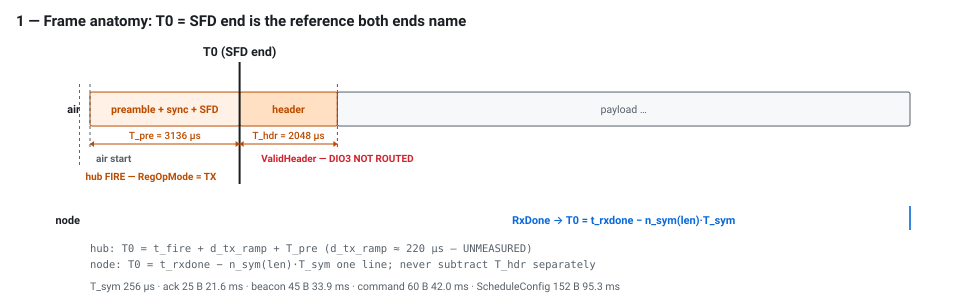
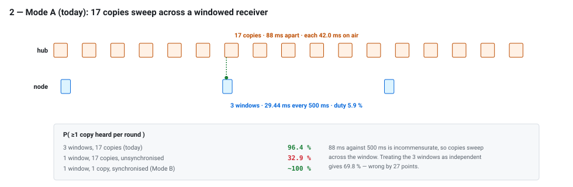
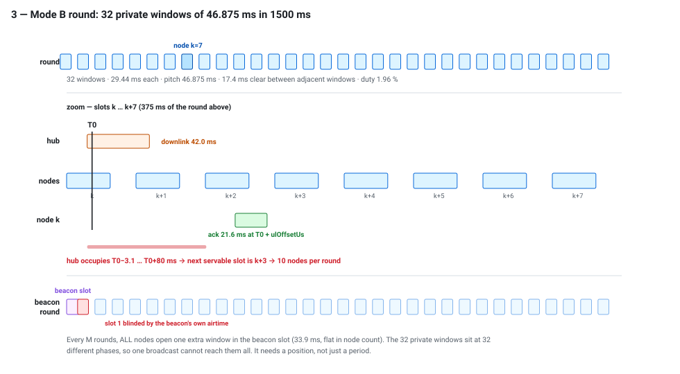
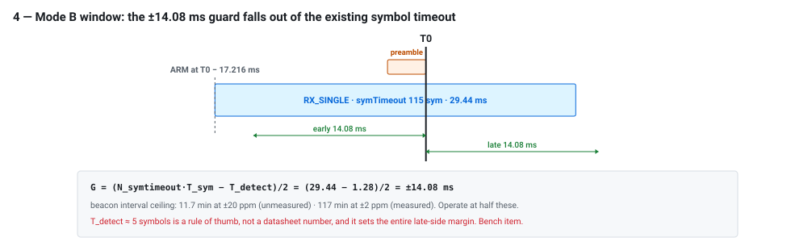
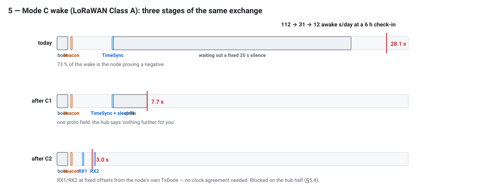
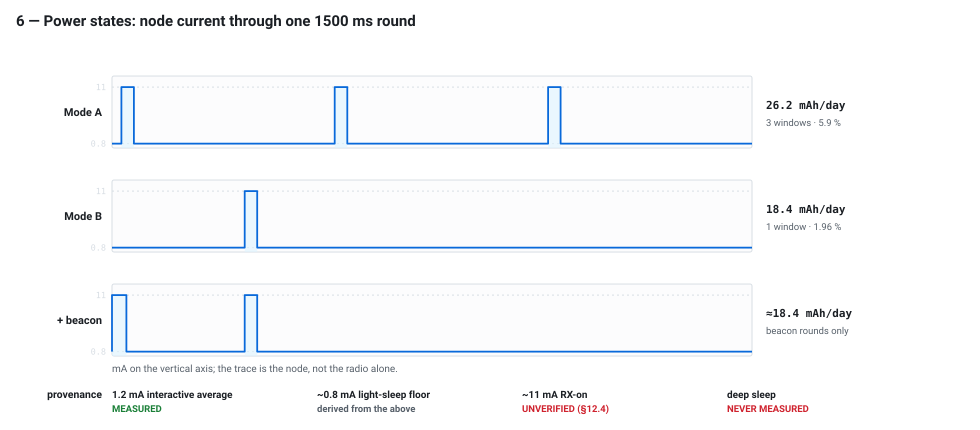
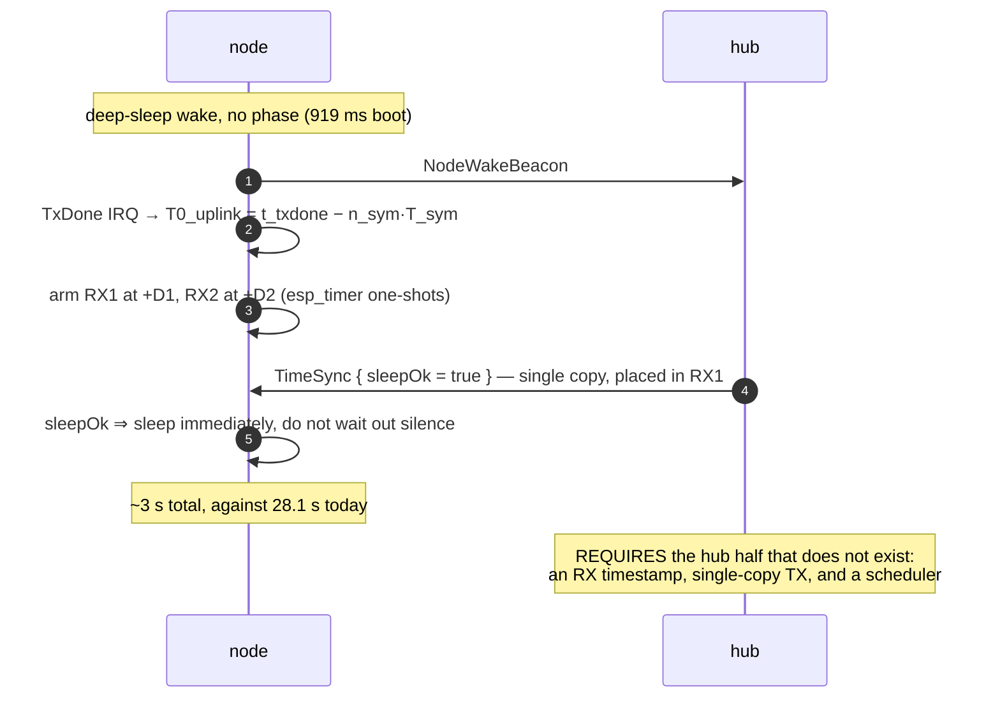
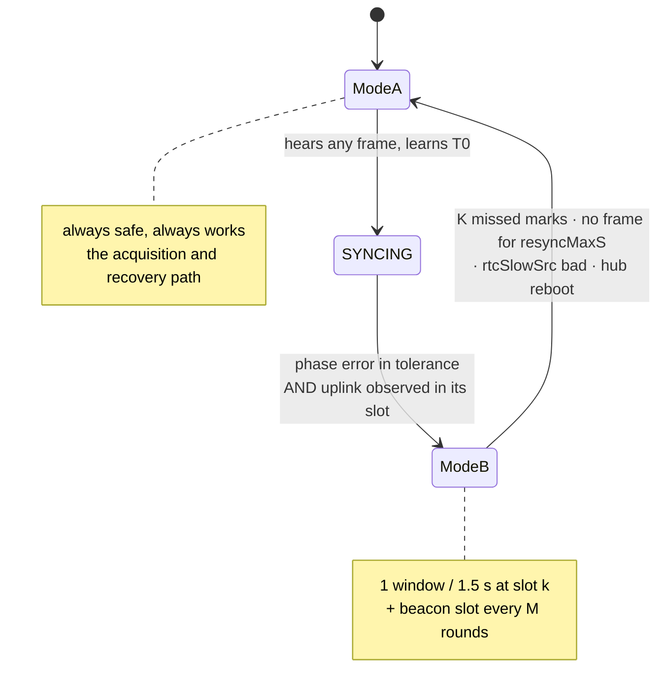

# Mode diagrams — timings, sequences and power states

Companion to `implementation-plan.md`. Every dimension in the SVGs is generated
from `diagrams/gen.py`, whose constants block mirrors the plan's §2.1 and §4.2 —
so the drawings cannot drift from the numbers. Regenerate with:

```
python3 configuration/docs/diagrams/gen.py
```

The timing diagrams are **to scale**. The mermaid charts are not — they show
ordering, not duration.

---

## 1. The reference point



T0 is the only instant both ends can name that is independent of frame size.
The hub names it forward from the SPI write that starts transmission; the node
names it backward from RxDone. ValidHeader would have been a cleaner node-side
anchor but **DIO3 is not routed on this board**, so the node computes it — which
is why `LoraTiming.h` is the plan's first deliverable.

---

## 2. Mode A — why 17 copies against 3 windows works



The green ticks mark copies that land inside a window. 88 ms against 500 ms is
incommensurate, so successive copies sweep across the window rather than
repeating the same phase — which is why the three windows are strongly
*anti*-correlated and the naive independence calculation is wrong by 27 points.

This is also why Mode A is kept rather than replaced: it is the only path that
works with no clock agreement, and every node uses it to acquire one.

---

## 3. Mode B — the round



Three things this drawing is meant to make obvious:

- the 32 windows **fit with room to spare** — 17.4 ms of clear air between
  adjacent ones;
- a *transmission* is wider than a window, so serving node k also covers k+1 and
  k+2 — hence 10 nodes per round, not 32;
- the beacon **cannot** be one of the 32 private windows, because they are at 32
  different phases. It needs its own slot, and that slot needs a position:
  placed at slot 0 its own airtime blinds slot 1, every beacon round, always the
  same node.

---

## 4. Mode B — the window



The guard band is not a new mechanism. Arm at `T0 − (T_pre + G)` and the existing
115-symbol timeout yields a symmetric ±14.08 ms — about a hundred times the
hub's transmit jitter, which is why the determinism work is an optimisation
rather than a prerequisite.

The weak term is `T_detect`. It sets the whole late-side margin, it is a
LoRaWAN rule of thumb rather than a datasheet figure, and the detection registers
are at reset defaults. **Measure it before B3.**

---

## 5. Mode C — the wake



The three bars are the same exchange, three times. Nothing about the *work*
changes — boot, beacon, TimeSync — only how long the node waits afterwards to
decide the hub has finished.

C1 replaces a fixed silence with an explicit flag. C2 replaces waiting with two
short windows at known offsets from the node's own TxDone. **C2 is blocked on the
hub half**, which does not exist: the hub has no timestamp of any kind, replies
at +750 ms, and replies as a 17-copy burst that both windows fall between.

---

## 6. Power states



Read the provenance row before quoting any of this. One number is measured; the
floor is derived from it; the RX-on current is a whole-node figure taken under a
different power profile and reused as a radio current; deep sleep has never been
measured at all.

The shape is trustworthy — three windows versus one, at the same height. The
absolute mAh/day figures inherit the RX-on uncertainty, so treat the **ratio**
(≈1.4×) as the result and the absolute values as provisional.

---

## 7. Sequences

### 7.1 Mode B — a synchronised exchange

```mermaid
sequenceDiagram
    autonumber
    participant H as hub
    participant HT as hub esp_timer
    participant A as air
    participant NT as node esp_timer
    participant N as node
    Note over H: command queued for node k
    H->>H: T0−20 ms PREPARE — FIFO burst-write (off the timing path)
    NT->>N: T0−22 ms PREPARE — RX config
    NT->>N: T0−17.216 ms ARM — RegOpMode = RX_SINGLE
    HT->>A: T0−3.356 ms FIRE — RegOpMode = TX
    A-->>N: T0 — SFD end (the reference)
    A-->>N: T0 + n_sym·T_sym — RxDone IRQ, stamp
    N->>N: DRAIN — FIFO read, decrypt, dispatch
    N->>N: phase update: err = T0_meas − T0_pred
    N->>A: T0 + ulOffsetUs — ack (no CAD; the slot is the arbitration)
    A-->>H: ack
    H->>H: node k confirmed timed; miss counter reset
```

### 7.2 Mode A → Mode B — acquisition

```mermaid
sequenceDiagram
    autonumber
    participant H as hub
    participant N as node
    Note over N: Mode A — 3 windows, 17-copy bursts
    H->>N: GridSync, bursted ×17 (96.4 % per round)
    N->>N: T0_meas from RxDone − airtime; grid phase known
    N->>H: beacon {timedRxReady, phaseErrUs, rtcSlowSrc}
    Note over H: 32 kHz crystal confirmed,<br/>phase error inside tolerance
    H->>N: GridSync {enable = true}, bursted
    N->>H: ack in its uplink slot — first slot-timed transmission
    Note over H,N: the hub SEES an ack arrive in its slot;<br/>a claim would not be evidence
    Note over N: Mode B — 1 window per round
```

### 7.3 Mode C — a check-in wake



### 7.4 Mode transitions



**The asymmetry that makes this safe:** a node may drop to Mode A unilaterally at
any moment; the hub may only send single-shot with positive, recent confirmation.
Any hub uncertainty means burst. So the one dangerous combination — hub
single-shot while the node is windowed, ~6 % hit rate — is unreachable by
construction.

Automatic-mode nodes have **no path into Mode B**: they wake with no phase, do a
few seconds of business and sleep again. That is by design and at no loss.
