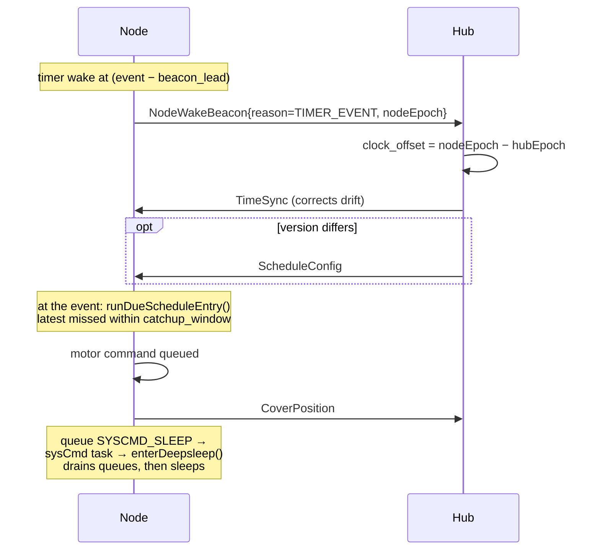
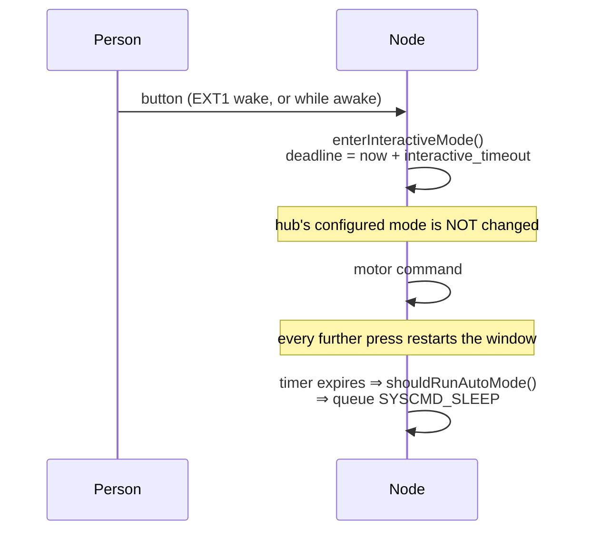
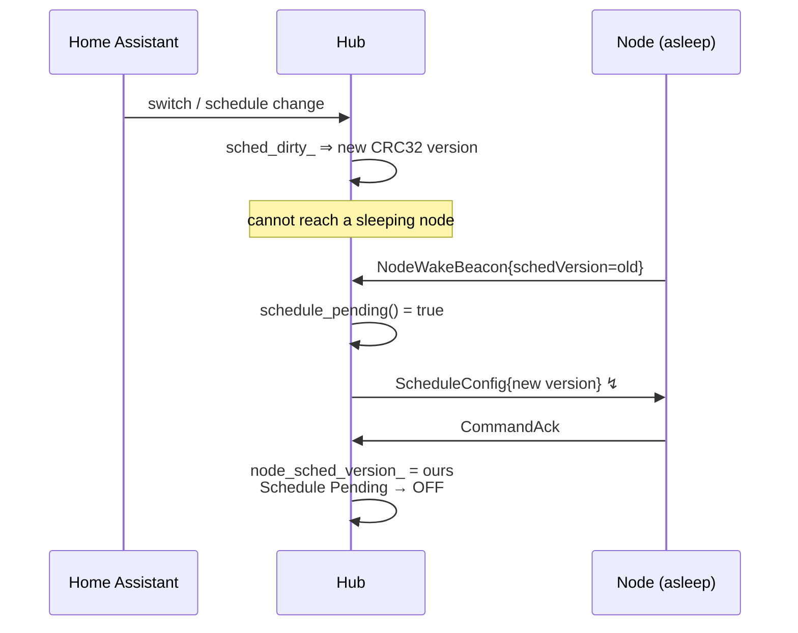

# LoRa Blinds — Message Sequence Charts & Conformance Review

Intended message flows for every operation, followed by a review of whether each
actually works, and a check of the implementation against the chart.

Written after a night in which automatic mode failed three times for three
*different* reasons, each found by chasing individual frames. Modelling the
flows first turns that into one structural question instead.

**Notation:** `msgid` is the unified counter used for both replay protection and
AES-GCM nonce derivation. `↯` marks a frame that is single-shot (not bursted)
and unacknowledged — i.e. lost silently if it collides.

---

## 1. Cold boot / provisioning

```mermaid
sequenceDiagram
    participant N as Node
    participant H as Hub
    Note over N: boot; load config.txt<br/>mode forced INTERACTIVE
    N->>N: tx=0, rx=0 (REGISTER resets counters)
    N->>H: ClientRegister{mac, needs_config} msgid=1
    Note over H: matched by MAC, not address<br/>(bypasses the address filter)
    H->>N: ClientConfig{addr, subnet, name, ...}
    H->>N: CoverConfig{openTime, closeTime, slack}
    Note over H: login after 4000 ms (config pushed)<br/>or 800 ms (already synced)
    H->>H: frame_counter_.tx=0, rx=0
    H->>N: LoginMsg{nonce} msgid=1
    N->>N: tx=0, rx=0; store base nonce
    N->>H: NodeWakeBeacon ↯ msgid=1
    N->>H: ClientAvailable msgid=2
    Note over H: any successful decrypt ⇒<br/>session_confirmed_, login_acked_
    H->>N: TimeSync ↯ (login-ack path, +750 ms)
    H->>N: ScheduleConfig ↯ (beacon path, +2000 ms)
    N->>H: CommandAck{schedule msgid}
    Note over N: clock valid AND schedule loaded<br/>⇒ queue SYSCMD_SLEEP
```

### Review

**Counter ordering is correct — but only just.** The node zeroes `tx`/`rx` when
it *sends* REGISTER (`CmdDispatcher.cpp:388`), while the hub does not zero its
own until `send_login()` (`lora_client.cpp:1328`). Everything the node sends in
between is therefore compared against the hub's *previous* session counter and
dropped as a replay. That window is real and was observed:

```
duplicate or old message ID: 3, ignoring. My MsgID: 11
```

The beacon is deliberately sent from the `CMD_LOGIN` handler, after both sides
have zeroed, which is the only point where it can be received. **Conforms.**

**The dependency chain is the problem.** TimeSync is sent on the login-ack path,
so it does not depend on the beacon. The **schedule push is sent only from
`handle_beacon_()`**. So:

> beacon lost ⇒ no schedule ⇒ no auto mode ⇒ node never sleeps ⇒ never wakes ⇒
> **never beacons again** ⇒ hub never re-pushes.

The beacon is a single unbursted, unacknowledged frame gating the entire feature,
with no retry and no alternative path. Observed live twice — a hub log with
`Login acknowledged` and `TimeSync sent` but **no `Beacon:` line at all**, and
consequently no push.

---

## 2. Resume-first wake (I2)

```mermaid
sequenceDiagram
    participant N as Node
    participant H as Hub
    Note over N: deep-sleep wake; counters<br/>continue from NVS (no reset)
    N->>N: armResumeFallback() — 12 s
    N->>H: NodeWakeBeacon ↯ (encrypted, session resumed)
    alt hub still holds the base nonce
        H->>N: TimeSync (encrypted)
        N->>N: decrypt OK ⇒ noteSessionProven()<br/>fallback cancelled
        H->>N: ScheduleConfig (only if version differs)
    else hub rebooted — no nonce
        H->>N: BaseNonceExchange (PLAINTEXT)
        Note over N: plaintext does NOT prove the session
        N->>N: fallback fires ⇒ full REGISTER
    end
```

### Review

**Conforms, and the failure branch is the well-designed part.** Only a
*decrypted* downlink clears the fallback, so a plaintext `BaseNonceExchange` —
exactly the hub-rebooted case — correctly lets the timer fire and re-register.
Verified by tests, including that a plaintext frame does not count.

**But it inherits the same single-frame risk.** If the resume beacon is lost, no
TimeSync arrives, the fallback fires after 12 s and the node re-registers. That
is a *safe* degradation (it costs the battery saving, not the connection), which
is the right trade — unlike case 1, where the equivalent loss is permanent.

---

## 3. Scheduled wake → execute → sleep



### Review

**The mechanism is proven.** Observed end to end:

```
Beacon: reason=TIMER_CHECKIN clock_offset=-4 s fw=10014 resume=1
'RollladenWohnzimmer2 Clock Offset' >> -4 s
```

A genuine timer wake ~30 s ahead of the event, with drift measured at −4 s
across the sleep. Sleep duration arithmetic also confirmed on device:
`next event 2026-08-23 21:28:00` (correctly rolling to tomorrow) and
`sleeping 600 s` (correctly capped by the 10-minute check-in).

**Sleep must be queued, never called inline.** Calling `enterDeepsleep()` from
the RX/dispatcher task crashed the node within ~1 s — tearing the radio down
from inside the receive path. `SYSCMD_SLEEP` routes it to `processSysCommand`'s
own task, the context the nightly `CMD_SLEEP` has always used. **Conforms**, and
a test pins it (mutation-checked).

---

## 4. Button press → interactive override (D4)



### Review

**Conforms.** The override is a local RTC-backed deadline, so one press cannot
silently disable the schedule permanently — the failure mode of the first
implementation, which wrote `autoMode=false` to `config.txt`.

`interactive_timeout == 0` is honoured as the proto documents it ("stay
interactive until told otherwise"), and with no valid clock the override is
treated as still active, since staying responsive is the safe failure. Six
tests, mutation-checked.

---

## 5. Home Assistant edits the schedule



### Review

**Reconciliation by version is sound and self-healing** — a node that missed a
push, was reflashed, or lost `config.txt` reports a stale version and is
corrected at its next wake, with no hub-side memory of owing anything.

**Retransmit now closed a real hole.** The push was a single unacknowledged
frame; a lost one was lost for good, for the reason in §1. The hub now
retransmits up to 3 times at 5 s until the node's `CommandAck` arrives.

**Still open:** the whole flow is gated on a beacon arriving.

---

## Findings

| # | Finding | Status |
|---|---|---|
| F1 | Schedule push only happens in `handle_beacon_()`, so a lost beacon permanently blocks auto mode | **OPEN — the root cause of tonight's failures** |
| F2 | Schedule push was single-shot with no retry | Fixed — retransmit until `CommandAck` |
| F3 | TimeSync/Schedule arrival order raced; whichever came second never re-evaluated auto mode | Fixed — both handlers re-check |
| F4 | Node uplinks between REGISTER and LOGIN are dropped (counters not yet aligned) | By design; beacon deliberately sent after `CMD_LOGIN` |
| F5 | `enterDeepsleep()` from the RX task crashes the node | Fixed — queued via `SYSCMD_SLEEP` |
| F6 | `config.txt` read truncated at 256 B, silently reverting every setting | Fixed — sized from the file, always terminated |
| F7 | A restart after a scheduled event drove the blind FULL_UP, undoing the schedule | Fixed — reference move now gated on RTC RAM actually having been lost |

### F7 — the restart that undid the schedule

Not visible in any of the charts above, because it happens *between* them: the
node executes its event correctly, restarts, and re-enters chart 1. Chart 1's
cold-boot path then issues a FULL_UP reference move — correct when the position
is genuinely unknown, destructive when it is not.

The move was gated on `powerOnBoot`, which is true for **every** reset that is
not a deep-sleep wake. `esp_restart`, a panic and the watchdogs all preserve RTC
RAM, and therefore preserve a valid position, yet all took the move. The gate is
now the RTC_NOINIT marker, which answers the question the reset reason only
approximates: *did RTC RAM survive?*

**Measured, and counterintuitive enough to record:** on this ESP32 an EN-pin
reset — a debugger or serial monitor asserting DTR/RTS — reports
`ESP_RST_POWERON` and **does** clear RTC RAM. It is a real cold boot, so the
reference move is right there. It also means **attaching a serial monitor
mid-test is itself a reboot**: a node that appears to restart spontaneously
during an observed event may be reacting to the observer. Capture with one
continuously-open port and never reconnect mid-run.

Every boot now logs `BOOT reason=… causes=… rtc_ram=… prev=… prev_mode=…`, so
this class of question is read off the log rather than reasoned about. `prev`
distinguishes a clean wake from a reset that happened *while entering* sleep,
because the marker is armed in the instruction before `esp_deep_sleep_start()`.

### The recommended fix for F1

**Push the schedule on the login-ack path as well as the beacon path.** TimeSync
already goes out there, so the mechanism exists and the node is demonstrably
listening at that moment. That removes the beacon as a single point of failure:
a lost beacon would then cost only the clock-offset reading, not the entire
feature.

The beacon stays the *steady-state* trigger — it is the only thing carrying the
node's applied version, which is what makes reconciliation self-healing. This
adds a second, independent path for the initial push.
