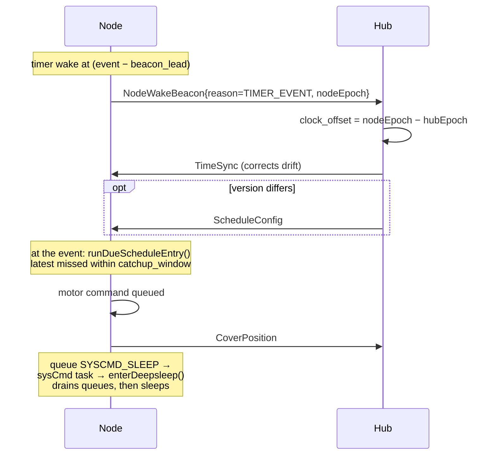
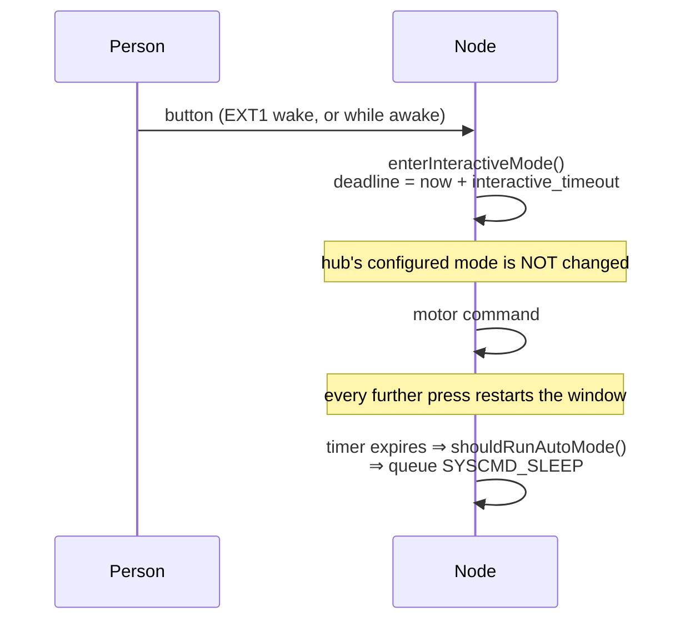
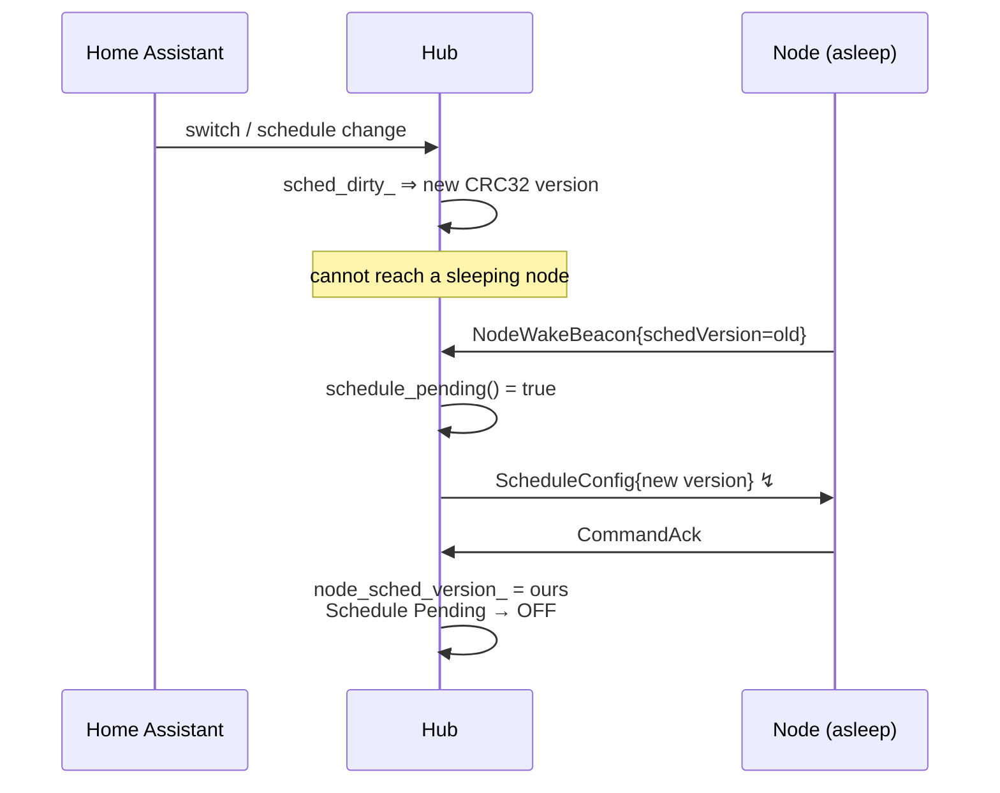

# LoRa Blinds — Message Sequence Charts & Conformance Review

Intended message flows for every operation, followed by a review of whether each
actually works, and a check of the implementation against the chart.

Written after a night in which automatic mode failed three times for three
*different* reasons, each found by chasing individual frames. Modelling the
flows first turns that into one structural question instead.

**Notation:** `msgid` is the unified counter used for both replay protection and
AES-GCM nonce derivation. `↯` marks a frame that is single-shot (not bursted)
and unacknowledged — i.e. lost silently if it collides.

---

## 1. Cold boot / provisioning

```mermaid
sequenceDiagram
    participant N as Node
    participant H as Hub
    Note over N: boot; load config.txt<br/>mode forced INTERACTIVE
    N->>N: tx=0, rx=0 (REGISTER resets counters)
    N->>H: ClientRegister{mac, needs_config} msgid=1
    Note over H: matched by MAC, not address<br/>(bypasses the address filter)
    H->>N: ClientConfig{addr, subnet, name, ...}
    H->>N: CoverConfig{openTime, closeTime, slack}
    Note over H: login after 4000 ms (config pushed)<br/>or 800 ms (already synced)
    H->>H: frame_counter_.tx=0, rx=0
    H->>N: LoginMsg{nonce} msgid=1
    N->>N: tx=0, rx=0; store base nonce
    N->>H: NodeWakeBeacon ↯ msgid=1
    N->>H: ClientAvailable msgid=2
    Note over H: any successful decrypt ⇒<br/>session_confirmed_, login_acked_
    H->>N: TimeSync ↯ (login-ack path, +750 ms)
    H->>N: ScheduleConfig ↯ (beacon path, +2000 ms)
    N->>H: CommandAck{schedule msgid}
    Note over N: clock valid AND schedule loaded<br/>⇒ queue SYSCMD_SLEEP
```

### Review

**Counter ordering is correct — but only just.** The node zeroes `tx`/`rx` when
it *sends* REGISTER (`CmdDispatcher.cpp:388`), while the hub does not zero its
own until `send_login()` (`lora_client.cpp:1328`). Everything the node sends in
between is therefore compared against the hub's *previous* session counter and
dropped as a replay. That window is real and was observed:

```
duplicate or old message ID: 3, ignoring. My MsgID: 11
```

The beacon is deliberately sent from the `CMD_LOGIN` handler, after both sides
have zeroed, which is the only point where it can be received. **Conforms.**

**The dependency chain is the problem.** TimeSync is sent on the login-ack path,
so it does not depend on the beacon. The **schedule push is sent only from
`handle_beacon_()`**. So:

> beacon lost ⇒ no schedule ⇒ no auto mode ⇒ node never sleeps ⇒ never wakes ⇒
> **never beacons again** ⇒ hub never re-pushes.

The beacon is a single unbursted, unacknowledged frame gating the entire feature,
with no retry and no alternative path. Observed live twice — a hub log with
`Login acknowledged` and `TimeSync sent` but **no `Beacon:` line at all**, and
consequently no push.

---

## 2. Resume-first wake (I2)

```mermaid
sequenceDiagram
    participant N as Node
    participant H as Hub
    Note over N: deep-sleep wake; counters<br/>continue from NVS (no reset)
    N->>N: armResumeFallback() — 12 s
    N->>H: NodeWakeBeacon ↯ (encrypted, session resumed)
    alt hub still holds the base nonce
        H->>N: TimeSync (encrypted)
        N->>N: decrypt OK ⇒ noteSessionProven()<br/>fallback cancelled
        H->>N: ScheduleConfig (only if version differs)
    else hub rebooted — no nonce
        H->>N: BaseNonceExchange (PLAINTEXT)
        Note over N: plaintext does NOT prove the session
        N->>N: fallback fires ⇒ full REGISTER
    end
```

### Review

**Conforms, and the failure branch is the well-designed part.** Only a
*decrypted* downlink clears the fallback, so a plaintext `BaseNonceExchange` —
exactly the hub-rebooted case — correctly lets the timer fire and re-register.
Verified by tests, including that a plaintext frame does not count.

**But it inherits the same single-frame risk.** If the resume beacon is lost, no
TimeSync arrives, the fallback fires after 12 s and the node re-registers. That
is a *safe* degradation (it costs the battery saving, not the connection), which
is the right trade — unlike case 1, where the equivalent loss is permanent.

---

## 3. Scheduled wake → execute → sleep



### Review

**The mechanism is proven.** Observed end to end:

```
Beacon: reason=TIMER_CHECKIN clock_offset=-4 s fw=10014 resume=1
'RollladenWohnzimmer2 Clock Offset' >> -4 s
```

A genuine timer wake ~30 s ahead of the event, with drift measured at −4 s
across the sleep. Sleep duration arithmetic also confirmed on device:
`next event 2026-08-23 21:28:00` (correctly rolling to tomorrow) and
`sleeping 600 s` (correctly capped by the 10-minute check-in).

**Sleep must be queued, never called inline.** Calling `enterDeepsleep()` from
the RX/dispatcher task crashed the node within ~1 s — tearing the radio down
from inside the receive path. `SYSCMD_SLEEP` routes it to `processSysCommand`'s
own task, the context the nightly `CMD_SLEEP` has always used. **Conforms**, and
a test pins it (mutation-checked).

---

## 4. Button press → interactive override (D4)



### Review

**Conforms.** The override is a local RTC-backed deadline, so one press cannot
silently disable the schedule permanently — the failure mode of the first
implementation, which wrote `autoMode=false` to `config.txt`.

`interactive_timeout == 0` is honoured as the proto documents it ("stay
interactive until told otherwise"), and with no valid clock the override is
treated as still active, since staying responsive is the safe failure. Six
tests, mutation-checked.

---

## 5. Home Assistant edits the schedule



### Review

**Reconciliation by version is sound and self-healing** — a node that missed a
push, was reflashed, or lost `config.txt` reports a stale version and is
corrected at its next wake, with no hub-side memory of owing anything.

**Retransmit now closed a real hole.** The push was a single unacknowledged
frame; a lost one was lost for good, for the reason in §1. The hub now
retransmits up to 3 times at 5 s until the node's `CommandAck` arrives.

**Still open:** the whole flow is gated on a beacon arriving.

---

## Findings

| # | Finding | Status |
|---|---|---|
| F1 | Schedule push only happens in `handle_beacon_()`, so a lost beacon permanently blocks auto mode | **OPEN — the root cause of tonight's failures** |
| F2 | Schedule push was single-shot with no retry | Fixed — retransmit until `CommandAck` |
| F3 | TimeSync/Schedule arrival order raced; whichever came second never re-evaluated auto mode | Fixed — both handlers re-check |
| F4 | Node uplinks between REGISTER and LOGIN are dropped (counters not yet aligned) | By design; beacon deliberately sent after `CMD_LOGIN` |
| F5 | `enterDeepsleep()` from the RX task crashes the node | Fixed — queued via `SYSCMD_SLEEP` |
| F6 | `config.txt` read truncated at 256 B, silently reverting every setting | Fixed — sized from the file, always terminated |
| F7 | A restart after a scheduled event drove the blind FULL_UP, undoing the schedule | Fixed — reference move now gated on RTC RAM actually having been lost |
| F8 | The node slept ~3 s after REGISTER, before the hub's deferred LoginMsg could arrive — the handshake could never complete | **Fixed — sleep deferred behind a quiet window** |
| F9 | `schedVersion` (a CRC32) was reloaded through cJSON's `valueint` and saturated at `INT_MAX`, so half of all versions were corrupted on every restart | Fixed — 32-bit fields read via `valuedouble` |
| F10 | An event was skipped outright if the hub kept the node awake past its scheduled time | Fixed — the quiet window re-runs `runDueScheduleEntry()` |
| F11 | A beacon predating a mode change reverted the HA switch to the state the user just left | Fixed — correction gated on `schedule_pending()` |
| F12 | A `CLIENTCONFIG` for another node could ratchet our replay counter onto its sequence | Fixed — CLIENTCONFIG exempt from the msgid check, gated by MAC |
| F13 | The RTC mode marker said INTERACTIVE for nodes running a schedule | Fixed — `setSchedule()` goes through `setAutoMode()` |
| F14 | TimeSync had no retry; losing that one frame stranded a node in interactive mode | Fixed — the node re-sends its wake beacon while it lacks a clock |
| F15 | Chart 2's beacon-first resume had never once executed | Fixed — three stacked defects, see below |

### F7 — the restart that undid the schedule

Not visible in any of the charts above, because it happens *between* them: the
node executes its event correctly, restarts, and re-enters chart 1. Chart 1's
cold-boot path then issues a FULL_UP reference move — correct when the position
is genuinely unknown, destructive when it is not.

The move was gated on `powerOnBoot`, which is true for **every** reset that is
not a deep-sleep wake. `esp_restart`, a panic and the watchdogs all preserve RTC
RAM, and therefore preserve a valid position, yet all took the move. The gate is
now the RTC_NOINIT marker, which answers the question the reset reason only
approximates: *did RTC RAM survive?*

**Measured, and counterintuitive enough to record:** on this ESP32 an EN-pin
reset — a debugger or serial monitor asserting DTR/RTS — reports
`ESP_RST_POWERON` and **does** clear RTC RAM. It is a real cold boot, so the
reference move is right there. It also means **attaching a serial monitor
mid-test is itself a reboot**: a node that appears to restart spontaneously
during an observed event may be reacting to the observer. Capture with one
continuously-open port and never reconnect mid-run.

Every boot now logs `BOOT reason=… causes=… rtc_ram=… prev=… prev_mode=…`, so
this class of question is read off the log rather than reasoned about. `prev`
distinguishes a clean wake from a reset that happened *while entering* sleep,
because the marker is armed in the instruction before `esp_deep_sleep_start()`.

### The recommended fix for F1

**Push the schedule on the login-ack path as well as the beacon path.** TimeSync
already goes out there, so the mechanism exists and the node is demonstrably
listening at that moment. That removes the beacon as a single point of failure:
a lost beacon would then cost only the clock-offset reading, not the entire
feature.

The beacon stays the *steady-state* trigger — it is the only thing carrying the
node's applied version, which is what makes reconciliation self-healing. This
adds a second, independent path for the initial push.

### F8 — the node slept in the middle of its own handshake

This is the one that invalidates the optimistic reading of chart 1, and it very
likely explains F1 as well.

Auto mode queued its sleep the *instant* `shouldRunAutoMode()` was satisfied.
On the register path that is about 3 s after boot, while the hub defers its
LoginMsg to ~4 s after REGISTER. Captured on serial:

```
Device not registered yet, going to register mode
Sending REGISTER response
Entering deep sleep — state persisted            <- 30 ms later
Auto mode: sleeping 600 s until next scheduled wake
```

The handshake could never complete. The hub logged `Login not acknowledged`
up to 24 times per cycle against a node that was asleep, and since the schedule
push rides on that session, the node was stuck with a stale schedule and **no
path by which it could ever be told about a new one**. From the outside this
looked exactly like a radio or crypto problem, which is where the previous
sessions went hunting.

The same shape appears twice more in the charts above. In chart 1, TimeSync is
sent ~1.25 s before ScheduleConfig — and sleeping on TimeSync alone would miss
the schedule push *and all three of its retransmits*. **F2's retransmits could
never have helped**, because the node was not listening. So the "lost beacon"
diagnosis in F1 was probably measuring this instead: not a frame lost in the
air, but a receiver that had already gone to sleep.

**Fix: the sleep is a quiet timer, not an event.** Every downlink that could
start auto mode refreshes it, so the node stays awake exactly as long as the hub
is still talking to it, and sleeps once the conversation stops. If the hub never
answers, it still fires, so this cannot become a battery leak. A button press
cancels it outright.

The lesson generalises past this bug: **"the condition for sleeping is true" and
"we are finished talking" are different questions**, and the charts only ever
modelled the first one.

### F10 — chart 3 assumes the node is asleep when its event arrives

Chart 3 draws the wake and the execution as one step. In the code they are two,
and nothing connects them.

The node wakes `beacon_lead` (30 s) *before* the event, so at that moment
`runDueScheduleEntry()` correctly finds nothing due. The sleep that follows is
computed as `next_event − lead`, which clamps to `now + 1 s` for an imminent
event — so the node naps for a second, wakes, and *then* executes. That is the
only path by which a scheduled entry ever runs on time.

Break the nap and the entry is skipped. Every downlink refreshes the quiet
window (F8), so a hub that is still talking holds the node awake past the event.
By the time it sleeps, `next_occurrence()` has already moved past the entry.
Observed live, twice in one run:

```
woken 15:27:23 for a 15:28:00 CLOSE, still awake at 15:28:03
  → "sleeping, next event 15:36:00"        (blind never moved)
woken 15:35:24 → "executed due entry"      (the 15:28 CLOSE, 7 min late,
                                            rescued by the catch-up window)
awake through 15:36:00
  → "sleeping, next event 2026-08-24 15:28:00"   (the OPEN skipped a whole day)
```

The events were not lost — catch-up served one of them seven minutes late — but
"the schedule works" and "the schedule runs on time" were different claims, and
only the first was true.

**This also re-explains the original symptom.** The very first scheduled CLOSE
that appeared to execute "about a minute late" was almost certainly catch-up on
the *following* wake, not the scheduled execution.

**Fix:** the quiet window re-runs `runDueScheduleEntry()` before computing the
next wake, so anything that fell due while we were awake runs now rather than a
wake later.

The pattern behind F8 and F10 is the same one: **the node treats "time to
sleep" as a single decision made at one instant**, when it is really a
condition that has to be re-evaluated as the conversation and the clock move.

### F11 — chart 5's reconciliation can run backwards

Chart 5 shows the hub pushing a change and the node acknowledging it. What it
does not show is the beacon that arrives *first*, carrying the node's state from
before the change.

The hub deliberately publishes what the node reports rather than what was asked
for, because the two legitimately diverge: the node refuses auto mode without a
clock or a usable schedule, and a button press flips it back. That is right. But
it could not distinguish *"the node chose this"* from *"our change has not
arrived yet"*. Observed live:

```
17:40:02.263  Beacon arrives — reports the node's PRE-push state (AUTO)
17:40:02.286  'Auto Mode' >> ON            <- the request is discarded
17:40:04.332  ScheduleConfig sent (mode=INTERACTIVE)
17:40:07.679  acknowledged
```

The command was not lost — the node did go interactive. This was the **UI**
lying, until the next beacon: on the configured `checkin_interval: 6h`, six
hours of showing the wrong mode for a blind.

`schedule_pending()` is exactly the missing distinction. A button press changes
no version, so the case the correction was written for still wins.

### F12 — the address filter has one exemption, and it was a hole

`CMD_CLIENTCONFIG` skips the address filter by design: a fresh node has
`cfgAddress` 0 and cannot match the hub's `destaddress`, so the MAC check inside
its handler is the gate instead.

But the msgid check sits *after* the address filter precisely so that overheard
frames cannot advance `rx_message_id_`. CLIENTCONFIG walked straight past that
protection. Caught on node 2 while watching an unrelated test:

```
Dest Adreess: 17 / Config Address: 18
   Message ID check
Rejected message ID: 2, ignoring, my MsgID: 3
```

Harmless only because 2 < 3. Reversed, node 2 would have ratcheted its counter
onto node 1's sequence and rejected every subsequent real command until its next
login — from nothing more than overhearing another node being provisioned.

CLIENTCONFIG now skips the msgid check like `CMD_LOGIN`. Nothing is lost: the
MAC check is strictly stronger than an address match.

### F13 — a diagnostic that disagreed with reality

The RTC mode marker added for the boot forensics reported `prev_mode=INTERACTIVE`
for a node that was demonstrably running a schedule. `setSchedule()` assigned
`g_config.autoMode` directly instead of going through `setAutoMode()`, which is
what keeps the marker in step — and the schedule push is the path auto mode is
actually entered by, so the marker was wrong for essentially every auto-mode
node.

Same shape as the firmware-version field (see the activity log): **a diagnostic
that can quietly disagree with reality is worse than not having one**, because
it is trusted. Both are now derived from a single owner rather than maintained
in parallel.

### F15 — chart 2 had never run

Chart 2 documents the resume-first wake as working, with a well-designed failure
branch. It had never executed. Three defects were stacked, each hiding the next,
and only fixing one at a time revealed the following one.

**1. The branch was unreachable.** It was gated on `getRegistered()`, which is
set ONLY by the CLIENTCONFIG and COVERCONFIG handlers — messages the hub sends
only when a node's config is unsynced *that boot*. A node the hub already knows
gets a bare LoginMsg:

```
Registered with LORA server
LoginMsg sent (request_register=0)      <- no config push, so no flag
```

so the flag stayed false for the life of the RTC domain and every wake fell
through to a full REGISTER. Now gated on `isProvisioned()`
(`getConfigAddress() != 0`), the persisted signal.

**2. The persisted session was stale and wrongly keyed.** `persistHubAddr_`
defaulted to `0xFF` and was assigned in exactly one place — from a blob just
loaded — so it was never set from the hub address learned at login, where the
live nonce is filed. Saves looked up `get_base_nonce(255)`, found an ancient
broadcast-keyed entry and rewrote it forever:

```
F-5: restored state hub=255 base_nonce=0x20fc0cdd tx=390(+64) rx=0
```

against a live session of `base_nonce=0xfd987e7d` under peer 1. The resume
beacon was therefore encrypted with a nonce the hub had never held, at msgid 455
against a hub counter of 11:

```
Received packet with length 60
psa_aead_decrypt failed: -149
AES-GCM decryption/authentication failed
```

**3. Verified working.** After both fixes, on a real check-in wake:

```
F-5: restored state hub=1 base_nonce=0x3eeb5af7 tx=8(+64) rx=3
Deep-sleep wake with valid session — resuming (beacon-first)
CMD TIMESYNC: 2026-08-24 21:18:30 — drift correction +0 s
P2b: session resumed OK — skipped REGISTER handshake
```

The restored nonce matches the session established at the previous login, the
hub decrypts the beacon, and the REGISTER handshake is skipped — roughly 4 s of
radio saved on every wake of a battery node.

**The lesson is about the charts themselves.** Chart 2 was reviewed and declared
conforming. It was conforming — as a description of code that could not run. A
sequence chart validates the design, never that the path is reached; only the
device says that.

### F14 — TimeSync inherits F1's shape

The schedule push got retransmit-until-ack (F2). TimeSync never did, and it is
sent only on the login-ack and beacon paths — neither of which an AWAKE node
travels. Losing that single frame left a node configured for auto mode sitting
interactive with nothing to re-trigger it. Observed: `CMD_LOGIN` and
`CMD SCHEDULE` both arrived, TimeSync did not, and the node stayed awake for 25
minutes repeating *"Auto mode is on but the clock is not valid yet"* until a
manual reset.

Fixed by having the node **ask again** — re-sending its wake beacon on a 60 s
timer while it lacks a clock — rather than the hub retransmitting blindly.
Nothing goes on air that the node does not currently need.
