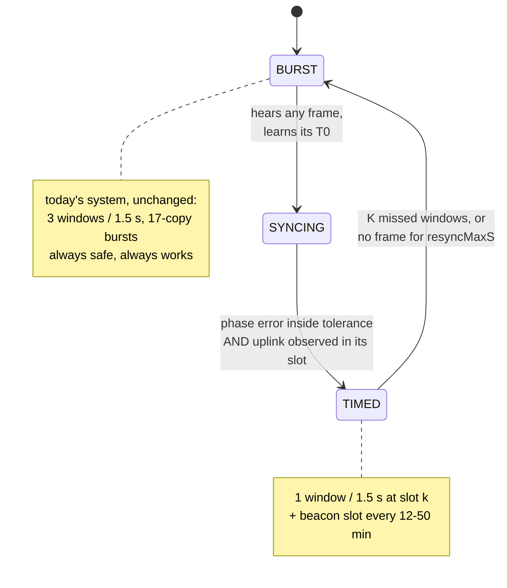

# Frame structure for ~32 nodes — a sketch

Written to answer a direct question: *"synced nodes use one RX window per 1.5 s;
there is a broadcast beacon every 12–50 min; can the hub still send a superframe
with a beacon, a contention phase and private slots?"*

**Yes — and the three things are more independent than my earlier description
made them sound.** I introduced a "superframe" as though it were a rigid frame
the hub must fill. It isn't. Companion to `timed-window-mode-plan.md`; this
document is the structure, that one is the mechanism.

---

## 1. The thing I conflated

There are two separate questions, and mixing them is what made this confusing:

| | what it is | who decides |
|---|---|---|
| **A. the node's listening rhythm** | one 29.44 ms window every 1500 ms, at the node's own phase offset | fixed, per node, never changes while synced |
| **B. what the hub puts in those windows** | commands, acks, beacons — placed into whichever node's window needs them | the hub, per round, dynamically |

The node's rhythm (A) is rigid. The hub's use of it (B) is not a frame at all —
it is a **scheduler with a placement constraint**. The hub is the only downlink
transmitter, so it always knows every node's window phase and simply avoids
putting two transmissions on top of each other.

So there is no superframe to fill. There is a repeating 1500 ms round with 32
window positions in it, and the hub uses the ones it needs.

---

## 2. Three timescales, three purposes

```
  1.5 s   ── every node opens its private window ──────────  latency + normal traffic
 12–50 m  ── all nodes additionally open the beacon slot ──  clock sync (+ optional paging)
 on demand ── a full-round burst, private traffic defers ──  joins, recovery, unsynced nodes
```

They do not nest and they do not need to align beyond sharing the same grid
anchor. The beacon interval is a configuration value, not a frame length.

---

## 3. The round: 32 private windows in 1500 ms

```
T0_k = A + n·1500 ms + k·46.875 ms          k = node's slot index, 0…31
```

```
 round n, 1500 ms
 |<-------------------------------------------------------------->|
 |  k=0     k=1     k=2     k=3     k=4    ...              k=31   |
 |  ┌──┐    ┌──┐    ┌──┐    ┌──┐    ┌──┐                    ┌──┐   |
 |  │29│    │29│    │29│    │29│    │29│       ...          │29│   |
 |  └──┘    └──┘    └──┘    └──┘    └──┘                    └──┘   |
 |  <-46.9->                                                       |
      ↑ 17.4 ms clear between adjacent windows
```

- window k spans `[T0_k − 17.22 ms, T0_k + 12.22 ms]` — 29.44 ms, unchanged from
  today's `symTimeout = 115`
- adjacent windows are **46.88 ms apart with 17.4 ms of clear air between them**
  — they do not overlap
- node RX duty stays **1.96 %**, and command latency stays **1.5 s**

### How many nodes the hub can serve in one round

A transmission is wider than a window, so serving node *k* also covers some of
its neighbours' windows. Counting the hub's frame plus the node's reply:

| downlink | hub occupies (relative to `T0_k`) | next servable slot | nodes/round |
|---|---|---|---|
| ack, 25 B | −3.1 … +60.0 ms | k+2 | 16 |
| routine command, 60 B | −3.1 … +80.5 ms | **k+3** | **10** |
| `ScheduleConfig`, 152 B | −3.1 … +133.7 ms | k+4 | 8 |

At 3.5 commands/node/day the chance of two nodes needing service in the same
1.5 s round is negligible, so this constraint almost never binds. Where it does:

| clustered event (sunset fires for all 32) | time to reach every node |
|---|---|
| today, 17-copy bursts back to back | **22.9 s** |
| this structure, 10 per round | **6.0 s** (4 rounds) |

A neighbour whose window is covered by someone else's frame is not harmed — it
finds no preamble and times out. It only matters if the hub *also* had traffic
for that node in that round, and the hub knows when that is true.

---

## 4. The beacon slot — and why it has to be separate

Here is the part that is easy to get wrong. **The 32 private windows are at 32
different phases, so one broadcast frame cannot reach them all.** A beacon sent
into node 7's window is invisible to the other 31.

So the beacon needs its own instant that *every* node opens:

```
 beacon round (every 12–50 min)          ordinary round (every 1.5 s)
 |<---------------------------->|        |<---------------------------->|
 | ┌────┐  k=0  k=1  k=2  ...   |        |  k=0  k=1  k=2  k=3  ...     |
 | │BCN │  ┌──┐ ┌──┐ ┌──┐       |        |  ┌──┐ ┌──┐ ┌──┐ ┌──┐        |
 | └────┘  └──┘ └──┘ └──┘       |        |  └──┘ └──┘ └──┘ └──┘        |
 |   ↑ ALL nodes listen here    |        |   ↑ each node only its own    |
```

Cost to the node: **one extra 29.44 ms window every 12–50 minutes.** Against one
window every 1.5 s that is 0.1–0.4 % more listening. Nothing.

Cost to the hub: one frame per beacon interval, **flat in node count** — 4.1 s/day
at 12 min, 1.0 s/day at 50 min. This is the difference between the design
working and not working at 32 nodes: a *unicast* keepalive to each of 32 nodes
would be 275 s/day (0.32 % occupancy, 3.4× worse than today's bursting), while
the shared beacon is 13 s/day total (0.015 %, **6× better**).

### The beacon interval is bounded by how well the node knows its clock

The window is ±14.08 ms wide, so the hub must say *something* before the node's
clock slips that far:

| node's clock knowledge | maximum beacon interval |
|---|---|
| unmeasured, ±20 ppm crystal spec | **11.7 min** |
| measured to ±2 ppm | **117 min** |

So a 12-minute beacon is right at the edge with no margin, and 50 minutes
requires the ppm estimate to be working. That is what makes P2 of the plan
(node measures and reports its drift) load-bearing rather than reassurance.

Two things soften it. **Ordinary traffic also refreshes the phase** — every
received frame gives a fresh `T0`, so the beacon only has to cover the gaps. And
the window width is a runtime register write, so it can be widened when sync is
stale:

| `symTimeout` | window | guard | node duty | holds ±20 ppm for |
|---|---|---|---|---|
| 115 (today) | 29.4 ms | ±14.1 ms | 1.96 % | 11.7 min |
| 200 | 51.2 ms | ±25.0 ms | 3.41 % | 20.8 min |
| 400 | 102.4 ms | ±50.6 ms | 6.83 % | 42.1 min |

Widening is not free — 400 symbols costs more duty than today's 5.9 % — but a
*modest* widening is a cheap safety valve while ppm is still being learned.

### Optional: the beacon can also page

If the beacon carries a 32-bit "who has traffic waiting" bitmap, a node that
sees its bit clear can skip its private window until the next beacon. That is
`wake-cost-proposal.md` Tier 3 and it is a pure addition — the structure above
works without it. Worth doing later, not needed for v1.

---

## 5. Unsynced nodes — priority, not a reserved region

An earlier version of this section proposed reserving ~300 ms of the round for
contention traffic, costing 6 of the 32 slots. **That was wrong, and the
arithmetic says so clearly.**

An unsynced node listens in 3 windows of 29.44 ms every 1.5 s, and a copy is
heard only if its *start* lands inside a window. Confining copies to a narrow
region gives very few chances per round:

| copies × region | P(heard) per round | rounds to 99.9 % | time |
|---|---|---|---|
| 3 in a 300 ms region | 17.7 % | 36 | **54 s** |
| 5 in a 400 ms region | 29.4 % | 20 | 30 s |
| **17 across the whole round (today)** | **99.0 %** | 2 | **3 s** |

A reserved region makes acquisition ~20× slower. The 17-copy burst is spread
across 1.4 s *precisely because* 88 ms is incommensurate with the node's 500 ms
window interval — the copies sweep across the window. Squeezing them into
300 ms destroys the mechanism that makes them work.

### What acquisition actually needs

Much less than a reservation implies. An unsynced node needs to hear **one**
frame carrying grid coordinates; after that it knows its phase and moves to a
private window. It does not need reliable command delivery while unsynced.

And the events are rare — joins at commissioning, plus deep-sleep
re-acquisitions at roughly 4 per node per day:

```
rounds per day                                   = 57 600
P(a given node needs a frame in a given round)   = 3.5 / 57 600 = 6.1e-5
P(any of 32 nodes does)                          = 1.9e-3
bursts per day (32 nodes × 4 wakes)              = 128
⇒ collisions with real queued traffic            = 0.23 per day
```

### The rule

**When the hub has unsynced-node work it runs a normal full-round 17-copy burst,
and defers any private-window traffic that collides with it by one round.**

- no region is reserved, so all 32 slots stay available;
- acquisition stays at 3 s rather than 54 s;
- the cost is **a quarter of one command per day delayed by 1.5 s.**

A stepped-on window costs nothing unless the hub *also* had traffic for that node
in that exact round — and the hub, being the only downlink transmitter, knows
when that is true. This supersedes the per-copy placement rules of
`timed-window-mode-plan.md` §8.6 as well: the answer is not to place copies
cleverly, it is to accept the collision and defer the loser.

### What actually travels over contention

Mostly joining and syncing — but **not exclusively**, and the exceptions decide
who benefits from this whole design.

| traffic | over contention? | why |
|---|---|---|
| join / registration (`ClientRegister`, `ClientConfig`, login, base nonce) | yes | a new node has no phase |
| sync acquisition (`GridSync`) | yes | that is the point |
| recovery after lost sync | yes | phase is gone |
| **deep-sleep wake exchange** (`NodeWakeBeacon` → `TimeSync` → `ScheduleConfig`) | **yes** | **routine communication, not bootstrap** |
| a command for a node that happens to be unsynced | yes | the hub bursts it rather than queueing until re-sync |
| everything else | no | private slot |

So the rule is not *"contention carries bootstrap, private slots carry
communication"*. The rule is about **phase knowledge**:

> **Contention is the path for any node whose phase the hub does not know.
> Private slots are the path for any node whose phase it does know.**
> What flows over each is whatever that node needs at the time.

### The consequence: automatic-mode nodes never leave contention

This follows directly and it is the most important scoping fact in this
document. A node in `MODE_AUTO` deep-sleeps between check-ins. On every wake it
has **no phase** — boot alone is 919 ms and variable
(`wake-cost-proposal.md`), and RTC drift across a 1–6 h sleep is far outside any
window. It sends its beacon, receives `TimeSync` and possibly a schedule, and is
asleep again seconds later. There is no point in it acquiring a slot it will use
twice.

```
  auto node   : BURST ─────────────────────────────────► BURST   (never promotes)
  interactive : BURST ──► SYNCING ──► TIMED ─────────────────►   (stays promoted)
```

**Timed-window mode is an interactive-mode feature.** Its battery saving
(26.2 → 18.4 mAh/day) applies only to nodes that stay awake, because an auto
node's receive duty is already irrelevant — it is asleep 99.7 % of the time.
That is the same split `timed-window-node-analysis.md` §10 reaches from the
power side: this mode helps interactive nodes, `sleepOk` (`wake-cost-proposal.md`
Tier 1) helps auto nodes, and they are not competing for the same milliamp.

**Scoping question for a 32-node target:** how many will run interactive? The
win scales with that count, not with 32. At 4 check-ins/day/node the auto
population also sets the contention load — 128 wake exchanges/day at 32 nodes is
what §5's collision arithmetic is built on.

---

## 5b. Reception: what can and cannot be guaranteed

**100 % cannot be ensured, and it is not ensured today either.** Two independent
reasons, and it is worth being blunt about both:

1. **RF is not deterministic.** 433 MHz is shared with weather stations, garage
   remotes and alarm sensors. No scheduling scheme addresses interference or
   fading.
2. The 96.4 % figure in §1 is **geometry only** — it assumes every copy landing
   in a window is decoded. Real losses sit on top of it.

Reliability in this system comes from **acknowledgement and retry**, not from
frame structure. That machinery already exists: `kOpMaxRetries = 4` at
`kOpRetryIntervalMs = 3000`, plus the burst fallback.

| per-frame success `q` | after 4 retries | + 17-copy burst fallback |
|---|---|---|
| 0.99 | 100 % | 100 % |
| 0.90 | 99.999 % | 100 % |
| 0.70 | 99.757 % | 100 % |
| 0.50 | 96.9 % | **99.99998 %** |
| 0.30 | 83.2 % | 99.961 % |

Even a coin-flip link reaches five nines. **The frame structure's job is to make
the first attempt cheap — 42 ms instead of 714 ms — not to make it certain.**

Four layers carry it:

1. the hub transmits into a known window, so the only loss is RF;
2. every command is acked, and an unacked command retries;
3. after K failures the hub falls back to bursting, whose statistics are
   *independent* of the timed attempt;
4. the node independently reverts to 3 windows after M empty ones, so it can
   never be stranded waiting for a hub that thinks it is synced.

### The one genuine regression, and the dial for it

**A single copy loses time diversity.** Seventeen copies spread over 1.4 s
survive a 200 ms burst of interference from another device; one copy at a fixed
instant does not. Retry-as-burst covers it, but the first attempt is more
fragile than today's.

| | node duty | battery | independent attempts per round |
|---|---|---|---|
| 1 window | 1.96 % | 18.4 mAh/day | 1 |
| **2 windows, 750 ms apart** | 3.93 % | 22.3 mAh/day | **2** |
| 3 windows (today) | 5.89 % | 26.2 mAh/day | 3 |

Two windows still beats today on battery and gives the hub two shots at instants
far enough apart to be independent. Make the window count a per-node config
value: **start at 2, drop to 1 once the link's measured `q` justifies it.**

## 6. Migration — nothing switches over at once

This is the answer to *"we start with the old structure"*: both modes coexist
permanently, per node.



A node in BURST costs what it costs today. A node in TIMED costs a third of the
receive duty. They share one channel, and the hub knows which is which.

Note the arrow that is missing: an **automatic-mode node has no path to TIMED**,
because it never holds a phase long enough to use one (§5). The state machine
above describes interactive nodes; auto nodes stay in the left-hand state for
life, by design and at no loss.

---

## 7. What this changes in the plan

| `timed-window-mode-plan.md` | change |
|---|---|
| §4 slot layout | 32 slots of 46.875 ms in a 1500 ms round, **not** 6 slots of 250 ms. Personal period stays 1.5 s — no multi-round superframe. |
| §4, new | **No reserved contention region.** Unsynced-node bursts use the full round and colliding private traffic defers by one round — 0.23 collisions/day (§5). |
| §5 economics | Recompute at N=32. The broadcast beacon is now **essential**: 13 s/day shared vs 275 s/day unicast. |
| §8.5 beacon | Promote the common beacon slot from a late optimisation to part of the core structure. It is what makes N=32 work. |
| §8.6 mixed modes | Superseded: neither per-copy placement nor a reserved region. Accept the collision and defer the loser (§5). |
| §9 protocol | `GridSync` needs `slotCount` and `windowsPerRound` (the §5b diversity dial); no contention-region fields. The paging bitmap is optional and later. |
| §10 phases | The beacon moves from P5 into P3 — without it the node is only synced ~5 % of the time and there is no battery saving to measure. |

## 8. Numbers, in one place

| | today | this structure |
|---|---|---|
| node RX duty | 5.9 % | **1.96 %** |
| node battery (interactive) | 26.2 mAh/day | **18.4 mAh/day** |
| command latency | ≤1.5 s | ≤1.5 s (unchanged) |
| hub airtime, 32 nodes, 3.5 cmd/node/day | 80 s/day (0.093 %) | **13 s/day (0.015 %)** |
| clustered event, all 32 nodes | 22.9 s | **6.0 s** |
| extra node listening for the beacon | — | one 29.44 ms window per 12–50 min |

Every airtime figure is far below the ~10 % band limit in both columns; the
reason to prefer the right-hand one is node battery and event latency, not
regulatory headroom.
