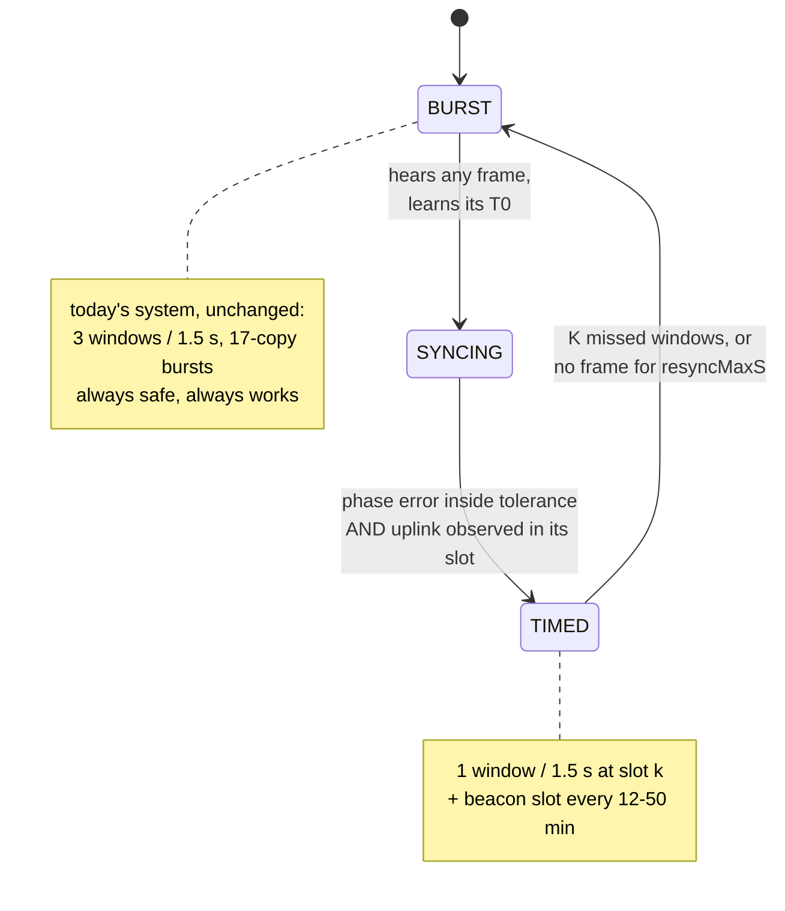

# Frame structure for ~32 nodes — a sketch

Written to answer a direct question: *"synced nodes use one RX window per 1.5 s;
there is a broadcast beacon every 12–50 min; can the hub still send a superframe
with a beacon, a contention phase and private slots?"*

**Yes — and the three things are more independent than my earlier description
made them sound.** I introduced a "superframe" as though it were a rigid frame
the hub must fill. It isn't. Companion to `timed-window-mode-plan.md`; this
document is the structure, that one is the mechanism.

---

## 1. The thing I conflated

There are two separate questions, and mixing them is what made this confusing:

| | what it is | who decides |
|---|---|---|
| **A. the node's listening rhythm** | one 29.44 ms window every 1500 ms, at the node's own phase offset | fixed, per node, never changes while synced |
| **B. what the hub puts in those windows** | commands, acks, beacons — placed into whichever node's window needs them | the hub, per round, dynamically |

The node's rhythm (A) is rigid. The hub's use of it (B) is not a frame at all —
it is a **scheduler with a placement constraint**. The hub is the only downlink
transmitter, so it always knows every node's window phase and simply avoids
putting two transmissions on top of each other.

So there is no superframe to fill. There is a repeating 1500 ms round with 32
window positions in it, and the hub uses the ones it needs.

---

## 2. Three timescales, three purposes

```
  1.5 s   ── every node opens its private window ──────────  latency + normal traffic
 12–50 m  ── all nodes additionally open the beacon slot ──  clock sync (+ optional paging)
  on demand ─ contention region ────────────────────────────  joins, recovery, unsynced nodes
```

They do not nest and they do not need to align beyond sharing the same grid
anchor. The beacon interval is a configuration value, not a frame length.

---

## 3. The round: 32 private windows in 1500 ms

```
T0_k = A + n·1500 ms + k·46.875 ms          k = node's slot index, 0…31
```

```
 round n, 1500 ms
 |<-------------------------------------------------------------->|
 |  k=0     k=1     k=2     k=3     k=4    ...              k=31   |
 |  ┌──┐    ┌──┐    ┌──┐    ┌──┐    ┌──┐                    ┌──┐   |
 |  │29│    │29│    │29│    │29│    │29│       ...          │29│   |
 |  └──┘    └──┘    └──┘    └──┘    └──┘                    └──┘   |
 |  <-46.9->                                                       |
      ↑ 17.4 ms clear between adjacent windows
```

- window k spans `[T0_k − 17.22 ms, T0_k + 12.22 ms]` — 29.44 ms, unchanged from
  today's `symTimeout = 115`
- adjacent windows are **46.88 ms apart with 17.4 ms of clear air between them**
  — they do not overlap
- node RX duty stays **1.96 %**, and command latency stays **1.5 s**

### How many nodes the hub can serve in one round

A transmission is wider than a window, so serving node *k* also covers some of
its neighbours' windows. Counting the hub's frame plus the node's reply:

| downlink | hub occupies (relative to `T0_k`) | next servable slot | nodes/round |
|---|---|---|---|
| ack, 25 B | −3.1 … +60.0 ms | k+2 | 16 |
| routine command, 60 B | −3.1 … +80.5 ms | **k+3** | **10** |
| `ScheduleConfig`, 152 B | −3.1 … +133.7 ms | k+4 | 8 |

At 3.5 commands/node/day the chance of two nodes needing service in the same
1.5 s round is negligible, so this constraint almost never binds. Where it does:

| clustered event (sunset fires for all 32) | time to reach every node |
|---|---|
| today, 17-copy bursts back to back | **22.9 s** |
| this structure, 10 per round | **6.0 s** (4 rounds) |

A neighbour whose window is covered by someone else's frame is not harmed — it
finds no preamble and times out. It only matters if the hub *also* had traffic
for that node in that round, and the hub knows when that is true.

---

## 4. The beacon slot — and why it has to be separate

Here is the part that is easy to get wrong. **The 32 private windows are at 32
different phases, so one broadcast frame cannot reach them all.** A beacon sent
into node 7's window is invisible to the other 31.

So the beacon needs its own instant that *every* node opens:

```
 beacon round (every 12–50 min)          ordinary round (every 1.5 s)
 |<---------------------------->|        |<---------------------------->|
 | ┌────┐  k=0  k=1  k=2  ...   |        |  k=0  k=1  k=2  k=3  ...     |
 | │BCN │  ┌──┐ ┌──┐ ┌──┐       |        |  ┌──┐ ┌──┐ ┌──┐ ┌──┐        |
 | └────┘  └──┘ └──┘ └──┘       |        |  └──┘ └──┘ └──┘ └──┘        |
 |   ↑ ALL nodes listen here    |        |   ↑ each node only its own    |
```

Cost to the node: **one extra 29.44 ms window every 12–50 minutes.** Against one
window every 1.5 s that is 0.1–0.4 % more listening. Nothing.

Cost to the hub: one frame per beacon interval, **flat in node count** — 4.1 s/day
at 12 min, 1.0 s/day at 50 min. This is the difference between the design
working and not working at 32 nodes: a *unicast* keepalive to each of 32 nodes
would be 275 s/day (0.32 % occupancy, 3.4× worse than today's bursting), while
the shared beacon is 13 s/day total (0.015 %, **6× better**).

### The beacon interval is bounded by how well the node knows its clock

The window is ±14.08 ms wide, so the hub must say *something* before the node's
clock slips that far:

| node's clock knowledge | maximum beacon interval |
|---|---|
| unmeasured, ±20 ppm crystal spec | **11.7 min** |
| measured to ±2 ppm | **117 min** |

So a 12-minute beacon is right at the edge with no margin, and 50 minutes
requires the ppm estimate to be working. That is what makes P2 of the plan
(node measures and reports its drift) load-bearing rather than reassurance.

Two things soften it. **Ordinary traffic also refreshes the phase** — every
received frame gives a fresh `T0`, so the beacon only has to cover the gaps. And
the window width is a runtime register write, so it can be widened when sync is
stale:

| `symTimeout` | window | guard | node duty | holds ±20 ppm for |
|---|---|---|---|---|
| 115 (today) | 29.4 ms | ±14.1 ms | 1.96 % | 11.7 min |
| 200 | 51.2 ms | ±25.0 ms | 3.41 % | 20.8 min |
| 400 | 102.4 ms | ±50.6 ms | 6.83 % | 42.1 min |

Widening is not free — 400 symbols costs more duty than today's 5.9 % — but a
*modest* widening is a cheap safety valve while ppm is still being learned.

### Optional: the beacon can also page

If the beacon carries a 32-bit "who has traffic waiting" bitmap, a node that
sees its bit clear can skip its private window until the next beacon. That is
`wake-cost-proposal.md` Tier 3 and it is a pure addition — the structure above
works without it. Worth doing later, not needed for v1.

---

## 5. The contention region — for nodes that are not synced

Joining nodes, nodes recovering from a lost beacon, nodes on the internal RC
oscillator, and nodes that have just woken from deep sleep have **no phase**, so
they cannot be reached in a private window and cannot reply in one.

They use today's mechanism unchanged: the node listens in 3 windows per 1.5 s,
the hub sends 17-copy bursts, the node replies with CAD and random backoff. That
is the contention region, and it is not a new thing to build — it is the
existing system, kept.

The one new rule: **the hub must place burst copies where they do not walk
through a synced node's window.** A 17-copy burst spans 1.4 s and would
otherwise cover most of a round. Options, in preference order:

1. Reserve a fixed region of the round for contention traffic (e.g. the last
   300 ms, leaving 26 private slots instead of 32) — simple and bounded.
2. Or place copies only in slots belonging to nodes that are themselves
   unsynced.

Option 1 is cleaner and costs 6 slots. At a 32-node target that is worth
deciding early, because it sets the slot count.

---

## 6. Migration — nothing switches over at once

This is the answer to *"we start with the old structure"*: both modes coexist
permanently, per node.



A node in BURST costs what it costs today. A node in TIMED costs a third of the
receive duty. They share one channel, and the hub knows which is which.

---

## 7. What this changes in the plan

| `timed-window-mode-plan.md` | change |
|---|---|
| §4 slot layout | 32 slots of 46.875 ms in a 1500 ms round, **not** 6 slots of 250 ms. Personal period stays 1.5 s — no multi-round superframe. |
| §4, new | Reserve a contention region (≈300 ms, 6 slots) for burst-mode traffic, rather than spreading bursts through the frame. |
| §5 economics | Recompute at N=32. The broadcast beacon is now **essential**: 13 s/day shared vs 275 s/day unicast. |
| §8.5 beacon | Promote the common beacon slot from a late optimisation to part of the core structure. It is what makes N=32 work. |
| §8.6 mixed modes | Superseded by the contention region — a bounded region beats per-copy placement rules. |
| §9 protocol | `GridSync` needs `slotCount` and `contentionStartUs`; the paging bitmap is optional and later. |
| §10 phases | The beacon moves from P5 into P3 — without it the node is only synced ~5 % of the time and there is no battery saving to measure. |

## 8. Numbers, in one place

| | today | this structure |
|---|---|---|
| node RX duty | 5.9 % | **1.96 %** |
| node battery (interactive) | 26.2 mAh/day | **18.4 mAh/day** |
| command latency | ≤1.5 s | ≤1.5 s (unchanged) |
| hub airtime, 32 nodes, 3.5 cmd/node/day | 80 s/day (0.093 %) | **13 s/day (0.015 %)** |
| clustered event, all 32 nodes | 22.9 s | **6.0 s** |
| extra node listening for the beacon | — | one 29.44 ms window per 12–50 min |

Every airtime figure is far below the ~10 % band limit in both columns; the
reason to prefer the right-hand one is node battery and event latency, not
regulatory headroom.
