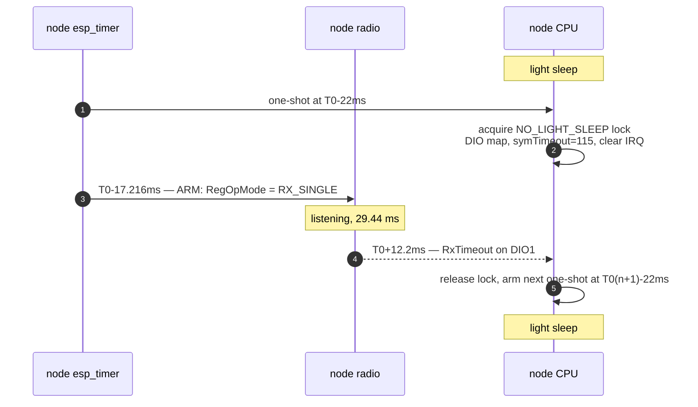
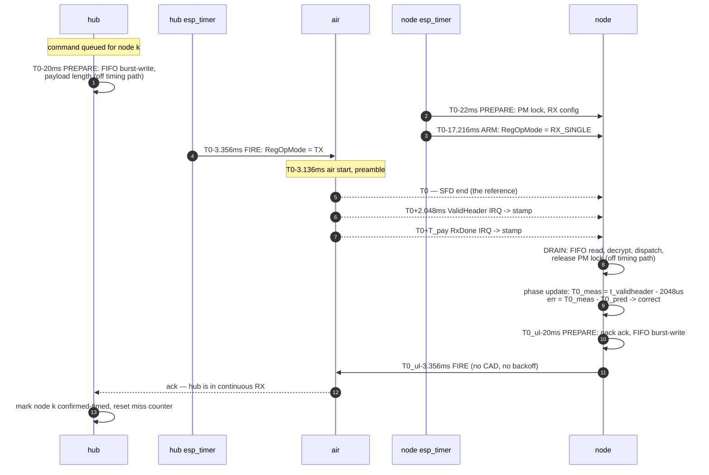

# Timed-window mode — implementation plan

**Target: the node opens ONE 29 ms receive window per 1.5 s round instead of
three.** Receive duty 5.9 % → 1.93 %. Hub airtime per command 714 ms → 42 ms.

This is the goal `timing-accuracy.md` §5 states, and it is far more forgiving
than a "narrow window" design. A 29 ms `RX_SINGLE` window gives **±14.08 ms** of
arrival tolerance — roughly a hundred times the placement error the hardware can
achieve once the timing-critical path is separated from the rest.

Supersedes the first version of this document, which was aimed at a ~4 ms window
and was wrong about the economics throughout. `timed-window-node-analysis.md`
records what changed and why.

---

## 1. Why one window needs synchronisation at all

Simulated against the real copy pattern (17 copies at 88 ms in a 1500 ms round,
windows at 500 ms, 29 ms wide):

| configuration | P(≥1 copy heard per round) |
|---|---|
| 3 windows, 17 copies — today | **96.4 %** |
| 1 window, 17 copies, unsynchronised | **32.9 %** |
| 1 window, 1 copy, synchronised | ~100 % |

Thinning the burst alone collapses reception by 3×; this is the point
`optimization-analysis.md` §2 makes ("`txSlotsPerRound = 17` is tuned to the
window scheme, not padded"). Synchronisation is what buys the window back —
and having bought it, the burst is no longer needed either.

---

## 2. The reference point: T0 = SFD end

Every instant in this document is expressed relative to **T0, the end of the
LoRa start-frame delimiter** of the frame in question.

```
air_start                    T0 = SFD end      ValidHeader           RxDone
    |                              |                |                   |
    |<-- n_pre up-chirps --><-sync-><-SFD->|<- header 8 sym ->|<- payload ... ->|
    |<---------- 12.25 sym --------------->|<--- 2048 us --->|
    |<------------ 3136 us --------------->|
```

At SF7 / BW500 / CR4-8, `T_sym = 2^7 / 500 000 = 256.0 µs`:

| interval | symbols | µs | depends on |
|---|---|---|---|
| `T_pre` — air start → **T0** | `n_pre + 4.25` = 12.25 | **3136** | preamble length only |
| `T_hdr` — **T0** → ValidHeader | 8 (explicit header, always CR4/8) | **2048** | nothing |

A caution on that second row. The leading `8` in the airtime formula
`n_sym = 8 + ceil(...)·(CR+4)` is **not** "the header" — it survives when
`IH=1` removes the header, which is the proof. What is true is that the
explicit header occupies the first 8 symbols after the SFD and those symbols
are always coded at 4/8 regardless of the configured CR. So `T_hdr = 8·T_sym`
holds, and it is independent of both payload length and CR — but the SX1278
asserts ValidHeader after *decoding* those symbols, so the real constant is
`2048 µs + a fixed decode delay`. **Calibrate it; do not assume 2048.** The
same applies to `d_tx_ramp`.
| `T_pay(len)` — ValidHeader → RxDone | `n_sym(len) − 8` | 18 430 … 92 160 | payload length |

### Why SFD end and not air start or RxDone

**It is the only instant both ends can name with a payload-independent
constant.**

- Hub: `T0 = t_fire + d_tx_ramp + T_pre` — `t_fire` is the `esp_timer` reading
  taken at the single SPI write that starts transmission; `d_tx_ramp` (~220 µs)
  is a radio constant.
- Node, preferred: `T0 = t_validheader − T_hdr` — **2048 µs, constant for every
  frame regardless of size**.
- Node, fallback: `T0 = t_rxdone − T_pay(len) − T_hdr` — requires the airtime
  model to be exactly right.

It is also the physically meaningful instant: the demodulator has finished sync
and the frame proper begins. Air start is not observable on either end; RxDone
drags the payload length into every calculation.

Frame sizes for reference (these are the real numbers, not the 15 ms placeholder
the first version of this document used):

| on-air bytes | time on air |
|---|---|
| 25 (bare ack) | 21.6 ms |
| 45 (`GridSync` beacon) | 33.9 ms |
| 60 (routine cover op) | 42.0 ms |
| 152 (8-entry `ScheduleConfig`) | 95.3 ms |

---

## 3. Timebase

| clock | source | resolution | runs in light sleep | used for |
|---|---|---|---|---|
| `esp_timer` | TG0 LAC ← APB ← 26 MHz XTAL (`CONFIG_ESP_TIMER_IMPL_TG0_LAC=y`) | 1 µs | **no** — IDF adds RTC-measured sleep time on wake | all timestamps and all scheduling, both ends |
| RTC slow | **external 32.768 kHz crystal** (`CONFIG_RTC_CLK_SRC_EXT_CRYS=y`) | 30.5 µs | yes | carries the node's phase across light sleep; recalibrated against XTAL every 100 sleeps (`CONFIG_PM_LIGHTSLEEP_RTC_OSC_CAL_INTERVAL=100`) |

**Everything reads `esp_timer_get_time()`.** It is XTAL-accurate while awake and
RTC-disciplined across sleep, and it is the same call the DIO0 ISR already makes.
Nothing in this design reads the FreeRTOS tick, which is 1000 Hz on the hub and
**100 Hz on the node** — 10 ms of granularity, five times the entire fixed error
budget below.

Window wakes come from an `esp_timer` one-shot. IDF's tickless idle converts a
pending `esp_timer` alarm into an RTC alarm when it light-sleeps, so no separate
sleep-timer plumbing is needed.

RTC quantisation over one 1500 ms round is 30.5 µs; crystal error at 20 ppm is
30 µs per round. Both are negligible against a ±14.08 ms guard. **The clock is
not the constraint at this target** — it only sets how long the node can coast
between syncs (§5).

**Grid periods must be exact integer milliseconds.** `DriftEstimator.h:47-70`
records that `1500/17` as 88.235 ms rather than the hub's integer 88.000 cost
three firmware revisions at −2663 ppm. A microsecond timer invites exactly that
mistake.

---

## 4. Slot layout

```
T_round  = 1 500 000 µs      (unchanged — the node's burst-end arithmetic assumes it)
T_slot   =   250 000 µs      6 nodes per round
T_ul_off =   150 000 µs      uplink offset within a slot
```

For node *k* in round *n*, on the hub's `esp_timer`:

```
T0_dl(k,n) = A + n·T_round + k·T_slot
T0_ul(k,n) = T0_dl(k,n) + T_ul_off
```

`A` is the grid anchor, set once when the grid starts and never moved.

A slot must hold the widest downlink plus its window: 14.08 ms of guard +
3.14 ms preamble + 95.3 ms for a full `ScheduleConfig` = 112.5 ms, then the
uplink at +150 ms and its 42 ms frame ends at 192 ms. 250 ms slot, 58 ms spare.

### The guard band comes free from the existing symbol timeout

`LoraInterface.cpp:347` already sets `symTimeout = int(30.0f/0.26f)` = 115
symbols = 29.44 ms. Arm at `T0 − (T_pre + G)` and the tolerance is symmetric:

```
G = (N_symtimeout·T_sym − T_detect) / 2 = (29.44 − 1.28) / 2 = 14.08 ms
```

- frame **early** by e: preamble starts at `T0 − T_pre − e`, still inside the
  window while `e ≤ G`.
- frame **late** by l: detection completes at `T0 − T_pre + l + T_detect`, still
  before the window closes while `l ≤ G`.

**The window itself does not change.** Only its cadence (1/round instead of 3)
and its phase (predicted instead of free-running).

---

## 5. Error budget

Everything below is the deviation of the actual SFD-end instant from the
scheduled `T0`, or of the node's window from where it should be.

| term | today | after this plan | why |
|---|---|---|---|
| hub fire jitter | ±2 ms + **1–4 ms payload-dependent bias** | **±50 µs** | prepare/fire split, §6 |
| `d_tx_ramp` uncertainty | — | ±20 µs | radio constant, calibrated once |
| node window-arm jitter | milliseconds under load | **±100 µs** | armed in the timer callback, §6 |
| node phase estimate | up to 500 ms (light sleep, §7) | ±20 µs (ValidHeader) / ±100 µs (RxDone + airtime) | PM lock across the window |
| **fixed subtotal** | | **≈ ±0.2 ms** | |
| **remaining for drift** | | **13.9 ms of 14.08** | |

Resync interval that the remaining budget allows:

| clock knowledge | full budget | with 50 % safety factor |
|---|---|---|
| no ppm measurement, ±20 ppm crystal spec | 694 s (11.6 min) | **347 s (5.8 min)** |
| ppm measured to ±2 ppm | 6940 s (116 min) | **3470 s (58 min)** |

Two conclusions that shape the phasing:

**The determinism work is not a prerequisite.** Today's ±2 ms hub jitter already
fits inside ±14.08 ms. Doing the work buys resync interval, not correctness.

**The drift estimator is an optimisation worth ~10× on the keepalive rate**, not
an enabler. The mode works at ±20 ppm with a 6-minute beacon.

### Airtime

Beacon 33.9 ms, command 42.0 ms, today's burst 17 × 42.0 = 714 ms.

| | today | timed + **broadcast** beacon | timed + **unicast** beacon |
|---|---|---|---|
| 2 nodes, 10 cmd/node/day, resync 5.8 min | 14.3 s/day | **9.3** | 17.7 |
| 2 nodes, resync 11.6 min | 14.3 s/day | **5.1** | 9.3 |
| 2 nodes, resync 58 min | 14.3 s/day | **1.7** | 2.5 |
| 6 nodes, resync 5.8 min | 42.9 s/day | **11.0** | 53.1 |
| 6 nodes, resync 58 min | 42.9 s/day | **3.4** | 7.6 |

A broadcast beacon wins at every rate and is flat in node count. A unicast
beacon only wins once the resync interval is long, i.e. only once ppm is
measured — and it scales with N. **Use a broadcast beacon; the drift estimator
is what makes even the unicast fallback tolerable.**

### Battery

RX-on ~11 mA (an unmeasured figure — see `timed-window-node-analysis.md` §10)
at 5.9 % duty contributes 0.65 mA of a ~1.45 mA awake budget:

| | awake | interactive average | per day |
|---|---|---|---|
| today, 3 windows | 1.45 mA | 1.09 mA | 26.2 mAh |
| 1 window | 1.01 mA | 0.77 mA | **18.4 mAh** |

~1.4×. Real, modest, and not the headline. The airtime reduction is.

---

## 6. Separating the timing-critical path

The rule: **the timing-critical operation is a single SPI register write, and
nothing else happens between the timer firing and that write.** Everything with
variable duration — FIFO transfer, protobuf, crypto, logging, NVS — is offloaded
either before the prepare point or after the event.

### Hub transmit

| when | phase | work | timing-critical |
|---|---|---|---|
| `T0 − 20 ms` | **PREPARE** | take radio mutex; standby; `RegFifoAddrPtr = 0`; **burst-write payload in ONE SPI transaction**; `RegPayloadLength` | no — ~200 µs, variable |
| `T0 − 3356 µs` | **FIRE** | `esp_timer` callback → one polled SPI write `RegOpMode = TX`; take `t_fire` immediately before it | **yes** |
| `T0 − 3136 µs` | air start | radio ramps and begins the preamble | — |
| `T0` | **SFD end** | the reference instant | — |
| after | **SETTLE** | poll/await TxDone, restore RX, log, free buffers | no |

`T0 − 3356 = −(T_pre + d_tx_ramp) = −(3136 + 220) µs`.

Five changes make FIRE deterministic, all in the hub's fork of the driver:

1. **Prepare/fire split** — the FIFO fill (~1 ms today, and **payload-dependent**
   because the driver writes one SPI transaction per byte) moves out of the
   timing path entirely.
2. **One burst SPI transaction for the FIFO** instead of one per byte. Removes
   the payload-dependent bias that no time-on-air correction can undo, and
   removes ~60 chances per frame for the silently-dropped register write at
   `lora.cpp:158`.
3. **Delete `esphome::delay(1)` from `lora_idle()` and `lora_tx()`** — use the
   `esp_rom_delay_us(120)` / `(220)` values already sitting commented out beside
   them. **The node's fork of the same driver already did this**; the hub is the
   stale copy.
4. **Move `ESP_LOGI("Sending packet…")` out of the mutex and after FIRE**
   (`lora_tracker.cpp:496`). Its cost is unverified — `sendPacketBurst` runs off
   the ESPHome main task and the logger may buffer — but it has no business in
   the path either way.
5. **Hoist the six per-packet config writes** (SF/CR/BW/sync/CRC, never change)
   into `setup()`.

### Node receive

| when | phase | work | timing-critical |
|---|---|---|---|
| `T0 − 22 ms` | **PREPARE** | acquire `ESP_PM_NO_LIGHT_SLEEP`; set DIO mapping, symbol timeout, clear IRQ flags | no |
| `T0 − 17 216 µs` | **ARM** | `esp_timer` callback → one polled SPI write `RegOpMode = RX_SINGLE` | **yes** |
| `T0 + 2048 µs` | **STAMP** | ValidHeader (DIO3) or RxDone (DIO0) ISR: `esp_timer_get_time()` as the first statement, push to queue, return | **yes** |
| after | **DRAIN** | FIFO read, decrypt, dispatch, release the PM lock | no |

`T0 − 17 216 = −(T_pre + G) = −(3136 + 14 080) µs`.

The ARM must run from the `esp_timer` callback, **not** by giving a semaphore to
`taskLoraRx` — that task is priority 5 beneath four priority-6 application tasks
on the same core, and its latency is correlated with traffic (it is those tasks'
protobuf/AES/NVS work that delays it).

### Node transmit (uplink)

| when | phase | work |
|---|---|---|
| `T0_ul − 20 ms` | **PREPARE** | FIFO fill in one transaction, from the RX-processing task |
| `T0_ul − 3356 µs` | **FIRE** | one polled SPI write `RegOpMode = TX` |

In timed mode the slot **is** the arbitration, so this path drops:

- the ~500 ms dequeue latency (the TX queue is drained once per RX loop
  iteration, and the loop is gated on the 500 ms semaphore);
- the burst-end deferral;
- the unconditional random pre-CAD backoff (`29·(1..10)` ms, quantised to a
  155 ms mean at the node's 100 Hz tick);
- CAD itself, and its 2 s bounded wait.

This is a **new transmit path beside the existing one**, not a modification of
it. The old path stays for burst mode.

---

## 7. Light sleep: the one thing that must be fixed first

`SystemCtrl.cpp:444` runs production with `light_sleep_enable = true`. Nothing
in the node arms a GPIO light-sleep wake source — `grep` for
`gpio_wakeup_enable` and `esp_sleep_enable_gpio_wakeup` across the whole tree
returns **zero hits**.

Because DIO0 is **level**-triggered (`LoraInterface.cpp:122`) the packet is not
lost: the line stays asserted, the frame waits in the FIFO, and the ISR runs at
the next wake. **The timestamp is lost.** `esp_timer_get_time()` in the ISR then
records when the CPU woke, not when the frame arrived — up to 500 ms late.

This is why the drift test disables light sleep outright, and it is why the
phase estimate row of §5 reads "up to 500 ms" today.

### The fix, and a correction to the record

`CmdDispatcher.cpp:2154-2158` justifies `esp_pm_configure(light_sleep_enable =
false)` over a PM lock like this:

> the lock only asks the power manager not to sleep, and leaves automatic light
> sleep armed underneath

**That is almost certainly a misdiagnosis.** `esp_pm_lock_create` is called
exactly once in the whole node tree, for the motor (`MotorCtrl.cpp:200`).
`pm_lock_handle_rx` is declared at `main.cpp:99`, externed in two files, and
**never created and never acquired**. An `ESP_PM_NO_LIGHT_SLEEP` lock does
prevent automatic light sleep; one that was never taken does nothing, which is
what was observed.

So the fix is small:

**Arm GPIO light-sleep wakeup on DIO0** — `gpio_wakeup_enable(DIO0,
GPIO_INTR_HIGH_LEVEL)` plus `esp_sleep_enable_gpio_wakeup()`. Two calls. The CPU
then wakes on the interrupt itself, and the timestamp is arrival + a light-sleep
wake latency that is a **repeatable constant** for a fixed configuration (PLL
relock, order 0.5–1 ms), because during the window the node has nothing else to
do and is reliably asleep. A repeatable bias calibrates out; only its jitter
enters the budget, and that must be measured.

### Correction: holding a PM lock instead would erase the battery win

An earlier draft of this section proposed holding `ESP_PM_NO_LIGHT_SLEEP`
across the 29 ms window instead, for an ISR-latency-accurate timestamp. The
arithmetic kills it:

| | window current | awake current | per day |
|---|---|---|---|
| today, 3 windows, CPU light-sleeps | 11 mA | 1.45 mA | 26.2 mAh |
| 1 window, CPU light-sleeps | 11 mA | 1.02 mA | **18.4 mAh** |
| 1 window, **PM lock held across it** | 11 + ~20 mA | 1.41 mA | **25.5 mAh** |

Holding the CPU awake for 1.9 % of the time costs ~0.4 mA and takes the whole
change from 26.2 → 25.5 mAh/day. **The mode would buy nothing.** The PM lock is
a fallback only if measured GPIO-wake jitter turns out to be unusable, and
taking it would mean accepting that the battery case is gone.

Either way, verify the wake source or the lock is actually armed. The precedent
for shipping one that never was is in the tree.

### Deep sleep is out of scope

`wake-cost-proposal.md` records 919 ms from deep-sleep wake to the first log
line. A scheduled window cannot be placed through a ~1 s variable boot. **A node
waking from deep sleep always starts in burst mode**, re-acquires, and promotes.

---

## 8. Message sequence charts

### 8.1 Empty round — the common case

Most rounds carry no traffic. This is what the 1.93 % duty actually buys.



Radio on 29.4 ms, CPU awake ~34 ms, per 1500 ms.

### 8.2 Synchronised downlink and reply



### 8.3 Acquisition: burst → timed

```mermaid
sequenceDiagram
    autonumber
    participant H as hub
    participant N as node
    Note over N: BURST — 3 windows/round, 17 copies
    H->>N: GridSync, bursted 17x<br/>{anchorRound, roundPeriodUs, slotIndex,<br/>slotPeriodUs, enable=false}
    Note over N: a windowed receiver catches a<br/>bursted frame with p=96.4%
    N->>N: T0_meas from ValidHeader; grid phase known
    N->>H: beacon {timedRxReady=true, phaseErrUs, rtcSlowSrc}
    Note over H: node reports the 32 kHz crystal<br/>and a phase error inside tolerance
    H->>N: GridSync {enable=true}, bursted
    N->>H: ack in the uplink slot — the first slot-timed transmission
    Note over H,N: hub sees an ack arrive IN ITS SLOT<br/>=> node is provably timed
    Note over N: TIMED — 1 window/round
    H->>N: single-copy frames from here
```

Promotion requires an uplink **observed in its slot**, not a claim. A beacon
saying "I am ready" is not evidence that the node's window is where it thinks.

### 8.4 Loss of sync

```mermaid
sequenceDiagram
    autonumber
    participant H as hub
    participant N as node
    Note over N: TIMED
    H->>N: single copy at T0
    Note over N: window empty (interference, or drift<br/>exceeded the guard)
    Note over H: no ack in the uplink slot
    H->>N: SAME frame, SAME msgid, bursted 17x
    Note over H: burst reaches a timed node too —<br/>copy 0 starts at the node's T0
    alt burst heard
        N->>H: ack; hub stays in TIMED
    else K consecutive misses
        Note over H: demote to BURST for this node
        Note over N: independently: M empty windows<br/>=> revert to 3 windows/round
    end
```

**The retry reuses the msgid, and must retransmit the byte-identical frame.**
Two constraints force this:

- The node's replay filter requires `msgid > rx_id_`
  (`SessionManager.cpp:111-121`), so a *new* msgid on a retry means the node
  executes the command a second time — on a blind, a second motor run.
- The AEAD nonce is derived from the msgid
  (`lora_client.cpp:256`: `counter = msgid | kDownlinkNonceFlag`). Reusing a
  msgid with *different* plaintext is GCM nonce reuse, which is a real
  cryptographic failure, not a protocol inconvenience. Reusing it with the
  identical ciphertext is a plain replay of the same message, which is safe.

So the retry path must re-send the stored frame, never re-pack it. This is
exactly what the 17-copy burst already does — all copies share one msgid and one
ciphertext — so the rule is "a burst fallback is a retransmission, not a new
send". See §9 for the ack-loss case it leaves open.

### 8.5 The keepalive beacon

```mermaid
sequenceDiagram
    autonumber
    participant H as hub
    participant N1 as node 1
    participant N2 as node 2
    Note over H: every 347 s (unmeasured ppm)<br/>or 3470 s (measured)
    H->>N1: GridSync broadcast (destAddress = 0xFF)
    H->>N2: (same frame — one transmission)
    Note over N1,N2: each node hears it in ITS OWN window,<br/>so the beacon repeats once per slot
    N1->>N1: phase correction; reset staleness timer
    N2->>N2: phase correction; reset staleness timer
```

**This only works with a common beacon slot**, and that is a design requirement,
not a detail. A node listening solely in its own private slot cannot hear one
shared transmission — the hub would have to repeat the beacon once per occupied
slot, which is unicast cost wearing a broadcast label and destroys the
flat-in-N property the §5 table depends on.

So: **slot 0 of the round is a common beacon slot.** Every node additionally
opens a window there, but only on beacon rounds — one extra 29 ms window per
resync interval (347 s or 3470 s), which is negligible against one window per
1.5 s. Beacon rounds are `n mod M == 0` for a published `M`, so a node that has
been asleep or has just re-acquired knows exactly which rounds to listen in.

Private slots then carry unicast traffic only, and the beacon is genuinely one
transmission for all N nodes. That is what §5's broadcast column prices.

---

### 8.6 Mixed modes on one channel — the hub must schedule bursts too

While node 1 is TIMED and node 2 is in BURST, node 2's 17-copy burst spans
1.4 s of the 1.5 s round. Copies are 42 ms of air every 88 ms, so the clear gap
between copies is 46 ms and node 1's 29.44 ms window fits inside a gap with only
17 ms of freedom:

```
P(node 1's window falls entirely in a gap) = (46.0 - 29.44) / 88.0 = 0.19
```

**81 % of the time, a burst aimed at node 2 walks straight through node 1's
window.** The frame is received, fails the address filter and is discarded — and
if the hub also had a downlink for node 1 that round, it is lost.

This does not appear in any single-node analysis, and the first draft of this
plan missed it entirely. The fix is cheap because the hub is the only downlink
transmitter and therefore already knows both schedules:

**The hub's transmit scheduler must be slot-aware for burst traffic as well as
timed traffic.** A burst to a node in BURST mode places its copies only in
rounds/segments not owned by a node in TIMED mode — or, more simply, keeps them
inside the addressed node's own slot and spreads the burst across consecutive
rounds. With a 250 ms slot and 42 ms frames, a slot holds 4–5 copies per round,
so a 17-copy burst spans four rounds (6 s) instead of one. That is slower than
today's 1.5 s, and it is the price of mixed modes.

This also means the per-frame TX policy of P1 needs a mark **and** a copy
schedule, not just a copy count: `send(buf, len, {copies, first_mark_us,
copy_stride_us})`.

## 9. Protocol changes

The `.proto` lives in the node repo (`proto/blinds.proto`); the hub vendors the
generated C. Changes are made there, regenerated into both trees, and mirrored in
`tests/proto_sim/sim/messages.h` and `wire_codec.cpp`.

New downlink command (`LoraClientOperationMessage.cmd`, next free tag 19):

```proto
message GridSync {
  uint32 anchorRound   = 1;  // n for THIS frame's slot
  uint32 roundPeriodUs = 2;  // 1500000
  uint32 slotPeriodUs  = 3;  //  250000
  uint32 slotIndex     = 4;  // which slot is yours
  uint32 ulOffsetUs    = 5;  //  150000
  uint32 guardUs       = 6;  // hub's view of the tolerance it can hit
  uint32 resyncMaxS    = 7;  // stale after this without a frame
  bool   enable        = 8;  // promote / demote
}
```

Uplink additions to `NodeWakeBeacon`:

```proto
  bool   timedRxReady    = ...;  // node believes it can hold a slot
  bool   timedRxActive   = ...;  // what the node is ACTUALLY doing
  int32  phaseErrUs      = ...;  // last (T0_measured - T0_predicted)
  int32  ppmEstimate     = ...;
  uint32 ppmSamples      = ...;
  int32  measuredPeriodUs= ...;  // ruler-mismatch alarm, see DriftEstimator.h:89
  uint32 rtcSlowSrc      = ...;  // gates the whole mode
```

Three constraints, each already paid for once in this project:

- **proto3 defaults must mean the safe thing.** `enable=false` → burst;
  `timedRxActive=false` → the hub must burst; `rtcSlowSrc=0` → unknown → burst.
  Same reasoning as the `sleepOk` field's comment.
- **Deploy node-first.** An unknown field decodes as `NOT_SET` with the header
  still readable.
- `LoraHeader.burstCount == 0` already means "single-shot, no deferral". Timed
  frames use it unchanged.

### The gap this plan does not close

The protocol cannot express **"arrived, but the ack was lost."** Reusing the
msgid on a retry means the replay filter drops it and no ack can ever be
generated; minting a new one means double execution. §8.4 chooses msgid reuse
(the safe failure is a missing ack, not a second motor run), which leaves the hub
retrying a command that already executed until it demotes.

The proper fix is for the node to answer a replayed msgid with the **cached ack**
rather than dropping it silently — a small change in `SessionManager` and the
admission path. It is not required for P1–P3 but it is required before
single-copy downlink becomes the normal case, because that is when retries stop
being rare.

---

## 10. Phases

| phase | content | gate |
|---|---|---|
| **P0** | **GPIO light-sleep wakeup on DIO0** (§7) — two calls. Then calibrate the wake latency and measure its jitter. | RxDone timestamps stop showing 100 ms-scale outliers under the production power profile, and the residual jitter is < 1 ms |
| **P1** | **Hub grid anchor** + per-frame TX policy (`send(buf, len, {copies, first_mark_us, copy_stride_us})`, replacing the global `setBurstCopies`). Bursts start at the addressed node's `T0`. **On air: unchanged, still 17 copies at 88 ms.** | bursts observably start on the grid; nothing regresses |
| **P2** | **Node phase tracking.** Compute `T0_measured` from ValidHeader (or RxDone + airtime), compare against the predicted grid, report `phaseErrUs` + `rtcSlowSrc` + `ppmEstimate` in the beacon. Still 3 windows. | `phaseErrUs` stays inside ±2 ms in the field, on both nodes, over days |
| **P3** | **One window.** Node opens a single predicted window per round; hub still bursts. This is the change that halves the battery, and it is reversible without touching the hub. | reception ≥ today's over a week |
| **P4** | **Single-copy downlink** + the ack-cache fix (§9). Hub sends one copy at `T0` to a confirmed-timed node; any miss retries as a burst immediately. | command success rate unchanged over a week |
| **P5** | **Common beacon slot + broadcast keepalive** (§8.5) — makes the resync cost flat in node count. Also **slot-aware burst scheduling** (§8.6), which becomes mandatory as soon as one node is TIMED and another is not — i.e. from P3 onward with more than one node. | a TIMED node's window is not walked through by another node's burst |
| **P6** | **Timed uplink** (§6) — new transmit path, CAD and backoff dropped. | — |
| **P7** | Determinism work (§6 items 1–5 on the hub). Buys ~10× resync interval. **Not a prerequisite** — schedule it when the beacon rate becomes the binding cost. | p99 fire residual < 200 µs |

**P3 is the deliverable.** P0–P2 are what make it safe; P4–P7 are what make it
cheap. With more than one node, §8.6's slot-aware burst scheduling moves forward
into P3 — it is not optional once the modes can differ per node. Note the ordering inversion against the first version of this plan: the
determinism work moved from prerequisite to last, because a ±14.08 ms guard does
not need it.

---

## 11. Tests

Host tests, in the style of the existing dependency-free policy headers:

- **`TimedGrid.h`** — `T0_dl(k,n)`, `T0_ul(k,n)`, slot assignment, `anchorRound`
  wraparound. Pure arithmetic.
- **`LoraTiming.h`** — one shared implementation of `T_sym`, `T_pre`, `T_hdr`,
  `n_sym(len)`, `T_pay(len)`, used by hub, node and tests. Pin it against the
  numbers already asserted in `auto_mode_proto_test.cpp` (95.296 ms for 152 B)
  and against `T_pre = 3136 µs`.
- **`TimedModePolicy.h`** — promotion/demotion as a pure function of
  (ppm validity, phase error, consecutive misses, `rtcSlowSrc`, confirmation
  age). **The test that matters is the negative one**: no input combination may
  produce "hub TIMED + node BURST".
- **Guard-band arithmetic** — `G` from symbol timeout, and the resync interval
  from `G` and ppm, asserted against the `drift_us_over` cases already in
  `drift_estimator_test.cpp`.
- **Ruler coupling** — assert on the *hub* side that the grid period is an
  integer number of milliseconds and that the burst copy spacing still equals the
  node's `kCopySpacingUs = 88000`.
- **Replay/ack** — a msgid-reuse retry must produce a cached ack, not a drop, and
  the retry must be byte-identical (nonce reuse, §8.4).
- **Slot-aware burst placement** — given one TIMED node and one BURST node,
  assert no burst copy overlaps the TIMED node's window. This is the §8.6
  property, and it is the one a single-node test can never catch.

Bench measurements that no host test can replace:

1. **`d_tx_ramp`** — the constant in `T0 = t_fire + d_tx_ramp + T_pre`. Scope on
   a GPIO toggled at FIRE versus the RF envelope, or derive it from a TxDone
   timestamp once a DIO line is wired on the hub (there is none today — the hub
   polls IRQ flags over SPI and has no GPIO ISR at all).
2. **Node RxDone/ValidHeader ISR latency** with the PM lock held, distribution
   not mean.
3. **RX-on current**, to replace the unprovenanced ~11 mA that §5's battery table
   rests on.
4. **ppm under the production power profile.** The +8 ppm figure was measured
   with light sleep **disabled**; it says nothing about the clock this mode runs
   on.

---

## 12. Known defects this plan depends on fixing

From `timed-window-node-analysis.md`, in the order they bite:

| defect | effect here |
|---|---|
| `pm_lock_handle_rx` never created (`main.cpp:99`) | P0 is exactly this |
| `sendPacketBurst` overwrites `burstCount` (`lora_tracker.cpp:420`); `setBurstCopies` is global | a single-copy frame **cannot be expressed** today; blocks P1 |
| `lora_reset()` — `pdMS_TO_TICKS(1)` is **0 ticks** at the node's 100 Hz | no SX1278 reset pulse at all; unrelated but adjacent and one line |
| `lora_write_reg` silently skips on a 1-tick semaphore timeout (`lora.cpp:158`) | a dropped `RegOpMode = TX` is a frame that never transmits, with no error |
| `getBurstEndUs` predicts `remaining × 88 ms` (`CmdDispatcher.cpp:2836`) | a 95 ms frame overruns its 88 ms slot, so the node replies into the burst tail |
| `CONFIG_FREERTOS_HZ` unpinned in `loradevices.yml` | the hub's tick rate is inferred, not guaranteed; 88 ms is consistent with 1000, 500, 250 and 125 Hz |
| `loradevices.yml:221` still documents an 88235 µs ruler | the exact error that cost three firmware revisions |
| no GPIO light-sleep wake source anywhere in the node tree | P0 is exactly this; without it the phase estimate is worthless (§7) |
| the hub's transmit scheduler is not slot-aware | a burst for one node walks through another's window 81 % of the time (§8.6) |
