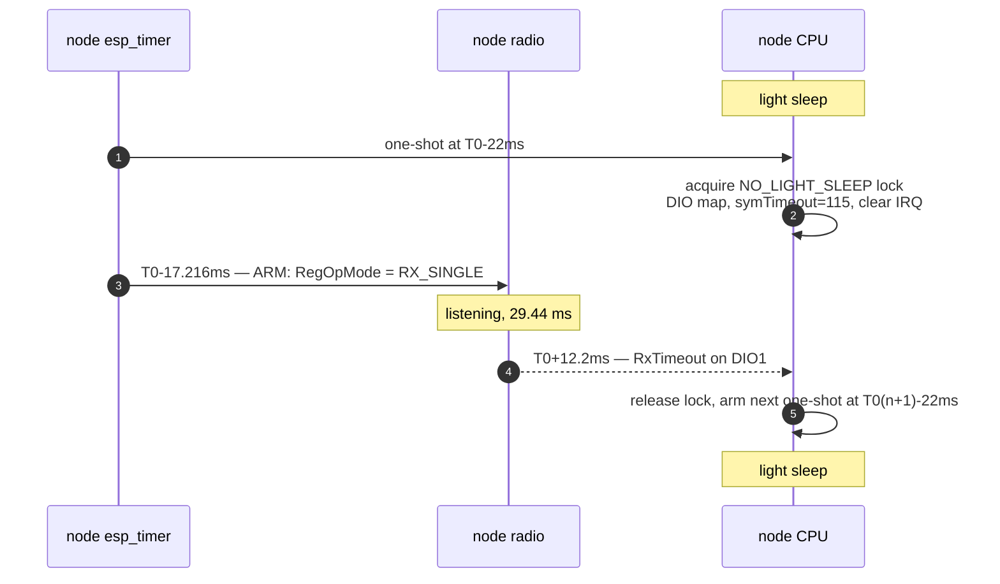
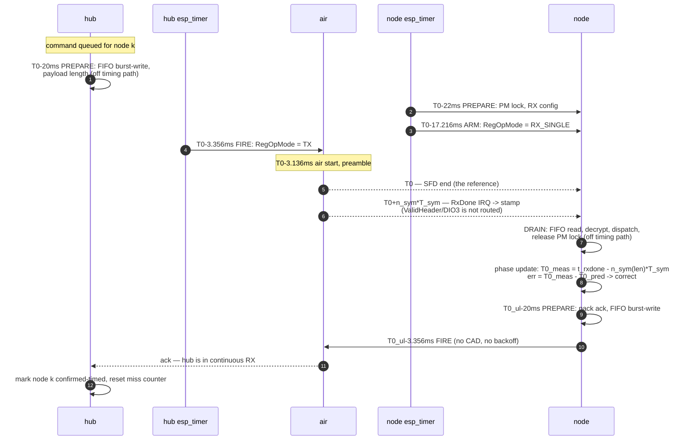

# Timed-window mode — implementation plan

**Target: the node opens ONE 29 ms receive window per 1.5 s round instead of
three.** Receive duty 5.9 % → 1.93 %. Hub airtime per command 714 ms → 42 ms.

This is the goal `timing-accuracy.md` §5 states, and it is far more forgiving
than a "narrow window" design. A 29 ms `RX_SINGLE` window gives **±14.08 ms** of
arrival tolerance — roughly a hundred times the placement error the hardware can
achieve once the timing-critical path is separated from the rest.

Supersedes the first version of this document, which was aimed at a ~4 ms window
and was wrong about the economics throughout. `timed-window-node-analysis.md`
records what changed and why.

---

## 1. Why one window needs synchronisation at all

Simulated against the real copy pattern (17 copies at 88 ms in a 1500 ms round,
windows at 500 ms, 29 ms wide):

| configuration | P(≥1 copy heard per round) |
|---|---|
| 3 windows, 17 copies — today | **96.4 %** |
| 1 window, 17 copies, unsynchronised | **32.9 %** |
| 1 window, 1 copy, synchronised | ~100 % |

The closed form, because the obvious check is wrong. Copy *i* leaves at `88i`;
a window of width *w* catches it iff `(x + 88i) mod P ∈ [0, w)` for window
period *P*. The residues are near-uniformly spread, so the union — not the sum —
is what counts:

- **P = 500 ms** (3 windows): residues sort to gaps of 28 ms (×11) and 32 ms (×6).
  Union = `11×28 + 6×29 = 482` → `482/500 = 96.4 %`.
- **P = 1500 ms** (1 window): all 17 gaps exceed 29 ms, so no overlap.
  Union = `17×29 = 493` → `493/1500 = 32.9 %`.

Treating the three windows as independent gives `1 − 0.671³ = 69.8 %` and is
**wrong by 27 points**: 88 ms against 500 ms sweeps the copies almost uniformly
across the window period, so the windows are strongly anti-correlated. That
anti-correlation *is* `optimization-analysis.md` §2's "tuned to the window
scheme". Its "1.00 expected catches" is a third quantity again —
`17 × 29/500 = 0.99` — and all three numbers are correct and consistent.

Thinning the burst alone collapses reception by 3×; this is the point
`optimization-analysis.md` §2 makes ("`txSlotsPerRound = 17` is tuned to the
window scheme, not padded"). Synchronisation is what buys the window back —
and having bought it, the burst is no longer needed either.

---

## 2. The reference point: T0 = SFD end

Every instant in this document is expressed relative to **T0, the end of the
LoRa start-frame delimiter** of the frame in question.

```
air_start                    T0 = SFD end   (ValidHeader)           RxDone
                                              not routed        <- the only IRQ
    |                              |                |                   |
    |<-- n_pre up-chirps --><-sync-><-SFD->|<- header 8 sym ->|<- payload ... ->|
    |<---------- 12.25 sym --------------->|<--- 2048 us --->|
    |<------------ 3136 us --------------->|
```

At SF7 / BW500 / CR4-8, `T_sym = 2^7 / 500 000 = 256.0 µs`:

| interval | symbols | µs | depends on |
|---|---|---|---|
| `T_pre` — air start → **T0** | `n_pre + 4.25` = 12.25 | **3136** | preamble length only |
| `T_hdr` — **T0** → ValidHeader *(structural only — DIO3 is not routed)* | 8 | 2048 | nothing |
| `T_pay(len)` — ValidHeader → RxDone | `n_sym(len) − 8` | 16 384 … 90 112 | payload length |
| **`T_hdr + T_pay` — T0 → RxDone** | **`n_sym(len)`** | **18 432 … 92 160** | payload length |

**The last row is the one the node uses**, and it is worth stating as a single
step rather than two:

```
T0 = t_rxdone − n_sym(len)·T_sym
```

Decomposing it into `T_pay` and `T_hdr` and subtracting both is arithmetically
identical but invites an error this document already made once: an earlier draft
listed `T_pay` as 18 430 … 92 160 µs, which is the *combined* figure, so
subtracting `T_hdr` on top of it double-counted the header — a fixed −2.048 ms
bias, 15 % of the guard band, indistinguishable from a crystal error. Implement
the one-line form.

**Why `T_hdr` is 8 symbols.** The first block after the SFD is *always* 8
symbols coded at CR 4/8, whatever CR is configured for the payload. In explicit
mode that block carries the header (20 header bits, plus spare payload bits — at
SF7 the block holds 4·SF = 28 bits). It survives `IH=1` because the block
persists as a payload-carrying block, not because it was never the header. The
row is kept because it explains the structure and because `n_sym`'s leading `8`
is otherwise mysterious — but nothing in the implementation needs it separately.

### Why SFD end and not air start or RxDone

**It is the only instant both ends can name that is independent of frame size**
— which is what makes one grid work for a 25-byte ack and a 152-byte schedule
push alike.

The hub names it with a constant (`t_fire + d_tx_ramp + T_pre`). The node has to
compute back from RxDone, so on the node the *reference* is size-independent
while the *route to it* is not. That is a software-correctness burden, not a
measurement error: `n_sym` is exact integer arithmetic on modem settings that
never change. §2's `LoraTiming.h` and its host test are what discharge it.

- Hub: `T0 = t_fire + d_tx_ramp + T_pre` — `t_fire` is the `esp_timer` reading
  taken at the single SPI write that starts transmission; `d_tx_ramp` (~220 µs)
  is a radio constant.
- Node: `T0 = t_rxdone − T_pay(len) − T_hdr` = `t_rxdone − n_sym(len)·T_sym`.
  RxDone on DIO0 is the **only** hardware timing event available — see below.

### DIO2 and DIO3 are not routed — settled by the PCB

ValidHeader is available on **DIO3 only** (`components/lora/include/lora.h:23`;
DIO0 offers RxDone/TxDone/CadDone, DIO1 offers RxTimeout/FhssChangeChannel/
CadDetected). The node's PCB does not bring DIO2 or DIO3 to the CPU. The
commented-out `loraDio3Pin = gpio_num_t(25)` in `LoraInterface.h:90` and the
`gpios.md` row that matches it are both aspirational; the copper is not there.

So the node computes T0 from RxDone, and there is no alternative. An earlier
revision of this document treated that as a serious loss. **It is not**, and
being clear about why matters, because the temptation is to spend a board
respin on it.

| | ValidHeader path | RxDone path |
|---|---|---|
| expression | `t_vh − 2048 µs` | `t_rxdone − n_sym(len)·T_sym` |
| error from the reference itself | one constant, calibrated | **zero** — `n_sym` is exact integer arithmetic on known modem settings |
| error from ISR + light-sleep wake | identical | identical |
| what can go wrong | a mis-calibrated constant | a mis-implemented formula |

The ISR and wake-latency terms are the same on both paths, and they dominate.
ValidHeader would have bought **no measurable accuracy** — it would have traded a
software correctness risk for a calibration risk. The formula is exact, it is
already written in this repository
(`tests/proto_sim/scenarios/auto_mode_proto_test.cpp:300-312`), and a host test
already pins one of its values (95.296 ms for 152 B). That converts the risk
into something a test catches once and forever.

Three consequences to carry into implementation:

- **`LoraTiming.h` becomes load-bearing, so it is a P-1 deliverable.** One
  implementation of `T_sym`, `T_pre`, `T_hdr`, `n_sym(len)` shared by hub, node
  and tests. Pin it against the two known values and against `T_pre = 3136 µs`.
- **Pin the `PL` convention by test.** `RegRxNbBytes` gives payload bytes
  *excluding* the CRC, and the formula's `+16·CRC` term accounts for the CRC
  separately — so `PL = RegRxNbBytes` is right. That is exactly the kind of
  off-by-two-bytes that would show up as a constant 0.5 ms bias and be blamed on
  the crystal.
- **A CRC-failed frame still yields a usable T0.** The header has its own CRC, so
  if the header decoded, the length is trustworthy even when the payload fails.
  This is why `noteDriftSample` is deliberately called before parsing
  (`frtosTasks.cpp:160-165`) — the existing design already gets this right.

### If the formula risk is ever judged too high: fix the beacon's length

There is a cheaper answer than a board respin. Only the **beacon** carries the
phase; commands do not need to update it. Padding the beacon — and only the
beacon — to a fixed on-air size makes its `T_pay` a single compile-time
constant, and the node's phase update becomes `t_rxdone − K`, with no runtime
arithmetic at all.

Cost: padding a 45 B beacon to 60 B takes it from 33.9 ms to 42.0 ms of air,
about 24 % more beacon airtime — a few seconds per day at the §5 rates. That is
a real option to hold in reserve, not a recommendation; the formula should be
correct regardless.

---

## 3. Timebase

| clock | source | resolution | runs in light sleep | used for |
|---|---|---|---|---|
| `esp_timer` | TG0 LAC ← APB ← 26 MHz XTAL (`CONFIG_ESP_TIMER_IMPL_TG0_LAC=y`) | 1 µs | **no** — IDF adds RTC-measured sleep time on wake | all timestamps and all scheduling, both ends |
| RTC slow | **external 32.768 kHz crystal** (`CONFIG_RTC_CLK_SRC_EXT_CRYS=y`) | 30.5 µs | yes | carries the node's phase across light sleep; recalibrated against XTAL every 100 sleeps (`CONFIG_PM_LIGHTSLEEP_RTC_OSC_CAL_INTERVAL=100`) |

**Everything reads `esp_timer_get_time()`.** It is XTAL-accurate while awake and
RTC-disciplined across sleep, and it is the same call the DIO0 ISR already makes.

Nothing in this design *schedules* on the FreeRTOS tick, which is 1000 Hz on the
hub and **100 Hz on the node** — 10 ms of granularity, fifty times the fixed
error budget below. But the tick has not been eliminated from the path: **every
SPI register write on both ends is gated by
`xSemaphoreTake(xSemaphore, (TickType_t)1)`** (hub `lora.cpp:158`, node
`components/lora/lora.cpp:143, 251, 304`) and silently does nothing on timeout.
That is a 10 ms window on the node, and the ARM write of §6 goes through it. It
must become a bounded-and-*reported* take before P3.

Window wakes come from an `esp_timer` one-shot. IDF's tickless idle converts a
pending `esp_timer` alarm into an RTC alarm when it light-sleeps, so no separate
sleep-timer plumbing is needed.

RTC quantisation over one 1500 ms round is 30.5 µs; crystal error at 20 ppm is
30 µs per round. Both are negligible against a ±14.08 ms guard. **The clock is
not the constraint at this target** — it only sets how long the node can coast
between syncs (§5).

**Grid periods must be exact integer milliseconds.** `DriftEstimator.h:47-70`
records that `1500/17` as 88.235 ms rather than the hub's integer 88.000 cost
three firmware revisions at −2663 ppm. A microsecond timer invites exactly that
mistake.

---

## 4. Slot layout

```
T_round  = 1 500 000 µs      (unchanged — the node's burst-end arithmetic assumes it)
T_slot   =   250 000 µs      6 nodes per round
T_ul_off =   150 000 µs      uplink offset within a slot
```

For node *k* in round *n*, on the hub's `esp_timer`:

```
T0_dl(k,n) = A + n·T_round + k·T_slot
T0_ul(k,n) = T0_dl(k,n) + T_ul_off
```

`A` is the grid anchor, set once when the grid starts and never moved.

A slot must hold the widest downlink plus its window: 14.08 ms of guard +
3.14 ms preamble + 95.3 ms for a full `ScheduleConfig` = 112.5 ms, then the
uplink at +150 ms and its 42 ms frame ends at 192 ms. 250 ms slot, 58 ms spare.

### The guard band comes free from the existing symbol timeout

`LoraInterface.cpp:347` already sets `symTimeout = int(30.0f/0.26f)` = 115
symbols = 29.44 ms. Arm at `T0 − (T_pre + G)` and the tolerance is symmetric:

```
G = (N_symtimeout·T_sym − T_detect) / 2 = (29.44 − 1.28) / 2 = 14.08 ms
```

- frame **early** by e: preamble starts at `T0 − T_pre − e`, still inside the
  window while `e ≤ G`.
- frame **late** by l: detection completes at `T0 − T_pre + l + T_detect`, still
  before the window closes while `l ≤ G`.

Three things this rests on, two of them unverified:

- **Detection stops the timeout.** A 95.3 ms `ScheduleConfig` is received today
  inside a 29.44 ms `RX_SINGLE` window, so the SX1278 demonstrably does not abort
  a packet already in progress. Settled empirically, worth stating.
- **`T_detect ≈ 5 symbols` is a LoRaWAN rule of thumb, not a datasheet number.**
  It appears nowhere in either repo, and it is the only thing setting the
  late-side margin. It also interacts with `RegDetectionOptimize` /
  `RegDetectThreshold`, which the driver never writes
  (`LoraInterface.cpp:78-82`) — they sit at reset defaults, unexamined. **Bench
  item, alongside `d_tx_ramp`.**
- **The 29.44 ms window is an accident.** `symTimeout = int(30.0f/0.26f)`
  (`LoraInterface.cpp:347`) was derived from a comment claiming "20 ms per
  packet"; real frames are 42–95 ms. The guard band now depends on a number
  chosen for a reason that was wrong. Pin it as a named constant before P3.

**The window itself does not change.** Only its cadence (1/round instead of 3)
and its phase (predicted instead of free-running).

---

## 5. Error budget

Everything below is the deviation of the actual SFD-end instant from the
scheduled `T0`, or of the node's window from where it should be.

| term | today | after this plan | why |
|---|---|---|---|
| hub fire jitter | ±2 ms + **1–4 ms payload-dependent bias** | **±50 µs** | prepare/fire split, §6 |
| `d_tx_ramp` uncertainty | — | ±20 µs | radio constant, calibrated once |
| node window-arm jitter | milliseconds under load | **±100 µs** | armed in the timer callback, §6 |
| node phase estimate | up to 500 ms (light sleep, §7) | **±100 µs + light-sleep wake jitter**, RxDone only | §7 — and the wake jitter is unmeasured |
| **fixed subtotal** | | **≈ ±0.2 ms** | |
| **remaining for drift** | | **13.9 ms of 14.08** | |

Resync interval that the remaining budget allows:

| clock knowledge | full budget | with 50 % safety factor |
|---|---|---|
| no ppm measurement, ±20 ppm crystal spec | 694 s (11.6 min) | **347 s (5.8 min)** |
| ppm measured to ±2 ppm | 6940 s (116 min) | **3470 s (58 min)** |

Two conclusions that shape the phasing:

**The determinism work is not a prerequisite.** Today's ±2 ms hub jitter already
fits inside ±14.08 ms. Doing the work buys resync interval, not correctness.

**The drift estimator is an optimisation worth ~10× on the keepalive rate**, not
an enabler. The mode works at ±20 ppm with a 6-minute beacon.

### Airtime

Beacon 33.9 ms, command 42.0 ms, today's burst 17 × 42.0 = 714 ms.

| | today | timed + **broadcast** beacon | timed + **unicast** beacon |
|---|---|---|---|
| 2 nodes, 10 cmd/node/day, resync 5.8 min | 14.3 s/day | **9.3** | 17.7 |
| 2 nodes, resync 11.6 min | 14.3 s/day | **5.1** | 9.3 |
| 2 nodes, resync 58 min | 14.3 s/day | **1.7** | 2.5 |
| 6 nodes, resync 5.8 min | 42.9 s/day | **11.0** | 53.1 |
| 6 nodes, resync 58 min | 42.9 s/day | **3.4** | 7.6 |

A broadcast beacon is flat in node count; a unicast one scales with N and only
wins once the resync interval is long.

**But 10 cmd/node/day is an unsourced assumption, and the win depends on it.**
The system's own configuration argues for far less: two scheduled events per day
per node (`loradevices.yml:98-107`, `:150-155`), a 6 h / 1 h check-in, and a
15 min battery update. Call it 3 commands/node/day:

| | today | broadcast @5.8 min | @11.6 min | @58 min |
|---|---|---|---|---|
| 2 nodes, 10 cmd/node/day | 14.3 s | 9.3 | 5.1 | 1.7 |
| 2 nodes, **3 cmd/node/day** | **4.3 s** | **8.7** ✗ | **4.5** ✗ | **1.1** ✓ |

At a realistic command rate the beacon only pays for itself **once ppm is
measured** (58 min resync). So the drift estimator moves from "optimisation" to
"what makes the airtime case true at all", and P2 is load-bearing rather than
merely reassuring. The per-command figure (714 ms → 42 ms) is unaffected; the
daily-total claim is assumption-bound.

**And the 50 % safety factor is spent twice.** The beacon is a single-copy
broadcast; one lost beacon doubles the time since sync and consumes exactly that
margin. Two consecutive losses put the node outside the guard with no mechanism
to notice before it starts missing commands. Beacon misses must be counted
separately from window misses, and a missed beacon must trigger an immediate
re-send.

### Battery

RX-on ~11 mA (an unmeasured figure — see `timed-window-node-analysis.md` §10)
at 5.9 % duty contributes 0.65 mA of a ~1.45 mA awake budget:

| | awake | interactive average | per day |
|---|---|---|---|
| today, 3 windows | 1.45 mA | 1.09 mA | 26.2 mAh |
| 1 window | 1.01 mA | 0.77 mA | **18.4 mAh** |

~1.4×. Real, modest, and not the headline. The airtime reduction is.

---

## 6. Separating the timing-critical path

The rule: **the timing-critical operation is a single SPI register write, and
nothing else happens between the timer firing and that write.** Everything with
variable duration — FIFO transfer, protobuf, crypto, logging, NVS — is offloaded
either before the prepare point or after the event.

### Hub transmit

| when | phase | work | timing-critical |
|---|---|---|---|
| `T0 − 20 ms` | **PREPARE** | take radio mutex; standby; `RegFifoAddrPtr = 0`; **burst-write payload in ONE SPI transaction**; `RegPayloadLength` | no — ~200 µs, variable |
| `T0 − 3356 µs` | **FIRE** | `esp_timer` callback → one polled SPI write `RegOpMode = TX`; take `t_fire` immediately before it | **yes** |
| `T0 − 3136 µs` | air start | radio ramps and begins the preamble | — |
| `T0` | **SFD end** | the reference instant | — |
| after | **SETTLE** | poll/await TxDone, restore RX, log, free buffers | no |

`T0 − 3356 = −(T_pre + d_tx_ramp) = −(3136 + 220) µs`.

Five changes make FIRE deterministic, all in the hub's fork of the driver:

1. **Prepare/fire split** — the FIFO fill (~1 ms today, and **payload-dependent**
   because the driver writes one SPI transaction per byte) moves out of the
   timing path entirely.
2. **One burst SPI transaction for the FIFO** instead of one per byte. Removes
   the payload-dependent bias that no time-on-air correction can undo, and
   removes ~60 chances per frame for the silently-dropped register write at
   `lora.cpp:158`.
3. **Delete `esphome::delay(1)` from `lora_idle()` and `lora_tx()`** — use the
   `esp_rom_delay_us(120)` / `(220)` values already sitting commented out beside
   them. **The node's fork of the same driver already did this**; the hub is the
   stale copy.
4. **Move `ESP_LOGI("Sending packet…")` out of the mutex and after FIRE**
   (`lora_tracker.cpp:496`). Its cost is unverified — `sendPacketBurst` runs off
   the ESPHome main task and the logger may buffer — but it has no business in
   the path either way.
5. **Hoist the six per-packet config writes** (SF/CR/BW/sync/CRC, never change)
   into `setup()`.

### Node receive

| when | phase | work | timing-critical |
|---|---|---|---|
| `T0 − 22 ms` | **PREPARE** | acquire `ESP_PM_NO_LIGHT_SLEEP`; set DIO mapping, symbol timeout, clear IRQ flags | no |
| `T0 − 17 216 µs` | **ARM** | `esp_timer` callback → one polled SPI write `RegOpMode = RX_SINGLE` | **yes** |
| `T0 + n_sym·T_sym` | **STAMP** | RxDone (DIO0) ISR: `esp_timer_get_time()` as the first statement, push to queue, return. DIO3/ValidHeader is not routed (§2). | **yes** |
| after | **DRAIN** | FIFO read, decrypt, dispatch, release the PM lock | no |

`T0 − 17 216 = −(T_pre + G) = −(3136 + 14 080) µs`.

**The DRAIN → PREPARE turnaround is the tightest unbudgeted interval in the
design.** A worst-case downlink (152 B `ScheduleConfig`) ends at `T0 + 92.2 ms`;
the uplink PREPARE must be complete by `T0_ul − 20 ms = T0 + 130 ms`. That is
**38 ms** to read 152 bytes from the FIFO one SPI transaction per byte
(`components/lora/lora.cpp:1397`), unpack protobuf, AES-GCM decrypt, hop three
priority-6 tasks (`CmdDispatcher.cpp:3012`, `1589`, `1669`), then build,
encrypt and burst-write the ack — on a CPU whose DFS floor is 40 MHz. It is not
obviously enough and it is certainly not bounded. Either `T_ul_off` grows, or
the ack is pre-built and only the msgid patched in. **Measure it before fixing
`T_ul_off` at 150 ms.**

The ARM must run from the `esp_timer` callback, **not** by giving a semaphore to
`taskLoraRx` — that task is priority 5 beneath four priority-6 application tasks
on the same core, and its latency is correlated with traffic (it is those tasks'
protobuf/AES/NVS work that delays it).

Three constraints on that callback, none of them optional:

- **`ESP_TIMER_ISR` dispatch is not compiled in** —
  `# CONFIG_ESP_TIMER_SUPPORTS_ISR_DISPATCH_METHOD is not set`
  (`sdkconfig:1811`). Every callback runs in `ESP_TIMER_TASK`, priority 22,
  pinned to core 0. It is a one-line sdkconfig change to enable, but —
- **it would not help, because the payload is illegal in an ISR.**
  `spi_device_polling_transmit()` acquires the bus lock and can block; it is not
  ISR-callable. `CONFIG_SPI_MASTER_ISR_IN_IRAM=y` places the *driver's own* ISR
  in IRAM so it survives cache-disable — a different property entirely.
- **±100 µs is a median with an unbounded tail.** The dispatch task and the
  callback body live in flash. During an SPI-flash write the cache is disabled on
  both cores and non-IRAM code cannot run. The node writes NVS on the RX path
  (`SessionManager::maybePersist()`, roughly every `kPersistTxMargin = 64`
  messages, `SessionManager.h:57`), which is a multi-millisecond stall landing on
  the DRAIN path immediately before the next ARM.

So ARM stays a priority-22 task dispatch, and the honest figure is "±100 µs
typical, milliseconds at the p99 until the flash stalls are moved off the RX
path".

### Node transmit (uplink)

| when | phase | work |
|---|---|---|
| `T0_ul − 20 ms` | **PREPARE** | FIFO fill in one transaction, from the RX-processing task |
| `T0_ul − 3356 µs` | **FIRE** | one polled SPI write `RegOpMode = TX` |

In timed mode the slot **is** the arbitration, so this path drops:

- the ~500 ms dequeue latency (the TX queue is drained once per RX loop
  iteration, and the loop is gated on the 500 ms semaphore);
- the burst-end deferral;
- the unconditional random pre-CAD backoff (`29·(1..10)` ms, quantised to a
  155 ms mean at the node's 100 Hz tick);
- CAD itself, and its 2 s bounded wait.

This is a **new transmit path beside the existing one**, not a modification of
it. The old path stays for burst mode.

---

## 7. Light sleep: the one thing that must be fixed first

`SystemCtrl.cpp:444` runs production with `light_sleep_enable = true`. Nothing
in the node arms a GPIO light-sleep wake source — `grep` for
`gpio_wakeup_enable` and `esp_sleep_enable_gpio_wakeup` across the whole tree
returns **zero hits**.

Because DIO0 is **level**-triggered (`LoraInterface.cpp:122`) the packet is not
lost: the line stays asserted, the frame waits in the FIFO, and the ISR runs at
the next wake. **The timestamp is lost.** `esp_timer_get_time()` in the ISR then
records when the CPU woke, not when the frame arrived — up to 500 ms late.

This is why the drift test disables light sleep outright, and it is why the
phase estimate row of §5 reads "up to 500 ms" today.

### The fix, and a correction to the record

`CmdDispatcher.cpp:2154-2158` justifies `esp_pm_configure(light_sleep_enable =
false)` over a PM lock like this:

> the lock only asks the power manager not to sleep, and leaves automatic light
> sleep armed underneath

**That is almost certainly a misdiagnosis.** `esp_pm_lock_create` is called
exactly once in the whole node tree, for the motor (`MotorCtrl.cpp:200`).
`pm_lock_handle_rx` is declared at `main.cpp:99`, externed in two files, and
**never created and never acquired**. An `ESP_PM_NO_LIGHT_SLEEP` lock does
prevent automatic light sleep; one that was never taken does nothing, which is
what was observed.

So the fix is small:

**Arm GPIO light-sleep wakeup on DIO0** — `gpio_wakeup_enable(DIO0,
GPIO_INTR_HIGH_LEVEL)` plus `esp_sleep_enable_gpio_wakeup()`. Two calls. The CPU
then wakes on the interrupt itself, and the timestamp is arrival + a light-sleep
wake latency that is a **repeatable constant** for a fixed configuration (PLL
relock, order 0.5–1 ms), because during the window the node has nothing else to
do and is reliably asleep. A repeatable bias calibrates out; only its jitter
enters the budget, and that must be measured.

### Correction: holding a PM lock instead would erase the battery win

An earlier draft of this section proposed holding `ESP_PM_NO_LIGHT_SLEEP`
across the 29 ms window instead, for an ISR-latency-accurate timestamp. The
arithmetic kills it:

| | window current | awake current | per day |
|---|---|---|---|
| today, 3 windows, CPU light-sleeps | 11 mA | 1.45 mA | 26.2 mAh |
| 1 window, CPU light-sleeps | 11 mA | 1.02 mA | **18.4 mAh** |
| 1 window, **PM lock held across it** | 11 + ~20 mA | 1.41 mA | **25.5 mAh** |

Holding the CPU awake for 1.9 % of the time costs ~0.4 mA and takes the whole
change from 26.2 → 25.5 mAh/day. **The mode would buy nothing.** The PM lock is
a fallback only if measured GPIO-wake jitter turns out to be unusable, and
taking it would mean accepting that the battery case is gone.

Either way, verify the wake source or the lock is actually armed. The precedent
for shipping one that never was is in the tree.

### "Two calls" understates P0 twice over

**DIO1 must be armed as well.** §8.1's empty round — 1466 of every 1500 ms — ends
on **RxTimeout on DIO1**, and that is what runs `lora_sleep()`
(`frtosTasks.cpp:272-274`) to return the SX1278 from post-`RX_SINGLE` STANDBY to
SLEEP. Arm DIO0 only and, with the CPU light-sleeping through the window as the
battery case requires, DIO1 goes unserviced until the next timer wake — leaving
the radio in STANDBY (~1.5 mA on SX1276/78) for most of the round. That term
alone exceeds the whole measured 1.2 mA node average. Either arm DIO1 too, or
move the radio-sleep into the next ARM callback.

**The level wake source is independent of the interrupt mask.**
`gpio_wakeup_enable(DIO0, GPIO_INTR_HIGH_LEVEL)` stays armed across
`gpio_intr_disable`, which the DIO0 ISR does on entry
(`myinterrupts.cpp:36-37`) and only re-enables at the end of the handler task
(`frtosTasks.cpp:227`). Any path that leaves an IRQ flag set — the unhandled
branch at `frtosTasks.cpp:218-224` logs and sleeps the radio without clearing
that flag — leaves DIO0 asserted indefinitely. Automatic light sleep then
refuses to sleep or thrashes sleep→immediate-wake, and the node silently burns
~20 mA. **P0's gate as written ("timestamps stop showing outliers") would not
detect this.** The gate must include a sleep-residency check.

### Deep sleep is out of scope

`wake-cost-proposal.md` records 919 ms from deep-sleep wake to the first log
line. A scheduled window cannot be placed through a ~1 s variable boot. **A node
waking from deep sleep always starts in burst mode**, re-acquires, and promotes.

---

## 8. Message sequence charts

### 8.1 Empty round — the common case

Most rounds carry no traffic. This is what the 1.93 % duty actually buys.



Radio on 29.4 ms, CPU awake ~34 ms, per 1500 ms.

### 8.2 Synchronised downlink and reply



### 8.3 Acquisition: burst → timed

```mermaid
sequenceDiagram
    autonumber
    participant H as hub
    participant N as node
    Note over N: BURST — 3 windows/round, 17 copies
    H->>N: GridSync, bursted 17x<br/>{anchorRound, roundPeriodUs, slotIndex,<br/>slotPeriodUs, enable=false}
    Note over N: a windowed receiver catches a<br/>bursted frame with p=96.4%
    N->>N: T0_meas from RxDone - airtime; grid phase known
    N->>H: beacon {timedRxReady=true, phaseErrUs, rtcSlowSrc}
    Note over H: node reports the 32 kHz crystal<br/>and a phase error inside tolerance
    H->>N: GridSync {enable=true}, bursted
    N->>H: ack in the uplink slot — the first slot-timed transmission
    Note over H,N: hub sees an ack arrive IN ITS SLOT<br/>=> node is provably timed
    Note over N: TIMED — 1 window/round
    H->>N: single-copy frames from here
```

Promotion requires an uplink **observed in its slot**, not a claim. A beacon
saying "I am ready" is not evidence that the node's window is where it thinks.

### 8.4 Loss of sync

```mermaid
sequenceDiagram
    autonumber
    participant H as hub
    participant N as node
    Note over N: TIMED
    H->>N: single copy at T0
    Note over N: window empty (interference, or drift<br/>exceeded the guard)
    Note over H: no ack in the uplink slot
    H->>N: SAME frame, SAME msgid, bursted 17x
    Note over H: burst reaches a timed node too —<br/>copy 0 starts at the node's T0
    alt burst heard
        N->>H: ack; hub stays in TIMED
    else K consecutive misses
        Note over H: demote to BURST for this node
        Note over N: independently: M empty windows<br/>=> revert to 3 windows/round
    end
```

**The node's "M empty windows" test is blinded by §8.6.** A window walked
through by another node's burst is **not** empty: it locks, receives, fails the
address filter and discards. The node sees a busy window and a missing command —
the one combination its miss counter cannot distinguish from success. The
counter must therefore key on *"no frame addressed to me at my mark"*, not on
"nothing received", and slot-aware burst scheduling has to land before the
demotion heuristic is trusted.

**The retry reuses the msgid, and must retransmit the byte-identical frame.**
Two constraints force this:

- The node's replay filter requires `msgid > rx_id_`
  (`SessionManager.cpp:111-121`), so a *new* msgid on a retry means the node
  executes the command a second time — on a blind, a second motor run.
- The AEAD nonce is derived from the msgid
  (`lora_client.cpp:256`: `counter = msgid | kDownlinkNonceFlag`). Reusing a
  msgid with *different* plaintext is GCM nonce reuse, which is a real
  cryptographic failure, not a protocol inconvenience. Reusing it with the
  identical ciphertext is a plain replay of the same message, which is safe.

So the retry path must re-send the stored frame, never re-pack it. This is
exactly what the 17-copy burst already does — all copies share one msgid and one
ciphertext — so the rule is "a burst fallback is a retransmission, not a new
send". See §9 for the ack-loss case it leaves open.

### 8.5 The keepalive beacon

```mermaid
sequenceDiagram
    autonumber
    participant H as hub
    participant N1 as node 1
    participant N2 as node 2
    Note over H: every 347 s (unmeasured ppm)<br/>or 3470 s (measured)
    H->>N1: GridSync broadcast (destAddress = 0xFF)
    H->>N2: (same frame — one transmission)
    Note over N1,N2: each node hears it in ITS OWN window,<br/>so the beacon repeats once per slot
    N1->>N1: phase correction; reset staleness timer
    N2->>N2: phase correction; reset staleness timer
```

**This only works with a common beacon slot**, and that is a design requirement,
not a detail. A node listening solely in its own private slot cannot hear one
shared transmission — the hub would have to repeat the beacon once per occupied
slot, which is unicast cost wearing a broadcast label and destroys the
flat-in-N property the §5 table depends on.

So: **slot 0 of the round is a common beacon slot.** Every node additionally
opens a window there, but only on beacon rounds — one extra 29 ms window per
resync interval (347 s or 3470 s), which is negligible against one window per
1.5 s. Beacon rounds are `n mod M == 0` for a published `M`, so a node that has
been asleep or has just re-acquired knows exactly which rounds to listen in.

Private slots then carry unicast traffic only, and the beacon is genuinely one
transmission for all N nodes. That is what §5's broadcast column prices.

**The beacon is a keepalive, not a re-acquisition mechanism.** Knowing *which
round is n* requires the phase a desynchronised node has just lost — it can no
more place a window in slot 0 than in its own. Recovery is via burst mode (§8.4)
and only via burst mode. The wording above must not be read as implying
otherwise, and §5's resync table prices maintenance, not recovery.

---

### 8.6 Mixed modes on one channel — the hub must schedule bursts too

While node 1 is TIMED and node 2 is in BURST, node 2's 17-copy burst spans
1.4 s of the 1.5 s round. Copies are 42 ms of air every 88 ms, so the clear gap
between copies is 46 ms and node 1's 29.44 ms window fits inside a gap with only
17 ms of freedom:

```
P(node 1's window falls entirely in a gap) = (46.0 - 29.44) / 88.0 = 0.19
```

**81 % of the time, a burst aimed at node 2 walks straight through node 1's
window.** The frame is received, fails the address filter and is discarded — and
if the hub also had a downlink for node 1 that round, it is lost.

This does not appear in any single-node analysis, and the first draft of this
plan missed it entirely. The fix is cheap because the hub is the only downlink
transmitter and therefore already knows both schedules:

**The hub's transmit scheduler must be slot-aware for burst traffic as well as
timed traffic.** A burst to a node in BURST mode places its copies only in
rounds/segments not owned by a node in TIMED mode — or, more simply, keeps them
inside the addressed node's own slot and spreads the burst across consecutive
rounds.

The usable downlink space in a slot is `[0, T_ul_off)` = 150 ms, not the full
250 ms: the uplink slot is reserved and a BURST-mode node still replies there
(unscheduled, via deferral and CAD). At 42 ms per copy that is
`floor(150/42) = 3` copies per round, so a 17-copy burst spans
**⌈17/3⌉ = 6 rounds = 9 s**, not one. That is the real price of mixed modes,
and it is six times today's latency.

Two things follow, and the second is a blocker:

**The per-frame TX policy needs a copy schedule, not a copy count:**
`send(buf, len, {copies, first_mark_us, copy_stride_us})`.

**The node cannot be told the stride, and its burst-end arithmetic breaks
badly.** `kBurstTxIntervalMs = 88` is compiled into the node
(`CmdDispatcher.h:425`) and `getBurstEndUs` predicts
`remaining × 88 ms` (`CmdDispatcher.cpp:2838`). Under a spread burst the real
stride is 42 ms within a round and ~1.36 s across a round boundary. For copy 0
of a 17-copy spread burst the node predicts a burst end 1408 ms out against a
true ~9000 ms — so `loraRxTask` waits `wait_ms` (`LoraInterface.cpp:441-448`)
and transmits its reply **~7.5 s early, into the middle of the hub's own
burst**. That is precisely the collision the deferral exists to prevent,
amplified sixfold.

`GridSync` as specified in §9 carries `roundPeriodUs`, `slotPeriodUs` and
`ulOffsetUs` and **no stride**. §8.6 is not implementable until either a
`burstStrideUs` field is added or burst-end becomes an explicit hub-signalled
timestamp in the header. The second is better: it removes a cross-repo compiled
constant rather than adding one.

## 9. Protocol changes

The `.proto` lives in the node repo (`proto/blinds.proto`); the hub vendors the
generated C. Changes are made there, regenerated into both trees, and mirrored in
`tests/proto_sim/sim/messages.h` and `wire_codec.cpp`.

New downlink command (`LoraClientOperationMessage.cmd`, next free tag 19):

```proto
message GridSync {
  uint32 anchorRound   = 1;  // n for THIS frame's slot
  uint32 roundPeriodUs = 2;  // 1500000
  uint32 slotPeriodUs  = 3;  //  250000
  uint32 slotIndex     = 4;  // which slot is yours
  uint32 ulOffsetUs    = 5;  //  150000
  uint32 guardUs       = 6;  // hub's view of the tolerance it can hit
  uint32 resyncMaxS    = 7;  // stale after this without a frame
  bool   enable        = 8;  // promote / demote
}
```

Uplink additions to `NodeWakeBeacon`:

```proto
  bool   timedRxReady    = ...;  // node believes it can hold a slot
  bool   timedRxActive   = ...;  // what the node is ACTUALLY doing
  int32  phaseErrUs      = ...;  // last (T0_measured - T0_predicted)
  int32  ppmEstimate     = ...;
  uint32 ppmSamples      = ...;
  int32  measuredPeriodUs= ...;  // ruler-mismatch alarm, see DriftEstimator.h:89
  uint32 rtcSlowSrc      = ...;  // gates the whole mode
```

Three constraints, each already paid for once in this project:

- **proto3 defaults must mean the safe thing.** `enable=false` → burst;
  `timedRxActive=false` → the hub must burst; `rtcSlowSrc=0` → unknown → burst.
  Same reasoning as the `sleepOk` field's comment.
- **Deploy node-first.** An unknown field decodes as `NOT_SET` with the header
  still readable.
- `LoraHeader.burstCount == 0` already means "single-shot, no deferral". Timed
  frames use it unchanged.

### The gap this plan does not close

The protocol cannot express **"arrived, but the ack was lost."** Reusing the
msgid on a retry means the replay filter drops it and no ack can ever be
generated; minting a new one means double execution. §8.4 chooses msgid reuse
(the safe failure is a missing ack, not a second motor run), which leaves the hub
retrying a command that already executed until it demotes.

The proper fix is for the node to answer a replayed msgid with the **cached ack**
rather than dropping it silently — a small change in `SessionManager` and the
admission path.

**Two corrections to how this document first framed it.**

*Double execution is not a hypothetical branch — it is what ships today.*
`tx_tracked_op_` mints a fresh msgid and re-packs on every retransmit
(`lora_client.cpp:1166`, called from `:1276`; the comment at `:1169` says so),
up to `kOpMaxRetries = 4`. So if the node executes a command and its ack is
lost, retry #1 arrives with a new, higher msgid, clears the replay filter, and
the blind moves a second time. That is a live defect and it belongs in §12.
Ack matching is unaffected by reuse: `handle_command_ack_` accepts any msgid in
`[op_first_msgid_, op_last_msgid_]` (`lora_client.cpp:1307`), and with reuse both
bounds are equal.

*The hazard is narrower and sharper than "re-pack is unsafe".* AES-GCM is
deterministic, so re-packing identical content under a reused msgid is already
byte-identical. The real danger is that `tx_tracked_op_` re-reads `op_position_`
and `op_operation_` at pack time (`lora_client.cpp:1180-1191`): if a user issues
a new position while a retry is pending, a naive "reuse the msgid" patch encrypts
**different plaintext under the same nonce** — key-stream reuse and tag forgery
on the command channel. The frame cache is defending against a mid-retry content
change, not against nondeterministic encryption.

---

## 10. Phases

| phase | content | gate |
|---|---|---|
| **P-1** | **`LoraTiming.h`** — one shared, exact implementation of `T_sym`, `T_pre`, `T_hdr`, `n_sym(len)` for hub, node and tests (§2). DIO3 is not routed, so this formula *is* the reference point and nothing else can check it. | pinned by host test against 3136 µs, 42.048 ms @60 B, 95.296 ms @152 B, and the `PL = RegRxNbBytes` convention |
| **P0** | **GPIO light-sleep wakeup on DIO0 *and* DIO1** (§7), with the wake source disarmed in step with every `gpio_intr_disable`. Calibrate the wake latency; measure its jitter under DFS. | timestamps lose their 100 ms-scale outliers, residual jitter < 1 ms, **and** light-sleep residency is unchanged |
| **P1** | **Hub grid anchor** + per-frame TX policy (`send(buf, len, {copies, first_mark_us, copy_stride_us})`, replacing the global `setBurstCopies`). Bursts start at the addressed node's `T0`. **On air: unchanged, still 17 copies at 88 ms.** | bursts observably start on the grid; nothing regresses |
| **P2** | **Node phase tracking.** Compute `T0_measured`, compare against the predicted grid, report `phaseErrUs` + `rtcSlowSrc` + `ppmEstimate` in the beacon. Still 3 windows. **Must filter the phase sample by slot/address first** — `noteDriftSample` is called before parsing, by design (`frtosTasks.cpp:160-165`), so node 1 currently stamps node 2's frames and `phaseErrUs` would be bimodal at 0 and ±250 ms. | `phaseErrUs` inside ±2 ms in the field, on both nodes, over days |
| **P3** | **One window.** Node opens a single predicted window per round; hub still bursts. This is the change that halves the battery, and it is reversible without touching the hub. | reception ≥ today's over a week |
| **P4** | **Single-copy downlink** + the ack-cache fix (§9), **node and hub**. The hub half is the larger part: `tx_tracked_op_` re-packs with a fresh msgid on every retry today (`lora_client.cpp:1166`, `:1276`) and must become pack-once / cache-the-frame / retransmit-stored. | command success rate unchanged over a week |
| **P5** | **Common beacon slot + broadcast keepalive** (§8.5) — makes the resync cost flat in node count. Also **slot-aware burst scheduling** (§8.6), which becomes mandatory as soon as one node is TIMED and another is not — i.e. from P3 onward with more than one node. | a TIMED node's window is not walked through by another node's burst |
| **P6** | **Timed uplink** (§6) — new transmit path, CAD and backoff dropped. | — |
| **P7** | Determinism work (§6 items 1–5 on the hub). Buys ~10× resync interval. **Not a prerequisite** — schedule it when the beacon rate becomes the binding cost. | p99 fire residual < 200 µs |

**P3 is the deliverable.** P0–P2 are what make it safe; P4–P7 are what make it
cheap. With more than one node, §8.6's slot-aware burst scheduling moves forward
into P3 — it is not optional once the modes can differ per node. Note the ordering inversion against the first version of this plan: the
determinism work moved from prerequisite to last, because a ±14.08 ms guard does
not need it.

---

## 11. Tests

Host tests, in the style of the existing dependency-free policy headers:

- **`TimedGrid.h`** — `T0_dl(k,n)`, `T0_ul(k,n)`, slot assignment, `anchorRound`
  wraparound. Pure arithmetic.
- **`LoraTiming.h`** — one shared implementation of `T_sym`, `T_pre`, `T_hdr`,
  `n_sym(len)`, `T_pay(len)`, used by hub, node and tests. Pin it against the
  numbers already asserted in `auto_mode_proto_test.cpp` (95.296 ms for 152 B)
  and against `T_pre = 3136 µs`.
- **`TimedModePolicy.h`** — promotion/demotion as a pure function of
  (ppm validity, phase error, consecutive misses, `rtcSlowSrc`, confirmation
  age). **The test that matters is the negative one**: no input combination may
  produce "hub TIMED + node BURST".
- **Guard-band arithmetic** — `G` from symbol timeout, and the resync interval
  from `G` and ppm, asserted against the `drift_us_over` cases already in
  `drift_estimator_test.cpp`.
- **Ruler coupling** — assert on the *hub* side that the grid period is an
  integer number of milliseconds and that the burst copy spacing still equals the
  node's `kCopySpacingUs = 88000`.
- **Replay/ack** — a msgid-reuse retry must produce a cached ack, not a drop, and
  the retry must be byte-identical (nonce reuse, §8.4). Also assert that a
  content change during a pending retry forces a **new** msgid rather than
  re-encrypting under the old one.
- **Slot-aware burst placement** — given one TIMED node and one BURST node,
  assert no burst copy overlaps the TIMED node's window. This is the §8.6
  property, and it is the one a single-node test can never catch.

Bench measurements that no host test can replace:

1. **`d_tx_ramp`** — the constant in `T0 = t_fire + d_tx_ramp + T_pre`. Scope on
   a GPIO toggled at FIRE versus the RF envelope, or derive it from a TxDone
   timestamp once a DIO line is wired on the hub (there is none today — the hub
   polls IRQ flags over SPI and has no GPIO ISR at all).
2. **Node RxDone ISR latency**, distribution not mean — including the
   light-sleep wake latency of §7, which is now the single largest term in the
   node's phase estimate.
3. **RX-on current**, to replace the unprovenanced ~11 mA that §5's battery table
   rests on.
4. **ppm under the production power profile.** The +8 ppm figure was measured
   with light sleep **disabled**; it says nothing about the clock this mode runs
   on.
5. **`T_detect`** — preamble symbols actually needed to lock, at the driver's
   reset-default detection registers.
6. **Light-sleep wake latency under DFS.** §7 assumes it is a repeatable
   constant. The configuration is not fixed: production scales 40–240 MHz
   (`SystemCtrl.cpp:443`) and the motor's PM lock (`MotorCtrl.cpp:200, 446`)
   changes the frequency mid-operation, so the PLL relock time varies with what
   else the node is doing. **This is the assumption most likely to fail, and
   P0's whole value rests on it.**

Note that measurement 1 needs hardware the hub does not have: there is no
`gpio_isr_handler_add` anywhere in the hub component, and `lora_endPacket(false)`
polls `REG_IRQ_FLAGS` with `esphome::delay(2)` between reads
(`lora_tracker/lora.cpp:477-482`). **P7's fire-residual gate is unmeasurable
until a DIO line is wired on the hub or a scope is attached.**

---

## 12. Rejected alternatives

Three hardware routes to a better timestamp were considered and rejected. All
three are recorded because each is the obvious "why didn't you just…" question,
and one of them (`timing-accuracy.md` §6) is still open in an earlier document.

The common thread: **all three are precision tools aimed at a budget the 3→1
target already made comfortable.** At ±14.08 ms of guard, the only error term
that is even visible is the light-sleep wake latency of §7 — everything else is
three to six orders of magnitude below it.

| term | magnitude | share of the ±14.08 ms guard |
|---|---|---|
| MCPWM hardware capture | 12.5 ns | 0.0000001 % |
| plain ISR, CPU already awake | 2–5 µs | ~0.03 % |
| ULP polling through light sleep | ~2–5 µs | ~0.03 % |
| **light-sleep wake latency jitter** | ~±0.2 ms | **~1.4 %** |

### 12.1 MCPWM capture unit — cannot run through light sleep

`timing-accuracy.md` §6 lists this as "real and available (12.5 ns resolution,
no ISR latency) … revisit only if the baseline must shrink drastically". It
should now be closed rather than left open.

MCPWM's capture timer is APB-clocked (80 MHz → the 12.5 ns). **In ESP32 light
sleep the APB clock is stopped and the PLL is off**; only the RTC domain stays
alive. So the capture timer is not counting and the capture logic is not
clocked — the DIO0 edge is *not latched at all*. That is a miss, not a
mis-timestamp. It is the same mechanism that stops `esp_timer` (TG0 LAC is also
APB-derived), which `shims_node/esp_pm.h` already documents.

ESP32 has no "CPU asleep, APB running" light-sleep variant, so using capture
means holding the chip in WAITI idle across the whole RX window:

| state | APB | capture | node current |
|---|---|---|---|
| active / WAITI idle | running | works | ~20 mA |
| light sleep | **stopped** | dead | ~0.8 mA |
| deep sleep | stopped | dead | ~10 µA |

29.44 ms per 1500 ms at ~20 mA above the sleep floor is ≈ **0.39 mA** — 18.4 →
~25.5 mAh/day against 26.2 today. That is the same arithmetic that rejected the
PM lock in §7, and it erases the entire battery win. And once the CPU is awake
anyway, a plain ISR is already good to a few microseconds, so capture would cost
0.4 mA to create the problem it then solves.

**Where it is genuinely free: the bench drift test.** There
`applyPowerProfile(true)` already disables light sleep, so the node is in WAITI
regardless — capture costs nothing extra and would drop the timestamp residual
to essentially zero, letting the same ppm come from a much shorter baseline than
294 s. The resource is unused: the motor is on LEDC (`MotorCtrl.cpp:75-80`), so
both MCPWM units and all six capture channels are free.

One asymmetry caps even that: **there is no hardware TX trigger on the SX1278** —
transmission starts only on an SPI write to `RegOpMode`. Capture improves the RX
end only; the hub's transmit instant stays software-timed either way.

### 12.2 ULP coprocessor — physically cannot reach the radio

Two independent blocks, either one fatal:

- The ESP32 **ULP-FSM has no SPI peripheral.** The RTC domain offers RTC_GPIO,
  RTC_I2C, ADC, touch and the temperature sensor. No SPI.
- **Bit-banging is impossible on this board**, because none of the radio pins
  are RTC-capable. `gpios.md` already records it: CS 19, RST 16, MISO 5,
  MOSI 18, SCK 17 — all `NO_RTC`. (ESP32 RTC GPIOs are 0, 2, 4, 12–15, 25–27,
  32–39.)

Everything interesting on this node goes through SPI to the SX1278, so the ULP
is locked out of all of it. Its entire reachable surface is:

| pin | function | RTC |
|---|---|---|
| 26 / 27 | DIO0, DIO1 | RTC_GPIO7 / 17 |
| 32, 34, 35 | buttons | RTC_GPIO9 / 4 / 5 |
| 4 | `battSenseEn` | RTC_GPIO10 |
| 39 (ADC1_CH3) | battery sense | RTC_GPIO3 |
| 36 (ADC1_CH0) | motor current | RTC_GPIO0 |

Motor drive (21 / 22 / 23) is `NO_RTC`, so sensing motor current without being
able to drive the motor is useless.

| candidate task | verdict |
|---|---|
| arm the RX window (`RegOpMode = RX_SINGLE`) | ✗ SPI |
| read the FIFO / decode a frame | ✗ SPI, and four 16-bit registers |
| **timestamp DIO0 through light sleep** | ✓ the only one with technical merit |
| buttons during deep sleep | ext1 wake already does it, and the node must wake to act — no gain |
| battery ADC during deep sleep | possible, but the CPU must wake to report it — marginal |
| wake scheduling | the RTC timer already does it — no gain |

Pricing the one that works: a tight ULP poll loop (`REG_RD` on RTC_GPIO7, mask,
jump) is 3–6 instructions at ~8 MHz RTC_FAST → **~2–5 µs resolution**. It could
self-schedule on the ULP timer, poll only across the 29 ms window, latch the RTC
counter into RTC_SLOW_MEM and `WAKE` the CPU. ULP current is ~150 µA while
running — negligible at a 1.96 % duty, ~0.15 mA if left polling continuously.

That takes the phase estimate from ~±0.2 ms of wake jitter to ~±5 µs: **1.4 % of
the budget recovered, at the cost of** ULP-FSM assembly (an 8-instruction ISA),
RTC_SLOW_MEM that is already carrying the node's deep-sleep retention
(`SystemCtrl.cpp:554-557`), and a failure mode nothing else in the system has.
Not worth it.

### 12.3 Wiring DIO3 for ValidHeader — the copper is not there

Settled in §2: the node PCB does not bring DIO2 or DIO3 to the CPU. A respin
would buy a length-independent reference, and §2 shows that is worth **no
measurable accuracy** — it trades a software-correctness risk (which a host test
discharges once) for a calibration risk. `LoraTiming.h` is the answer instead.

### When to revisit any of this

All three become live again **only if the window narrows**. At a ~4 ms window
the light-sleep wake latency becomes the binding term, and then the ULP is the
only way to get a sub-millisecond timestamp through sleep, while MCPWM capture
is the only way to get a sub-microsecond one with the CPU awake. That is the
design this plan deliberately moved away from — but if the airtime pressure of
§5 ever forces the window down, start here rather than re-deriving it.

## 13. Known defects this plan depends on fixing

From `timed-window-node-analysis.md`, in the order they bite:

| defect | effect here |
|---|---|
| `pm_lock_handle_rx` never created (`main.cpp:99`) | P0 is exactly this |
| `sendPacketBurst` overwrites `burstCount` (`lora_tracker.cpp:420`); `setBurstCopies` is global | a single-copy frame **cannot be expressed** today; blocks P1 |
| `lora_reset()` — `pdMS_TO_TICKS(1)` is **0 ticks** at the node's 100 Hz | no SX1278 reset pulse at all; unrelated but adjacent and one line |
| `lora_write_reg` silently skips on a 1-tick semaphore timeout (`lora.cpp:158`) | a dropped `RegOpMode = TX` is a frame that never transmits, with no error |
| `getBurstEndUs` predicts `remaining × 88 ms` (`CmdDispatcher.cpp:2836`) | a 95 ms frame overruns its 88 ms slot, so the node replies into the burst tail |
| `CONFIG_FREERTOS_HZ` unpinned in `loradevices.yml` | the hub's tick rate is inferred, not guaranteed; 88 ms is consistent with 1000, 500, 250 and 125 Hz |
| `loradevices.yml:221` still documents an 88235 µs ruler | the exact error that cost three firmware revisions |
| no GPIO light-sleep wake source anywhere in the node tree | P0 is exactly this; without it the phase estimate is worthless (§7) |
| the hub's transmit scheduler is not slot-aware | a burst for one node walks through another's window 81 % of the time (§8.6) |
| `lora_write_reg_isr` calls `xSemaphoreTakeFromISR` on a **mutex** (`components/lora/lora.cpp:197`, created `xSemaphoreCreateMutex()` at `:108`) and then `spi_device_polling_transmit` | FreeRTOS forbids mutex operations from an ISR, and the SPI call is not ISR-callable. Zero block time means a held mutex **silently skips the write** — if the ARM is built on this helper, the window simply never opens |
| `tx_tracked_op_` mints a fresh msgid per retransmit (`lora_client.cpp:1166`, `:1276`) | a lost ack makes the blind move a second time — **live today**, not a consequence of this plan |
| the FIFO is filled one SPI transaction per byte (`lora_tracker/lora.cpp:702-717`) | §6's "one transaction" is a driver rewrite (new `spi_transaction_t`, different CS discipline), and it appears in no phase of §10 — it is needed by P1's PREPARE, not by P7 |
| `d_tx_ramp ≈ 220 µs` | its only provenance is a commented-out `delayMicroseconds(220)` (`lora_tracker/lora.cpp:741`) — a mode-transition comment of unknown origin promoted to "a radio constant" |
